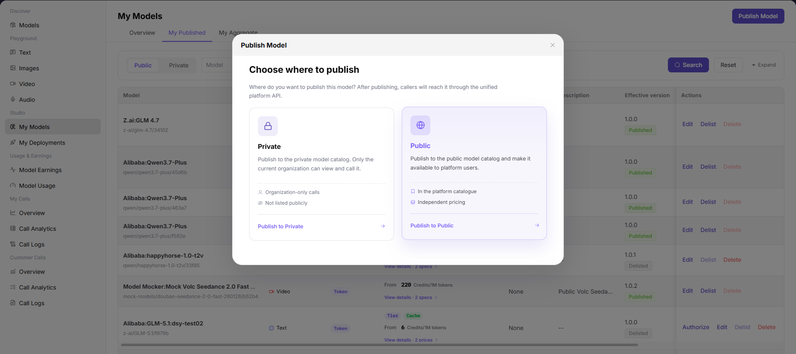
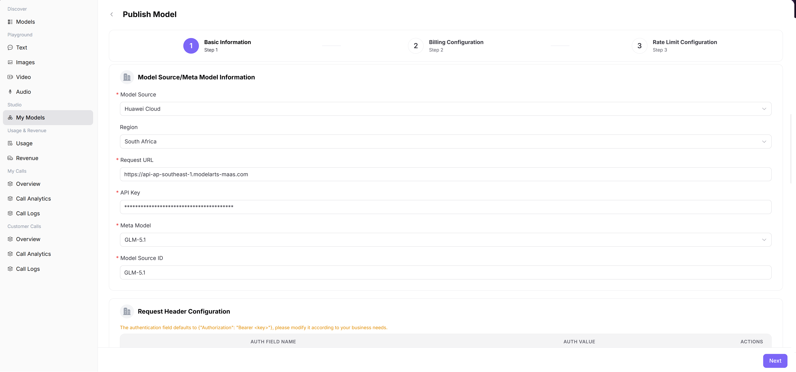
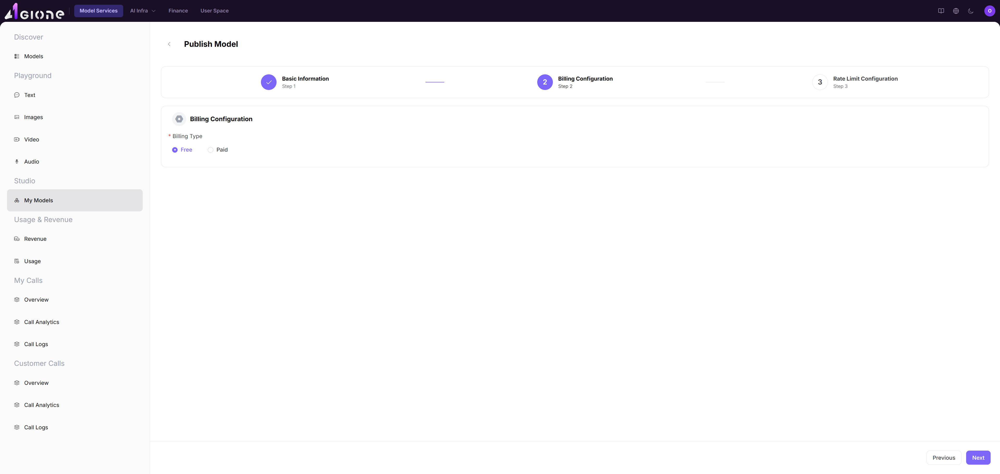
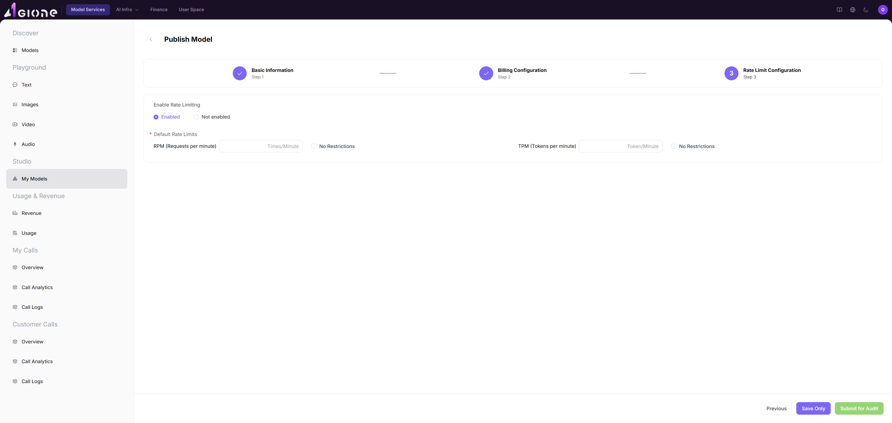

# Publish Public Models

This guide explains how model providers publish a model to the public marketplace, including sign-in, model information, protocol testing, billing, rate limits, and approval submission.

## Target Outcome

The model passes protocol testing, is submitted to the correct publication scope, and can be located after approval.

## Applicable Roles

- Model Provider
- Platform Operator when approval is required

## Before You Start

- Confirm that the Platform Operator has prepared the required meta-model, source, template, tags, and currency.
- Prepare the model identifier, endpoint, credential, protocol, billing decision, rate limits, and harmless test data.

## 1. Sign In To AGIOne

1. Open the AGIOne sign-in page at `https://agione.pro/user/login`.
2. Select **"Password"** sign-in.
3. Enter your **"Username or email"** and **"Password"**.
4. Tick **"I agree to the Privacy Policy and Terms of Service"**.
5. Click **"Sign In"**.

## 2. Open The Model Publishing Page

1. After signing in, open **"Model Services"**.
2. In the left menu, go to **"Studio" > "My Models"**.
3. Click **"Publish Model"**.
4. In the dialog, choose a deployment method:
   - **On-Prem / On-Cloud** for a model deployed on compute managed through AGIOne.
   - **BYOK (Bring Your Own Key)** for an existing third-party or self-hosted model API.
5. Choose **Private** for internal use or **Public** for the public marketplace.
6. Click **Start**.

### 2.1 Choose Platform-Hosted Deployment or BYOK

| Deployment Method | Use When | Confirm Before Publishing |
| --- | --- | --- |
| On-Prem / On-Cloud | AGIOne-managed compute will host the model | Model asset, resource pool, inference template, or cloud deployment prerequisites are ready |
| BYOK (Bring Your Own Key) | An external or self-hosted model API should use AGIOne experience, billing, and governance | Endpoint, provider model ID, headers, key, protocol, and response format are ready |

Select the publication area and deployment method before clicking Start. Enter a BYOK credential only on the platform configuration page; never expose it in documentation, screenshots, or tickets.

## 3. Fill In Basic Information

1. In **Select Model Type**, choose the model type and subtype that match the upstream service.
2. Check the basic-information area and confirm that the visible capability fields match that type.

3. In **Model Source/Meta Model Information**, select the real provider, region, and target meta-model.
4. For BYOK, enter the model service URL, provider key, and exact provider-side model ID. For platform-hosted deployment, select the prepared model asset and deployment source.

## 4. Test The Protocol

1. Find **Official Native Protocol & Default Advanced Parameters**.
2. Select the protocol you want to use, such as **OpenAI-ChatCompletions**, and expand its card.
3. Confirm the endpoint path and required input parameters.
4. Select **Start Testing** and wait until the result shows **Test Pass**.

5. Enter an easy-to-recognize custom tag, confirm the final display name, and select **Next**.

## 5. Configure Billing

1. Go to **"Billing Configuration"**.
2. If the model is free to use, select **"Free"**.
3. If the model should be paid, select **"Paid"** and fill in the price fields shown on the page.
4. Click **"Next"**.

## 6. Configure Rate Limits And Submit

1. Go to **"Rate Limit Configuration"**.
2. Choose whether to enable rate limiting.
3. If rate limiting is enabled, fill in:
   - **"RPM"**: maximum requests per minute.
   - **"TPM"**: maximum tokens per minute.
4. If you do not want to submit yet, click **"Save Only"**.
5. If everything is ready, click **"Submit for Audit"**.
6. Wait for approval. The model is not fully published until the audit is approved.

## 7. Check The Model In The Marketplace

1. In the left menu, go to **"Discover" > "Models"**.
2. If you published a public model, use **"All Models"**.
3. If you published a private model, use **"Private Models"**.
4. Search by the final display name, such as **"Qwen3.5-27b highspeed"**.
5. Find your model in the list.
6. Click **"View"** to open the detail page and confirm the model information.

## Remember These 2 Things

- **Do not share your API Key or put it in public documents.**
- **The protocol test must pass before you continue.**

## Completion Checklist

> **Purpose:** These are the exit criteria for the current feature task. Use them to decide whether the result is observable and reviewable and whether you can continue to the next step in the scenario. They do not repeat the procedure; if any item fails, follow the troubleshooting section below.

| Check | Pass Criteria |
| --- | --- |
| 1 | Protocol testing passes with the final model identifier and endpoint. |
| 2 | Billing, free quota, and rate limits match the intended offer. |
| 3 | The model is saved or submitted and its status can be located in My Models. |
| 4 | After approval, the intended audience can find and call the model. |

## Troubleshooting

| Symptom | Check First |
| --- | --- |
| Required template or source is missing | Operator preconfiguration, region, model type, and account scope |
| Protocol test fails | Endpoint, credential, model identifier, headers, request body, and network access |
| Model is not visible after submission | Review status, publication time, public/private scope, and marketplace filters |

## User Manual

- [Publish and Call a Model](../../../usermanual/model-services/end-to-end/publish-and-call-model/)
- [My Models](../../../usermanual/model-services/user/studio/my-models/)
