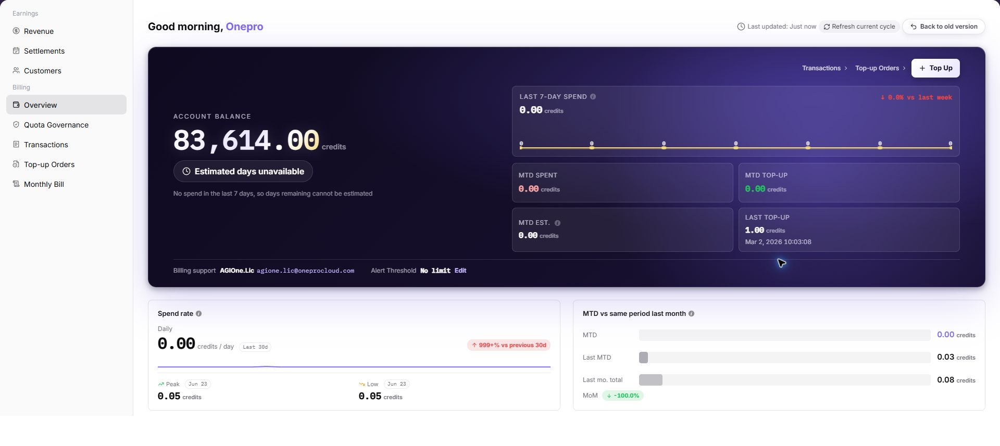
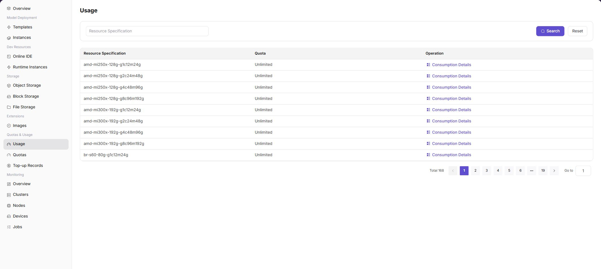
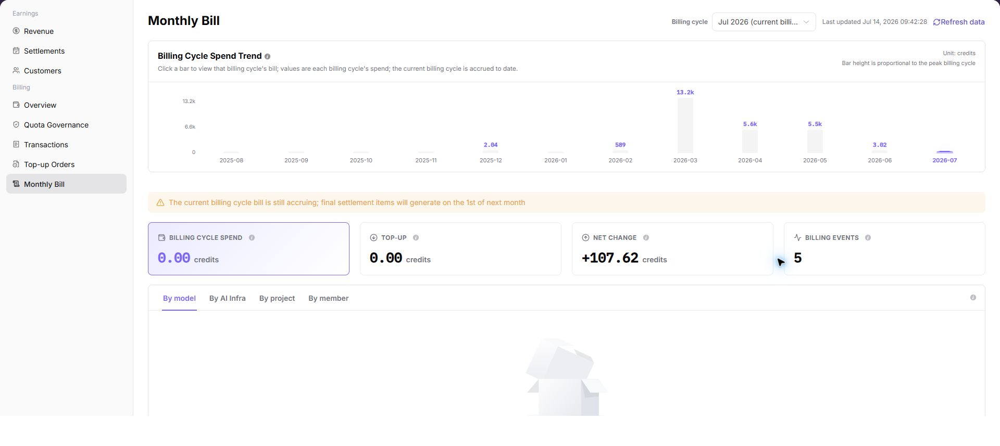

# Recharge & Billing

This scenario helps users distinguish account top-ups, resource quota, resource usage, and model billing and select the correct view for checking whether credits arrived, whether capacity is usable, and why deductions occurred.

## Applicable Roles

- Platform User reviewing top-ups, quota, usage, and charges
- Model Provider reviewing model usage and revenue
- Platform Operator reconciling quota, credits, metering, and billing periods

## Four Concepts

| Concept | Question | Entry |
| --- | --- | --- |
| Top-up orders | Did the account receive new spendable credits? | [Top-Up Orders](../../../usermanual/billing/user/billing/top-up-orders/) |
| Transactions | Why did the balance increase or decrease? | [Transactions](../../../usermanual/billing/user/billing/transactions/) |
| Resource quota | How much compute or storage can the tenant request? | [Resource Quotas](../../../usermanual/ai-infra-on-prem/user/quotas-usage/quotas/) |
| Resource usage | How much did an instance or job actually consume? | [Resource Usage](../../../usermanual/ai-infra-on-prem/user/quotas-usage/usage/) |
| Model usage and revenue | How many tokens, calls, duration, charges, or revenue did model calls produce? | [Model Usage](../../../usermanual/model-services/user/usage-revenue/model-usage/), [Model Revenue](../../../usermanual/model-services/user/usage-revenue/model-revenue/) |
| Monthly bill | Can summarized spending for the billing cycle be reconciled? | [Monthly Bill](../../../usermanual/billing/user/billing/monthly-bill/) |

## Target Outcome

- The user confirms top-up history and updated spendable credits.
- The user distinguishes insufficient resource quota from insufficient balance or credits.
- Resource or model consumption can be traced to an instance, job, or call.
- Operators can explain deductions with details and billing-period summaries.

## Before You Start

1. Decide whether the issue concerns model calls or On-Prem resources.
2. Confirm tenant, account, time range, billing period, and unit.
3. Prepare a redacted top-up, instance, job, or call identifier.

## Procedure

1. Open [Billing Overview](../../../usermanual/billing/user/billing/overview/) and confirm available balance, billing cycle, and alerts. Then review **Top-Up Orders** and check payment state and credited amount.

2. Open [Transactions](../../../usermanual/billing/user/billing/transactions/) and explain increases, deductions, or adjustments for the same account and time range.

3. Review **Resource Quotas** or [Quota Governance](../../../usermanual/billing/user/billing/quota-governance/) and confirm that limits and remaining values cover the target workload.

4. For On-Prem resources, compare instance state with **Resource Usage** and operator metering details.

5. For models, compare call logs, model usage, and model revenue.
6. Open [Monthly Bill](../../../usermanual/billing/user/billing/monthly-bill/) and reconcile currency, billing unit, price, transactions, and summarized deductions in the same cycle.

7. If operator assistance is required, provide tenant, billing cycle, object ID, and redacted evidence. Operators continue with [Billing-Cycle Reconciliation and Settlement](../billing-cycle-reconciliation-settlement/).

Operator references: [Tenant Quotas](../../../usermanual/ai-infra-on-prem/operator/quotas-metering/tenant-quotas/), [Tenant Credits](../../../usermanual/ai-infra-on-prem/operator/quotas-metering/tenant-credits/), [Metering Details](../../../usermanual/ai-infra-on-prem/operator/quotas-metering/metering-details/), and [Monthly Usage](../../../usermanual/ai-infra-on-prem/operator/quotas-metering/monthly-usage/).

## Completion Checklist

> **Purpose:** These are the exit criteria for the current feature task. Use them to decide whether the result is observable and reviewable and whether you can continue to the next step in the scenario. They do not repeat the procedure; if any item fails, follow the troubleshooting section below.

| Check | Pass Criteria |
| --- | --- |
| 1 | Top-up order, transactions, account credit, and event time agree. |
| 2 | Resource quota covers the target flavor and credits cover expected consumption. |
| 3 | Deductions map to a specific instance, job, or model call. |
| 4 | Billing unit, price, currency, transactions, and monthly bill are consistent. |
| 5 | Anomaly notes include a reproducible time range and object ID. |

## Troubleshooting

| Symptom | Check First |
| --- | --- |
| Top-up exists but creation still fails | Resource quota, flavor capacity, template scope, and account credits |
| Balance is sufficient but model calls fail | Model grant, personal key, rate limit, and model state |
| Stopped instance still incurs usage | Metering end time, residual job, and state synchronization |
| Amount differs from expectation | Billing mode, unit, effective price time, currency, and period |
| User and operator views differ | Tenant, time range, aggregation level, and synchronization delay |
