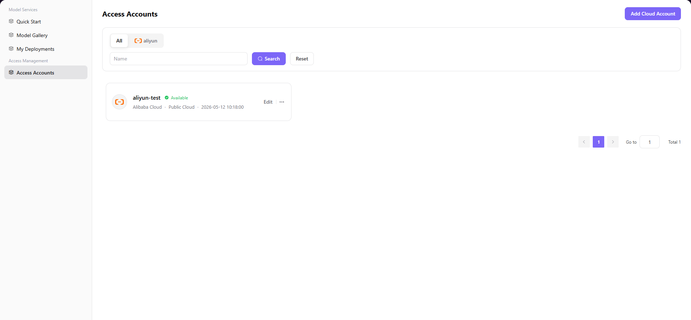

# Access Accounts

## Introduction

| Item                 | Content                                                      |
| -------------------- | ------------------------------------------------------------ |
| Applicable Role      | User                                                         |
| Navigation Path      | Access Management > Access Accounts                          |
| Function Description | Provides cloud platform account access, editing, and deletion functionality |

## Page Structure

### Search Area

The page top provides cloud platform filter bar and search box with **"Search"** and **"Reset"** buttons.

### Action Area

The upper right corner provides **"Add Cloud Account"** button for adding new cloud platform accounts.

### Data List Description

The account card list displays registered cloud platform accounts, showing account name, cloud platform, account type, creation time, and other information.

### Page Screenshot

## Operations

### Add Cloud Account

1. On the platform home page, click the **"Access Management"** menu in the left navigation bar to enter the Access Accounts page.
2. Click the **"Add Cloud Account"** button in the upper right corner to open the "Add Account" dialog.
3. Configure account information:
   - Enter the **Account Name** (e.g., `aliyun-test`)
   - Select the **Cloud Platform** (e.g., Alibaba Cloud, Huawei Cloud, Amazon, etc.)
   - Enter the **Access Key ID**
   - Enter the **Access Key Secret**
4. After confirming all information is correct, click the **"Confirm"** button to complete the addition.

#### Parameters

| Field Name | Field Type | Example | Description |
|------------|------------|---------|-------------|
| Account Name | Text | `aliyun-test` | Required. Custom account identifier |
| Select Cloud Platform | Dropdown | `Alibaba Cloud` | Required. The cloud platform of the account |
| Access Key ID | Text | `your-access-key-id` | Required. Cloud platform access key ID |
| Access Key Secret | Text | `your-access-key-secret` | Required. Cloud platform access key Secret |

## Other Operations

| Operation | Steps |
|-----------|-------|
| Edit Account | Click the **"..."** (More) button on the target account card → Select **"Edit"** → Modify account information → Click **"Confirm"** |
| Delete Account | Click the **"..."** (More) button on the target account card → Select **"Delete"** → Confirm operation (**Data cannot be recovered after deletion, please operate with caution**) |

## Notes

- **Access Key Secret** is sensitive information. Please keep it properly and never disclose it.
- **Account deletion is irreversible**. Once deleted, data cannot be recovered. Please operate with caution.
- Ensure that the Access Key ID and Access Key Secret entered match those in the cloud platform console. Otherwise, resource pulling may fail.