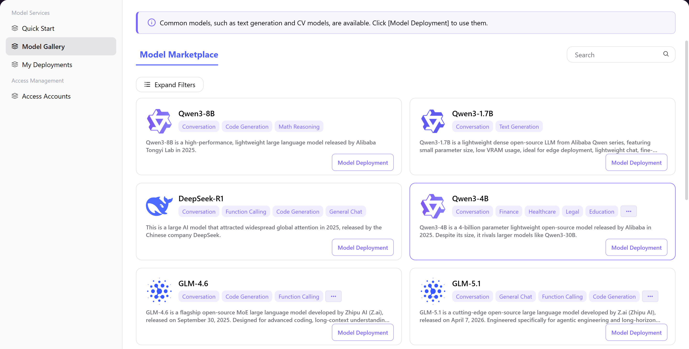

# Model Gallery

## Introduction

| Item                 | Content                                                                                                                                       |
| -------------------- | --------------------------------------------------------------------------------------------------------------------------------------------- |
| Applicable Role      | User                                                                                                                          |
| Navigation Path      | Model Services > Model Gallery                                                                                                              |
| Function Description | The model browsing and discovery portal, providing centralized access to pre-configured model resources. Users can quickly locate target models through filtering or keyword search, view details, and initiate deployment directly. |

## Page Structure

### Search Area

The page top provides multi-select filtering by model type (Conversation, Multimodal, Image models, etc.) and tags (LLM, Code Generation, Vector & Retrieval, etc.), with a search box for quick model location.

### Action Area

The model card provides **"Model Deployment"** button for direct deployment access.

### Data List Description

The model card list displays models with name, type, tags, description, and action entry. Pagination navigation supports multi-page browsing.

### Page Screenshot

## Operations

### Browse and View Model Details

1. On the platform home page, click **"Model Services > Model Gallery"** in the left navigation menu to enter the Model Gallery page.
2. Filter target models:
   - Use the left filter bar to filter by **Model Type** and **Tags**
   - Or use the search box to quickly locate by entering the model name
3. Click the target model card to enter the model detail page, where you can view complete model introduction, core features, and technical specifications.
4. If deployment is needed, click the **"Model Deployment"** button and follow the guided deployment process.

#### Parameters

| Field | Type | Example | Description |
|-------|------|---------|-------------|
| Model Type | Multi-select Filter | `Conversation` / `Image Model` / `Embedding Model` | Filter by model functional classification |
| Tags | Multi-select Filter | `LLM` / `Code Generation` / `Vector & Retrieval` | Filter by model capability and use case |
| Search Box | Text | `Qwen3-8B` | Enter model name or keywords to quickly locate |

## Other Operations

| Operation | Steps |
|-----------|-------|
| Collapse / Expand Filters | Click **"Collapse Filters"** / **"Expand Filters"** button → Adjust page layout, focus on model list browsing |
| Model Deployment | On model card or detail page, click **"Model Deployment"** button → Enter deployment flow, complete configuration following the guide |

## Notes

- The Model Gallery contains platform pre-configured resources; browsing requires no additional permissions.
- Before deploying a model, ensure that a cloud platform account has been connected. See the "Access Management" module for details.
- Deployment incurs compute costs; ensure sufficient account balance in advance.
- After model deployment is complete, you can manage and monitor the running status in "My Deployments".