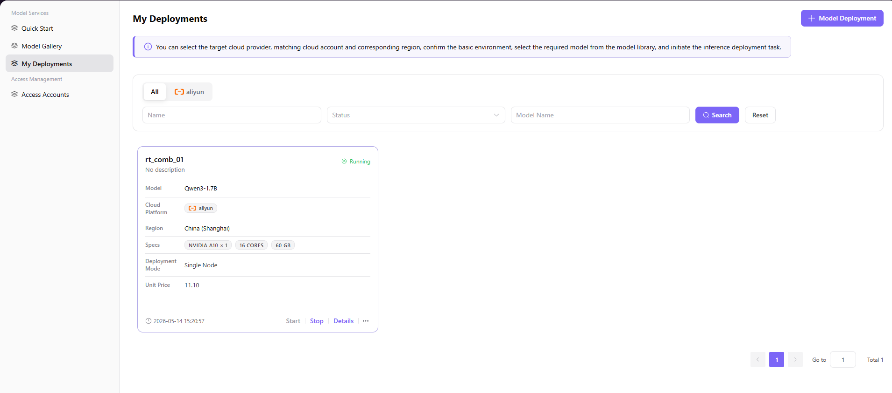

# My Deployments

## Introduction

| Item                 | Content                                                    |
| -------------------- | ---------------------------------------------------------- |
| Applicable Role      | User                                                       |
| Navigation Path      | Model Services > My Deployments                            |
| Function Description | Provides model deployment management, status viewing, and API call functionality |

## Page Structure

### Search Area

The page top provides filter toolbar supporting filtering and searching by cloud platform, deployment name, status, and model name, with **"Search"** and **"Reset"** buttons.

### Action Area

The upper right corner provides **"Model Deployment"** button for creating new deployment tasks.

### Data List Description

The data table displays deployment list with columns such as name, model, status, cloud platform, and creation time. Pagination controls support page navigation and jump to specific page.

### Page Screenshot

## Operations

### Deploy Model

1. On the platform home page, click **"Model Services > My Deployments"** in the left navigation bar to enter the My Deployments page.
2. Click the **"Model Deployment"** button in the upper right corner to enter the deployment workflow.
3. Configure basic deployment information (Step 1):
   - Select target **Model** (e.g., `Qwen3-1.7B`)
   - Select **Deployment Mode** (Single Node Mode / High Availability Mode)
   - Select **Cloud Platform**, **Cloud Account**, and **Region**
   - Fill in the deployment **Name** (e.g., `rt_comb_01`), and optionally add description
4. Configure deployment settings (Step 2):
   - Select the running **Framework** and **Version**
   - Select instance **Specification** (e.g., `ecs.gn7i-c16g1.4xlarge`, including GPU/CPU/memory configuration)
   - Confirm the estimated cost, and click "Start Deployment"
5. After deployment completes, you can view the status in the "My Deployments" list. The model is ready to use when the status shows "Running".

#### Parameters

| Field | Type | Example | Description |
|-------|------|---------|-------------|
| Model | Selection | `Qwen3-1.7B` | Required. Target model to deploy |
| Deployment Mode | Single Choice | `Single Node Mode` | Required. Single instance low-cost mode or high availability mode |
| Cloud Platform | Selection | `aliyun` | Required. Target cloud platform for deployment |
| Cloud Account | Selection | `aliyun-test` | Required. Configured cloud account |
| Region | Selection | `China (Shanghai)` | Required. Target region for deployment |
| Name | Text | `rt_comb_01` | Required. Custom deployment task name |
| Framework | Selection | `VLLM-Qwen3-1.7B` | Required. Runtime framework for the model |
| Specification | Selection | `ecs.gn7i-c16g1.4xlarge` | Required. Instance configuration (including GPU/CPU/memory) |

## Other Operations

| Operation                 | Steps                                                                                                                                                |
| ------------------------- | ---------------------------------------------------------------------------------------------------------------------------------------------------- |
| Start / Stop Deployment   | On the deployment card, click the **"Start"** / **"Stop"** button to control the instance running state                                              |
| View Deployment Details   | Click the **"Details"** button on the deployment card → View Basic Information, API Calls, Monitoring Information, and Event Records                 |
| View API Call Information | On the details page, switch to the "API Calls" tab to view Request URL, Request Method, Request Headers, and Request Parameters                      |
| Publish Model             | Click the **"..."** button on the deployment card → Select **"Publish"** → Choose Private/Public Region → Complete publishing configuration → Submit |
| Delete Deployment         | Click the **"..."** button on the deployment card → Select **"Delete"** → Confirm (**This operation is irreversible, please proceed with caution**)  |

## Notes

- **Deletion is irreversible**: Once a deployment task is deleted, the data cannot be recovered. Please ensure there are no remaining business dependencies before deletion.
- **Deployment status monitoring**: After submitting a deployment task, it is recommended to regularly check the status to ensure the instance starts normally before making API calls.
- **Cost estimation**: Before initiating deployment, please confirm the estimated cost is within your budget to avoid losses due to resource costs exceeding expectations.
- **Cloud account configuration**: Ensure that the configured cloud account (AK/SK) is valid and has sufficient permissions; otherwise, deployment may fail.
- **Publishing region selection**: After publishing to the public region, the model will be visible and callable by all tenants. Please choose carefully if your business involves sensitive data.
- **Specification selection**: Choose the appropriate instance specification based on your business load. Higher specifications cost more but offer better performance.