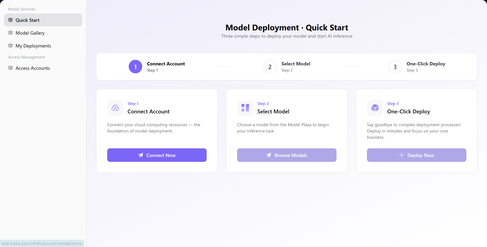

# Quick Start

## Introduction

| Item                 | Content                                              |
| -------------------- | ---------------------------------------------------- |
| Applicable Role      | User                                                 |
| Navigation Path      | Model Services > Quick Start                         |
| Function Description | A quick start page that guides users through model deployment in 3 steps |

## Page Structure

### Search Area

N/A (this page is a guide page with step cards, no search functionality required).

### Action Area

Each step card provides corresponding action buttons: **"Continue Connecting"**, **"Continue Selecting"**, **"Deploy Now"**.

### Data List Description

The page uses a guided layout with three step cards displayed in parallel:

- **Step 1: Connect Account** — Connect your cloud computing resources, the foundation of model deployment
- **Step 2: Select Model** — Choose a model from the Model Plaza to begin your inference task
- **Step 3: One-Click Deploy** — Say goodbye to complex deployment processes and deploy in minutes

Each step card contains a title, description, and action button. Users can click the button to navigate to the corresponding page for configuration.

### Page Screenshot

## Operations

Follow the page guidance and complete the following 3 steps:

**Step 1: Connect Account**
- Click **"Continue Connecting"** button to add and configure a cloud platform account (AK/SK credentials), connect cloud computing resources, and provide basic computing support for model deployment.

**Step 2: Select Model**
- Click **"Continue Selecting"** button to enter the Model Plaza, browse and select a target model from the repository to prepare for subsequent inference tasks.

**Step 3: One-Click Deploy**
- Click **"Deploy Now"** button, select the connected computing resources, confirm the target model and deployment specifications, and submit to quickly complete model deployment and start your AI inference journey.

## Notes

- Before deployment, ensure that the cloud platform account has been connected; otherwise, subsequent selection and deployment operations cannot be performed
- Before one-click deployment, confirm the applicable scenarios and specification requirements of the selected model to ensure they match your business needs
- The deployment process usually takes a few minutes. After completion, you can check the deployment status on the "My Deployments" page