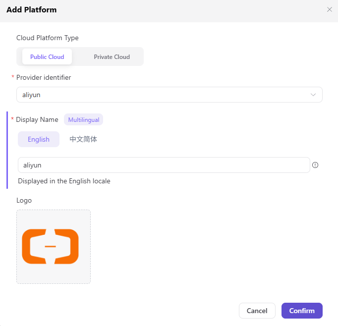

# Access Cloud Platforms

::: info Document Information
Version: v1.0
Updated: 2026-07-08
:::

## Feature Overview

`Access Cloud Platforms` is used to maintain cloud platform types, private cloud addresses, enablement status, and access notes, supporting multi-cloud scheduling, resource authorization, and model deployment workflows.

| Item | Content |
| --- | --- |
| Applicable role | Operator |
| Navigation path | Access Management > Access Cloud Platforms |
| Page route | /operator/access-management/access-cloudtype |
| Managed objects | Cloud platform types, private cloud addresses, enablement status, and access notes |
| Typical use | Maintain accessible public cloud or private cloud platforms |

### Beginner View

Access Cloud Platforms is like registering the "available cloud resource types" for the platform. Only after confirming whether a platform is public cloud, private cloud, or dedicated cloud and maintaining its enablement status can subsequent cloud accounts, resource pools, and deployment assets know where to connect.

### Terms

| Term | Description |
| --- | --- |
| Public cloud | A standard cloud resource platform provided by a cloud provider. |
| Private cloud | An enterprise-internal or dedicated cloud resource platform. |
| Platform address | Private cloud access entry. Use `https://cloud.example.com` for examples. |
| Enablement status | Controls whether a cloud platform can be selected by access accounts and resource pools. |

## Prerequisites

1. The current account has permission to maintain cloud platform types.
2. The type, access method, and maintenance boundary of the cloud platform to be accessed have been confirmed.
3. Real connection information for private or dedicated clouds is maintained only in secure configuration.

## Page Description

The page is used to maintain accessible cloud platform types, access entries, and enablement status. Operators need to confirm cloud platform ownership, network connectivity mode, and maintenance boundaries before deciding whether to enable it for access accounts and resource pools.

Page screenshot:

Used to confirm accessed cloud platform types, status, and operation entries.

## Main Operations

### Procedure

1. Go to `Access Management > Access Cloud Platforms`.
2. View existing cloud platform types, enablement status, and maintenance notes.
3. When adding a private cloud or dedicated cloud, fill in the platform name, type, and placeholder access address.
4. Confirm that access accounts, network connectivity, and resource synchronization plans are ready.
5. After saving, go to the access account page and verify that the cloud platform can be selected.

Key step screenshot:

Before adding, confirm cloud provider type, region mapping, and API capability scope.

### Parameters

| Field | Required | Type | Example | Description |
| --- | --- | --- | --- | --- |
| Cloud platform name | Yes | Text | `AGIOne Private Cloud` | Cloud platform name displayed to operators. Avoid internal code names. |
| Cloud platform type | Yes | Enum | `Private Cloud` | Distinguishes public cloud, private cloud, or dedicated cloud. |
| Access address | Conditionally required | URL | `https://cloud.example.com` | Private cloud entry example. Documentation should only use placeholders. |
| Enablement status | Yes | Enum | `Enabled` | Controls whether subsequent access accounts and resource pools can select it. |
| Maintenance notes | No | Multi-line text | `Production resource entry` | Records cloud platform purpose, owner, and limitations. |

### Pitfalls

- Do not write real internal domain names, IP addresses, or internal Endpoint values as private cloud access addresses.
- Before disabling a cloud platform, confirm whether access accounts, resource pools, or deployment assets reference it.
- After changing a cloud platform name, also check operation manuals, ticket templates, and downstream filters.

### Result Validation

1. The added or updated record is visible in the Access Cloud Platforms list.
2. The enablement status matches expectations.
3. The cloud platform can be selected on the access account page.

## FAQ

### The Target Cloud Platform Is Missing on the Access Account Page

**Issue Symptom:**

When adding an access account, the newly maintained platform is not in the cloud platform dropdown.

**Possible Causes:**

- The cloud platform is not enabled.
- The cloud platform type is configured incorrectly.
- The current account has no management permission for this cloud platform.

**Handling:**

1. Return to Access Cloud Platforms and confirm the enablement status.
2. Verify the cloud platform type and name.
3. Check current account menu and data permissions.

### Private Cloud Address Is Unavailable After Saving

**Issue Symptom:**

The platform has been saved, but later account access or resource synchronization fails.

**Possible Causes:**

- The access address was set to an example address, but real connection information was not maintained in system security configuration.
- Network connectivity, certificates, or proxy are not ready.
- The cloud platform type does not match the access plugin.

**Handling:**

1. Enter real connection information in secure configuration or on the access account page.
2. Contact network or cloud platform administrators to confirm connectivity.
3. Verify the platform type and access plugin.

## Next Steps

1. Maintain cloud account access information.
2. Create or synchronize resource pools.
3. Configure authorization for tenants or business regions.

## Notes

- Use only placeholders for private cloud addresses in documentation.
- Confirm cloud account and resource pool dependencies before disabling a cloud platform.
- Cloud platform names should avoid internal code names.
