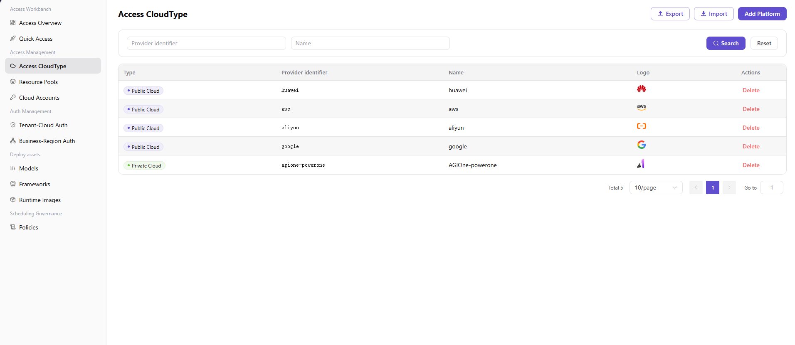

# Access Cloud Type

## Preface

| Item            | Content                                                                                                                                                          |
| --------------- | ---------------------------------------------------------------------------------------------------------------------------------------------------------------- |
| Target Audience | Operator                                                                                                                                                         |
| Navigation Path | Access Management > Access Cloud Type                                                                                                                            |
| Overview        | Maintain the list of cloud platforms supported by the platform (public / private cloud), providing foundational data support for subsequent access to resource pools, access to accounts, and model publishing processes |

## Page Structure

### Search Area

The page top supports multi-dimensional filtering by vendor identifier and name.

### Action Buttons

- The page top-right provides the **"Add Platform"** button for adding new cloud platforms.
- The page top provides **"Export"** / **"Import"** buttons for batch management of cloud platform configurations.
- Each cloud platform row provides a **"Delete"** operation.

### Data List

The page displays all cloud platforms in table format, with column headers including Type / Vendor Identifier / Name / Logo / Actions. By default, 5 cloud platform records are displayed:
- **Public Cloud**: Huawei Cloud (huawei / Huawei Cloud), AWS (aws / Amazon), Alibaba Cloud (aliyun / Alibaba Cloud), Google Cloud (google / Google Cloud)
- **Private Cloud**: AGIOne-powerone (agione-powerone / AGIOne-powerone)

## Operations

### Adding a Platform

1. Enter the platform homepage, click the **"Access Management > Access Cloud Type"** menu in the left navigation bar to enter the cloud platform management page.
2. Click the **"Add Platform"** button at the top right of the page to pop up the "Add Platform" window.

3. Select **"Cloud Platform Type"** (Public Cloud / Private Cloud, toggle Tab).
4. Configure the cloud platform information:
   - Fill in / Select **"Vendor Identifier"**, used to uniquely identify this cloud platform in the system (dropdown for public cloud, text input for private cloud);
   - **"Display Name"** (marked "Multilingual"): Used to set the display name of the cloud platform in lists, details, and selection controls. Click the **"English"** / **"Simplified Chinese"** tabs to switch language tabs, with the prompts **"Will be displayed in English language environment"** / **"Will be displayed in Simplified Chinese language environment"**. Fill in the names for the English and Simplified Chinese environments in the corresponding tabs;
   - (**Private Cloud only**) Fill in the **"Link Address"**, used to access the private cloud platform;
   - Upload the **"Logo"** icon.
5. After confirming all information is correct, click the **"Confirm"** button to complete the addition; to discard, click **"Cancel"**.

#### Parameters

| Term | Type | Example | Description |
|------|------|---------|-------------|
| Cloud Platform Type | Toggle Tab | `Public Cloud` / `Private Cloud` | Required. Identifies the type of cloud platform |
| Vendor Identifier | Dropdown (Public) / Text (Private) | `aliyun` / `agione-powerone` | Required. The unique identifier of the cloud platform |
| Display Name | Multilingual Text | English: `aliyun` / Simplified Chinese: `阿里云` | Required. Configure display names under the "English" and "Simplified Chinese" tabs respectively |
| Link Address | URL | `http://test.metis.opr/infrahub/op/access/platform` | **Private Cloud only** Required. The access address of the private cloud platform |
| Logo | Image | `Alibaba Cloud / Huawei Cloud / AGIOne-powerone icon` | Optional. The icon for displaying the cloud platform |

## Other Operations

| Operation | Steps |
|-----------|-------|
| Delete Platform | Click the target cloud platform's **"Delete"** button → **This action is irreversible. Please operate with caution.** |
| Export / Import Configuration | Click the **"Export"** / **"Import"** buttons at the top right of the page → Batch management of cloud platform configurations |

## Notes

- **Deletion operations are irreversible.** Please operate with caution.
- Key difference between private cloud and public cloud: Private cloud requires additional configuration of "Link Address" to access the private cloud platform.
- In the public cloud scenario, "Vendor Identifier" is a dropdown selection (including preset huawei / aws / aliyun / google / baidu, etc.); in the private cloud scenario, it is text input.
- Multilingual fields must maintain both English and Chinese versions simultaneously. Switch language tabs to maintain the other language version.
