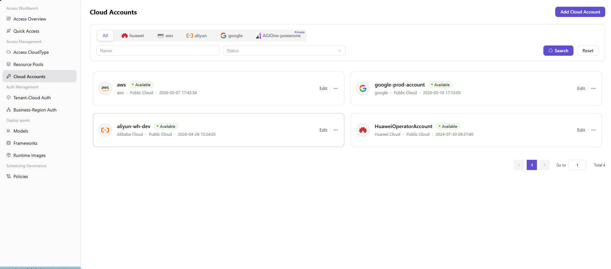
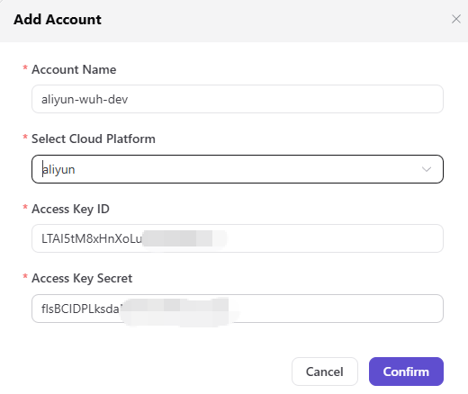

# Access Cloud Accounts

## Preface

| Item            | Content                                                                                                                                                |
| --------------- | ------------------------------------------------------------------------------------------------------------------------------------------------------ |
| Target Audience | Operator                                                                                                                                               |
| Navigation Path | Access Management > Access Cloud Accounts                                                                                                              |
| Overview        | Maintain cloud account credentials (Access Key) under each cloud platform, providing identity authentication support for subsequent model deployment and compute configuration processes |

## Page Structure

### Cloud Platform Tabs

The page top provides cloud platform Tabs (**All** / Huawei Cloud / AWS / Alibaba Cloud / Google Cloud / AGIOne-powerone [Private]).

### Search Area

The page top provides search fields (**Name** / **Status**) with **"Search"** / **"Reset"** buttons.

### Data List

By default, all cloud account cards are displayed in a grid (2 per row). Each card contains Account Name / Cloud Platform Logo + Name / Public-Private Cloud / Creation Time / Status ("Available", etc.), e.g., aws (public, 2026-05-07 17:43:34), google-prod-account (public, 2026-05-19 17:15:05), aliyun-wh-dev (public, 2026-04-28 15:24:05), HuaweiOperatorAccount (public, 2024-07-30 09:37:40), etc.

### Action Buttons

- The page top-right provides the **"Add Cloud Account"** button for adding new cloud accounts.
- Each cloud account card provides an **"Edit"** button (direct edit).
- The top-right of each cloud account card provides a **"..."** (More) button, which contains the **"Delete"** operation.

## Operations

### Adding a Cloud Account

1. Enter the platform homepage, click the **"Access Management > Access Cloud Accounts"** menu in the left navigation bar to enter the access account management page.
2. Click the **"Add Cloud Account"** button at the top right of the page to pop up the "Add Account" window.

3. Configure the account information:
   - Fill in the **"Account Name"** to identify the cloud account;
   - Select **"Choose Cloud Platform"** from the dropdown (e.g., Alibaba Cloud, Amazon, Huawei Cloud, etc.);
   - Enter the target cloud platform's **"Access Key ID"**;
   - Enter the target cloud platform's **"Access Key Secret"**.
4. After confirming all information is correct, click the **"Confirm"** button to complete the addition; to discard, click **"Cancel"**.

#### Parameters

| Term | Type | Example | Description |
|------|------|---------|-------------|
| Account Name | Text | `aliyun-wh-dev` | Required. Custom account identifier |
| Choose Cloud Platform | Dropdown | `Alibaba Cloud` | Required. Select the target cloud platform |
| Access Key ID | Text | `LTAI5tM8xHnXoLuBW...` | Required. Cloud platform access credential ID |
| Access Key Secret | Password | `flsBCIDPLksdaNh05J...` | Required. Cloud platform access credential secret |

## Other Operations

| Operation | Steps |
|-----------|-------|
| Edit Account | Click the target account card's **"Edit"** button → Modify the account information → Click **"Confirm"** |
| Delete Account | Click the top-right **"..."** (More) button on the target account card → Select **"Delete"** → **Data cannot be recovered after deletion. Please operate with caution.** |
