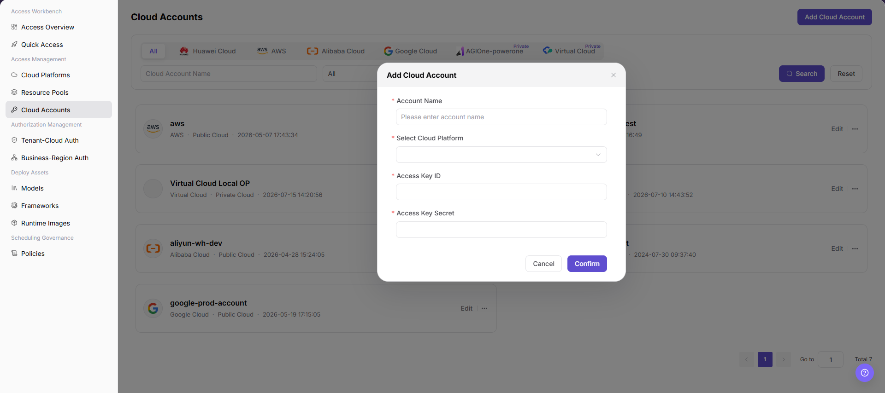

# Cloud Accounts

::: info Document Information
Version: v1.0
Updated: 2026-07-08
:::

## Feature Overview

`Cloud Accounts` is used to view and maintain cloud platform account access information. It supports filtering accounts by cloud platform and provides an add entry for entering account name, cloud platform, and access credentials.

| Item | Content |
| --- | --- |
| Applicable role | Operator |
| Navigation path | AI Infrastructure > On-Cloud > Access Management > Cloud Accounts |
| Page route | `/infrahub/op/access/account` |
| Managed objects | Cloud accounts, cloud platforms, cloud platform types, access credentials, and action entries |
| Typical use | Add cloud accounts and provide the authentication foundation for resource pool discovery, resource synchronization, and authorization configuration |

#### Beginner Explanation

Cloud Accounts is like registering keys that let the platform access cloud provider resources. When adding an account, verify the account name, owning cloud platform, and credential source. Real credentials should only be entered in secure input fields and should not be written into documentation, screenshots, or tickets.

#### Terms Quick Reference

| Term | Description |
| --- | --- |
| Cloud Account Name | Account display name in the add dialog, also used by the list and search. |
| Cloud Platform | Cloud provider or private cloud platform that owns the account. |
| Access Key ID | Cloud-side access credential identifier used to identify the access identity. |
| Access Key Secret | Sensitive credential paired with Access Key ID. It can only be maintained in secure input fields. |
| Cloud Platform Type | Type shown on list cards, such as Public Cloud or Private Cloud. |

## Prerequisites

1. The current account has access to `Access Management > Cloud Accounts` and permission to add cloud accounts.
2. The target cloud platform exists, and the account purpose, permission scope, and credential source have been confirmed.
3. If resource synchronization or status checks are needed after adding, related cloud-side permissions and network connectivity are ready.

## Page Description

The page title is `Cloud Accounts`. The top area provides cloud platform filters, a `Cloud Account Name` search box, a type dropdown filter, and `Search` and `Reset` buttons. The upper-right corner provides `Add Cloud Account`. Accounts are displayed as cards with account name, cloud platform, cloud platform type, update time, and action entries such as `Edit` and more actions.

Page screenshot:

## Main Operations

### Add Cloud Account

1. Go to `AI Infrastructure > On-Cloud > Access Management > Cloud Accounts`.
2. On the `Cloud Accounts` page, click `Add Cloud Account` in the upper-right corner.
3. In the `Add Cloud Account` dialog, fill in the required `Account Name`.
4. In the `Select Cloud Platform` dropdown, select the cloud platform that owns the account.
5. Fill in `Access Key ID` and `Access Key Secret`, and confirm the credential source, permission scope, and downstream resource synchronization impact.
6. Before clicking the final `Confirm`, verify the account information, cloud platform, and access credentials again. For learning or page validation only, click `Cancel` or close the dialog without submitting real account configuration.

## Parameter Reference

| Field Name | Required | Field Type | Example | Description |
| --- | --- | --- | --- | --- |
| Cloud Account Name | No | Text / search condition | Displayed on page | Account name used for list filtering. |
| Account Name | Yes | Text | Displayed on page | Account display name entered when adding a cloud account. |
| Cloud Platform | Yes | Filter / dropdown | Displayed on page | Cloud platform that owns the account. Select it through `Select Cloud Platform` when adding. |
| Cloud Platform Type | System-generated | Text | `Public Cloud` | Cloud platform type shown on list cards. |
| Access Key ID | Yes | Secure input | Not shown in documentation | Cloud-side access credential identifier. |
| Access Key Secret | Yes | Secure input | Not shown in documentation | Cloud-side sensitive credential. Do not write it into documentation or screenshots. |
| Search | No | Action button | `Search` | Queries the cloud account list by filters. |
| Reset | No | Action button | `Reset` | Clears filters and restores the default list. |
| Add Cloud Account | No | Action button | `Add Cloud Account` | Opens the add cloud account dialog. |
| Edit | No | Action entry | `Edit` | Opens existing cloud account configuration. |
| Cancel | No | Action button | `Cancel` | Closes the add dialog without submitting configuration. |
| Confirm | No | High-risk action | `Confirm` | Submits the new cloud account configuration and may save real credentials and trigger later validation or synchronization. |

## Pitfalls

- The add dialog in the screenshot only confirms `Account Name`, `Select Cloud Platform`, `Access Key ID`, and `Access Key Secret`. If account type, region, authorization scope, or synchronization configuration appears on a subsequent page, verify those fields according to the real page.
- Do not write real accounts, access credentials, endpoints, or internal test parameters into documentation, screenshots, or tickets.
- Before adding or editing a cloud account, confirm that cloud-side permissions follow the least-privilege principle and avoid over-authorization.

## Result Validation

| Check Item | Success Signal | If Abnormal |
| --- | --- | --- |
| Page is accessible | The `Cloud Accounts` page opens normally, and `Access Management > Cloud Accounts` is highlighted in the sidebar. | Check account permissions, navigation path, and page loading status. |
| Cloud account list loads normally | Account cards show account name, cloud platform, cloud platform type, and action entries normally. | Refresh the page or check data permissions. |
| Add entry is visible | `Add Cloud Account` is displayed in the upper-right corner. | Check whether the current account has add permission. |
| Add dialog can be opened | Clicking `Add Cloud Account` opens the `Add Cloud Account` dialog. | Check browser state, page API, and permission configuration. |
| Required fields display normally | `Account Name`, `Select Cloud Platform`, `Access Key ID`, and `Access Key Secret` all show required marks. | Check the page version or reopen the dialog. |
| Learning validation does not submit | Only fields and the dialog are viewed; the final `Confirm` is not clicked. | If a final action is triggered by mistake, follow the change audit process to check the impact scope. |
| Real submission can be tracked | If a real submission is performed, the new cloud account should appear in the list, and later validation, synchronization, or edit entries should be traceable. | Check required fields, credential validity, cloud platform selection, and API response. |

## Troubleshooting Path

| Issue Type | Check First | Next Step |
| --- | --- | --- |
| Add dialog cannot open | Add permission, page loading status, and browser console errors | Refresh the page or contact the administrator to check permissions |
| Submission fails | Required fields, cloud platform selection, and credential validity | Fix the configuration according to the API error message |
| New account not visible in list | Filters, pagination, and synchronization latency | Click `Reset`, then refresh the list |

## FAQ

#### What if the new cloud account is not shown in the list?

**Issue Symptom:**

After clicking `Confirm`, the new account is not visible in the list.

**Possible Causes:**

- Current filters have not been cleared.
- The add request was not submitted successfully.
- List data has refresh latency.

**Handling:**

1. Click `Reset` to clear filters.
2. Refresh the page and check the account list again.
3. If it still does not exist, reopen the add dialog and check required fields and submission result.

#### What if access credentials cannot pass validation?

**Issue Symptom:**

The cloud account has been added, but later resource synchronization, status check, or edit validation fails.

**Possible Causes:**

- Access Key ID or Access Key Secret is invalid, expired, or mismatched.
- The cloud-side authorization scope is insufficient.
- The wrong cloud platform was selected, or cloud-side APIs, network, or proxy are unreachable.

**Handling:**

1. Check and update credentials in the secure credential source.
2. Check the cloud-side authorization policy and least-privilege scope.
3. Check cloud platform selection, network connectivity, and API response information.

## Next Steps

1. Go to Resource Pools to view resource pools that can be synchronized or used by this account.
2. Go to Tenant-Cloud Auth or Business-Region Auth to configure resource visibility scope.
3. Go to Access Overview to review account, resource pool, and authorization flow status.

## Notes

- Adding a cloud account may save real cloud-side authentication information and trigger resource synchronization, status checks, or authorization scope changes.
- `Confirm`, `Save`, and `Submit` are high-risk final actions. Do not click them during learning or screenshots.
- This document only describes viewing fields and checking configuration before final submission. It does not guide real account configuration submission during test learning.
- Do not write real accounts, passwords, keys, Tokens, AK/SK, endpoints, cloud resource IDs, or internal test parameters in the document.
