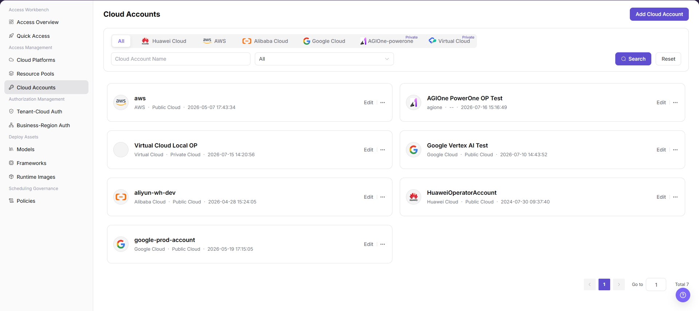

# Access Accounts

::: info Document Information
Version: v1.0
Updated: 2026-07-08
:::

## Feature Overview

`Access Accounts` is used to maintain cloud provider account credentials for Alibaba Cloud, AWS, Huawei Cloud, Google Cloud, private clouds, and similar platforms.

| Item | Content |
| --- | --- |
| Applicable role | Operator |
| Navigation path | Access Management > Access Accounts |
| Page route | /infrahub/op/access/account |
| Managed objects | Cloud accounts, cloud platforms, Access Key, authorization status, and resource access permissions |
| Typical use | Connect cloud provider accounts and provide authentication for resource pool discovery, model deployment, and cloud resource management |

### Beginner View

A cloud account is like a keychain that lets the platform access cloud provider resources. The key must open the door, but the permissions must not be too broad. The document only explains field meanings. Real AK/SK, account IDs, and authorization policies must be maintained only in secure input fields or a key system.

### Terms

| Term | Description |
| --- | --- |
| Access Key ID | Cloud provider access key ID used to identify the access identity. |
| Secret Key | Sensitive key paired with Access Key ID. It can only be saved in the platform's secure input field. |
| Cloud platform | Cloud provider or private cloud platform type that owns the account. |
| Least privilege | Grants only the resource access and deployment permissions required by the current business. |

## Prerequisites

1. The current account has permission to access cloud accounts.
2. The cloud provider account, AK/SK, or role authorization is ready and follows least privilege.
3. Resource synchronization regions and authorization policies have been confirmed.

## Page Description

The page is used to access and maintain cloud provider accounts, credential validation status, resource synchronization scope, and authorization policies. Operators need to manage accounts by cloud platform, account purpose, and region scope, and avoid mixing production, test, and customer accounts.

Page screenshot:

Used to view cloud account status, resource synchronization, and authorization entries.

## Main Operations

### Procedure

1. Go to `Access Management > Cloud Accounts`.
2. Filter target accounts by cloud platform, account status, or account name.
3. When adding an account, select the cloud platform and fill in account name, authorization method, and resource scope.
4. Enter access keys in secure input fields or select an existing key reference.
5. After saving, run connectivity validation and check resource synchronization status.

Key step screenshot:

Use redacted examples when adding. Do not expose AK/SK or account IDs in screenshots.

### Parameters

| Field | Required | Type | Example | Description |
| --- | --- | --- | --- | --- |
| Account name | Yes | Text | `prod-cloud-account` | Display name in the platform. It should indicate purpose and cloud platform. |
| Cloud platform | Yes | Dropdown | `Alibaba Cloud` | Cloud provider or private cloud platform that owns the account. |
| Authorization method | Yes | Enum | `AK/SK` | Access key, role authorization, or another method supported by the platform. |
| Resource scope | Conditionally required | Multi-select | `cn-shanghai` | Regions or resource scopes allowed for synchronization and use. |
| Validation status | System-generated | Enum | `Validation passed` | Returned by the platform according to credentials and cloud provider APIs. |

### Pitfalls

- Do not write AK/SK, Secret Key, or account IDs into documentation, screenshots, or ticket comments.
- Production accounts should use least-privilege policies instead of global administrator permissions.
- Before disabling an account, confirm whether resource pools, authorization, and deployment instances still reference it.

### Result Validation

1. The account list shows the new account and normal validation status.
2. Resource synchronization tasks can obtain resources from the target regions.
3. Resource pool and authorization pages can select resources under this account.

## FAQ

### Account Validation Fails

**Issue Symptom:**

After saving a cloud account, validation status shows failed or resources cannot synchronize.

**Possible Causes:**

- The access key is invalid or expired.
- The authorization policy lacks permission to query resources.
- Cloud provider API, proxy, or private cloud Endpoint is unreachable.

**Handling:**

1. Update credentials in the key system.
2. Verify cloud provider authorization policies and the least-privilege checklist.
3. Check network, proxy, certificate, and cloud platform connectivity.

### Target Region Resources Cannot Be Synchronized

**Issue Symptom:**

Account validation passes, but the resource pool page has no target region or resources.

**Possible Causes:**

- The resource scope does not include the target region.
- Cloud provider resource tags or types do not match synchronization rules.
- The synchronization task has not completed or failed.

**Handling:**

1. Check account resource scope configuration.
2. Confirm that cloud-side resources have been created and are available.
3. View synchronization task status and handle according to the error message.

## Next Steps

1. Create or synchronize cloud resource pools.
2. Configure tenant-cloud authorization and business region authorization.
3. Maintain deployable models and runtime environments on deployment asset pages.

## Notes

- AK/SK, Secret Key, and account IDs must not appear in screenshots or ticket bodies.
- After cloud account validation passes, resource synchronization results still need to be confirmed.
- Before changing production accounts, assess the impact on resource pools and deployments.
