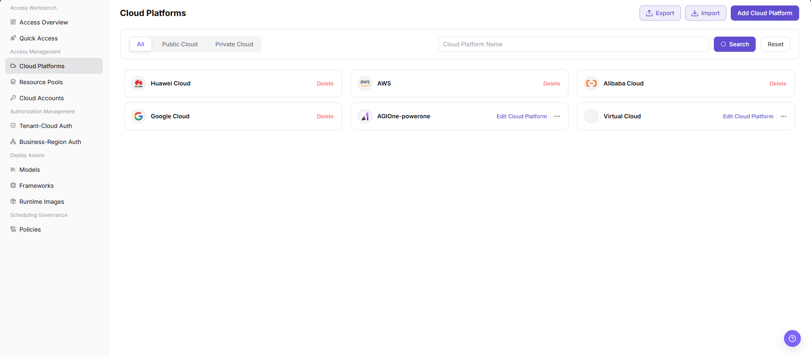
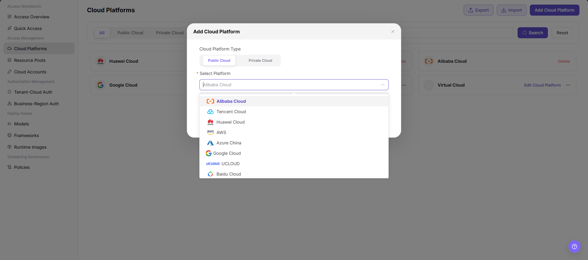

# Cloud Platforms

::: info Document Information
Version: v1.0
Updated: 2026-07-08
:::

## Feature Overview

`Cloud Platforms` is used to view and maintain the list of cloud platforms that can be accessed. It supports filtering by public cloud and private cloud, and provides an add entry for registering a new cloud platform type.

| Item | Content |
| --- | --- |
| Applicable role | Operator |
| Navigation path | AI Infrastructure > On-Cloud > Access Management > Cloud Platforms |
| Page route | `/infrahub/op/access/platform` |
| Managed objects | Cloud platform name, cloud platform type, platform source, and action entries |
| Typical use | Add cloud platforms and maintain the accessible cloud platform list |

#### Beginner Explanation

Cloud Platforms is like registering which clouds the system can access. Select Public Cloud or Private Cloud and choose the specific platform here first. Then cloud accounts, resource pools, and authorization configurations can use the corresponding cloud platform information.

#### Terms Quick Reference

| Term | Description |
| --- | --- |
| Cloud Platform Type | Category field on the page. The current screenshot shows `Public Cloud` and `Private Cloud`. |
| Select Platform | Required dropdown in the Add Cloud Platform dialog, used to select a specific cloud provider or platform. |
| Cloud Platform Name | Display name used in the list and search box. |
| Edit Cloud Platform | Action entry in the list for entering an existing cloud platform configuration. |
| Delete | High-risk list action that may remove a cloud platform access configuration. |

## Prerequisites

1. The current account has access to `Access Management > Cloud Platforms`.
2. The target cloud platform type, public or private cloud category, and access scope have been confirmed.
3. If authentication information, endpoints, or resource synchronization parameters need to be configured later, prepare them in advance and maintain them through secure configuration.

## Page Description

The page title is `Cloud Platforms`. The top area provides `All`, `Public Cloud`, and `Private Cloud` filters, supports searching by `Cloud Platform Name`, and provides `Export`, `Import`, and `Add Cloud Platform` entries. Cloud platforms are displayed as cards with platform names and action entries such as `Delete` and `Edit Cloud Platform`.

Page screenshot:

## Main Operations

### Add Cloud Platform

1. Go to `AI Infrastructure > On-Cloud > Access Management > Cloud Platforms`.
2. On the `Cloud Platforms` page, click `Add Cloud Platform`.
3. In the `Add Cloud Platform` dialog, select `Cloud Platform Type`. The current visible options include `Public Cloud` and `Private Cloud`.
4. In the required `Select Platform` dropdown, select the target platform, such as `Alibaba Cloud`, `Tencent Cloud`, `Huawei Cloud`, `AWS`, `Azure China`, `Google Cloud`, `UCLOUD`, or `Baidu Cloud`.
5. If the page later shows authentication information, endpoint, resource synchronization, or status check settings, verify the cloud platform information, access scope, and affected objects again before submitting.
6. For learning or page validation only, view the fields and dialog, then close or return. Do not perform the final `Save`, `Submit`, or `OK`.

## Parameter Reference

| Field Name | Required | Field Type | Example | Description |
| --- | --- | --- | --- | --- |
| Cloud Platform Name | No | Text / search condition | `Huawei Cloud` | Cloud platform name used for list display and search. |
| Cloud Platform Type | Yes | Segmented control | `Public Cloud` | Platform category selected when adding a cloud platform. The current screenshot shows `Public Cloud` and `Private Cloud`. |
| Select Platform | Yes | Dropdown | `Alibaba Cloud` | Specific cloud provider or cloud platform selected when adding a cloud platform. |
| Add Cloud Platform | No | Action button | `Add Cloud Platform` | Opens the add cloud platform dialog. |
| Search | No | Action button | `Search` | Filters the list by cloud platform name or other conditions. |
| Reset | No | Action button | `Reset` | Clears filters and restores the default list. |
| Import | No | Action button | `Import` | Imports cloud platform configuration and may affect real configuration. Use with caution. |
| Export | No | Action button | `Export` | Exports cloud platform configuration or list data. Pay attention to sensitive information. |
| Edit Cloud Platform | No | Action entry | `Edit Cloud Platform` | Opens the configuration page or dialog for an existing cloud platform. |
| Delete | No | High-risk action | `Delete` | Before deleting a cloud platform record, confirm dependent accounts, resource pools, and authorization relationships. |

## Pitfalls

- The add dialog in the current screenshot only confirms `Cloud Platform Type` and `Select Platform`. Authentication information, endpoint, region, or resource synchronization parameters should follow the actual subsequent page.
- `Import`, `Export`, `Edit Cloud Platform`, and `Delete` may involve real configuration or sensitive data. Do not perform these actions during learning or screenshots.
- Before screenshots or external communication, redact real accounts, secrets, Tokens, AK/SK, endpoints, cloud resource IDs, and internal test parameters.

## Result Validation

| Check Item | Success Signal | If Abnormal |
| --- | --- | --- |
| Page is accessible | The `Cloud Platforms` page opens normally, and `Access Management > Cloud Platforms` is highlighted in the sidebar. | Check account permissions, navigation path, and page loading status. |
| Cloud platform list loads normally | List cards show cloud platform names and action entries. | Refresh the page or check data permissions. |
| Add entry is visible | `Add Cloud Platform` is displayed in the upper-right corner. | Check whether the current account has add permission. |
| Add dialog can be opened | Clicking `Add Cloud Platform` opens the dialog with the same title. | Check browser blocking, page state, and permission configuration. |
| Required fields display normally | `Cloud Platform Type` and `Select Platform` are displayed, and `Select Platform` has a required mark. | Check the page version or reopen the dialog. |
| Learning validation does not submit | Only fields and the dialog are viewed; no real save, submit, or OK action is performed. | If a final action is triggered by mistake, follow the change audit process to check the impact scope. |
| Real submission can be tracked | If a real submission is performed, the new cloud platform should appear in the list and be editable or deletable. | Check required fields, API response, synchronization tasks, and permissions. |

## FAQ

#### The target platform is missing in the add dialog

**Issue Symptom:**

After opening `Add Cloud Platform`, the target cloud platform is not available in the `Select Platform` dropdown.

**Possible Causes:**

- The selected platform type is incorrect, such as staying on `Public Cloud` when `Private Cloud` should be selected.
- The target platform has not been preset or enabled in the system.
- The current account does not have access permission for the platform.

**Handling:**

1. Switch between `Public Cloud` and `Private Cloud`, then check the dropdown again.
2. Confirm whether the target platform has been enabled in the system.
3. Contact the platform administrator to check account permissions and platform access scope.

#### The new platform is not shown after adding

**Issue Symptom:**

The add action has been completed, but the new cloud platform is not visible in the `Cloud Platforms` list.

**Possible Causes:**

- Current list filters have not been cleared.
- The new configuration is still synchronizing or refreshing.
- The final save, submit, or OK action did not complete successfully.

**Handling:**

1. Click `Reset` to clear filters.
2. Refresh the page or wait for synchronization to complete, then review again.
3. Reopen the add dialog and check required fields and submission result.

## Next Steps

1. Go to Cloud Accounts to configure account access for the added cloud platform.
2. Go to Resource Pools to create or synchronize the corresponding resource pool.
3. Go to Tenant-Cloud Auth or Business-Region Auth to configure the available scope.

## Notes

- Adding a cloud platform may create real access configuration, trigger resource synchronization, or expose or use cloud-side authentication information.
- `Save`, `Submit`, and `OK` are high-risk final actions. Do not click them during learning or screenshots.
- This document only describes viewing fields and checking configuration before final submission. It does not guide real configuration submission during test learning.
- Do not write real accounts, secrets, Tokens, AK/SK, endpoints, cloud resource IDs, or internal test parameters in the document.
