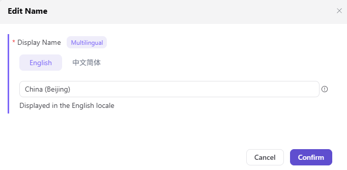

# Resource Pools

::: info Document Information
Version: v1.0
Updated: 2026-07-08
:::

## Feature Overview

`Resource Pools` is used to maintain cloud account resource pools, regions, instance specifications, inventory, and synchronization status, supporting multi-cloud scheduling, resource authorization, and model deployment workflows.

| Item | Content |
| --- | --- |
| Applicable role | Operator |
| Navigation path | Access Management > Resource Pools |
| Page route | /operator/access-management/resource-pools |
| Managed objects | Cloud account resource pools, regions, instance specifications, inventory, and synchronization status |
| Typical use | Organize deployable resources by cloud account and region |

### Beginner View

A resource pool is like putting machines, accelerator cards, and storage from a cloud account onto shelves by region. During deployment, users see available resources on the shelves, not the cloud provider account itself.

### Terms

| Term | Description |
| --- | --- |
| Resource pool | A resource collection organized by cloud account, region, and resource type. |
| Inventory | Current instance or accelerator card capacity available for deployment. |
| Synchronization task | A task where the platform pulls resource status from the cloud provider. |
| Resource boundary | Which tenants or business regions a resource pool is opened to. |

## Prerequisites

1. The cloud account has been accessed and passed validation.
2. Target region resources have been synchronized.
3. Resource pool capacity, resource type, and enablement status have been confirmed.

## Page Description

The page is used to view and maintain resource pools synchronized from cloud accounts, including cloud platform, region, resource type, capacity level, enablement status, and authorization status. Operators should split resource pools by region and business purpose to keep subsequent authorization and scheduling policies controllable.

Page screenshot:

Used to view resource pool regions, capacity, levels, and enablement status.

## Main Operations

### Procedure

1. Go to `Access Management > Resource Pools`.
2. Filter resource pools by cloud platform, region, resource type, or status.
3. After synchronizing or adding a resource pool, verify capacity, specifications, and resource type.
4. Set enablement status, purpose notes, and authorizable scope for the resource pool.
5. Go to the authorization page and open the resource pool to tenants or business regions.

Key step screenshot:

Before editing the name, confirm that it will not affect authorization or user-side recognition.

### Parameters

| Field | Required | Type | Example | Description |
| --- | --- | --- | --- | --- |
| Resource pool name | Yes | Text | `gpu-cn-shanghai-prod` | Should indicate cloud platform, region, and purpose. |
| Cloud account | Yes | Dropdown | `prod-cloud-account` | Cloud account that owns the resource pool. |
| Region | Yes | Dropdown | `cn-shanghai` | Region where the cloud resource is located. |
| Resource type | Yes | Multi-select | `GPU / CPU` | Resource types that the resource pool can host. |
| Enablement status | Yes | Enum | `Enabled` | Controls whether it can be authorized and scheduled. |

### Pitfalls

- Normal resource pool capacity does not mean the tenant already has permissions. Authorization must also be completed.
- Do not mix cross-region resource pools to avoid selecting unreachable resources during deployment.
- Before disabling a resource pool, confirm whether running deployment instances exist.

### Result Validation

1. The resource pool list shows capacity, region, and enablement status.
2. The authorization page can select the target resource pool.
3. The user deployment page can show the corresponding resource within the authorized scope.

## FAQ

### Resource Pool Cannot Be Authorized

**Issue Symptom:**

The target resource pool cannot be found on tenant authorization or business region authorization pages.

**Possible Causes:**

- The resource pool is not enabled.
- The cloud account that owns the resource pool failed validation.
- The resource pool region does not match the authorization object.

**Handling:**

1. Confirm resource pool enablement status.
2. Check cloud account validation and synchronization tasks.
3. Verify the cloud platform and region of the authorization object.

### Resource Pool Capacity Shows Abnormal

**Issue Symptom:**

Resource pool capacity is 0 or inconsistent with the cloud provider console.

**Possible Causes:**

- Synchronization task latency.
- Cloud provider resource tags or specifications do not match recognition rules.
- Resources are occupied by other businesses.

**Handling:**

1. Refresh or retrigger synchronization.
2. Verify resource tags, specifications, and status.
3. Check actual available capacity together with the cloud provider console.

## Next Steps

1. Configure tenant-cloud authorization.
2. Configure business region authorization.
3. Maintain scheduling policies and deployment assets.

## Notes

- Normal resource pool capacity does not mean the tenant has been authorized.
- Do not mix cross-region resource pools.
- Confirm there are no running deployments before disabling a resource pool.
