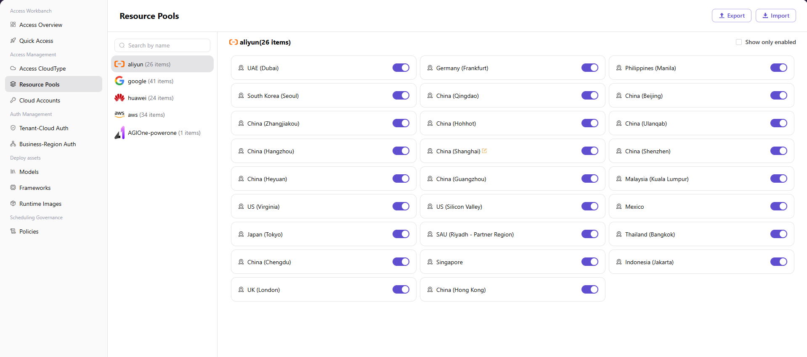

# Access Resource Pools

## Preface

| Item            | Content                                                                                                                                                          |
| --------------- | ---------------------------------------------------------------------------------------------------------------------------------------------------------------- |
| Target Audience | Operator                                                                                                                                                         |
| Navigation Path | Access Management > Access Resource Pools                                                                                                                         |
| Overview        | Maintain cloud platform resource pool regions, enable/disable specific regions, and manage their display names, providing foundational data support for subsequent model deployment and compute configuration processes |

## Page Structure

### Cloud Platform List

The page left side displays the cloud platform list, which can be quickly filtered through **"Enter Name to Search"** (including 26 for Alibaba Cloud / 41 for Google Cloud / 24 for Huawei Cloud / 34 for AWS / 1 for AGIOne-powerone, etc.).

### Region Card Grid

The right side displays the region card grid (3 per row) of the selected cloud platform, with each card showing the region name and an enable/disable toggle.

### Action Buttons

- The page top provides **"Export"** / **"Import"** buttons for batch management of resource pool configurations.
- The page top-right provides a **"Show Enabled Only"** checkbox to filter enabled regions.

## Operations

### Enabling / Disabling Resource Pool Regions

1. Enter the platform homepage, click the **"Access Management > Access Resource Pools"** menu in the left navigation bar to enter the resource pool management page.
2. Enter keywords in the search box above the left-side cloud platform list to search for cloud vendors (including 26 for Alibaba Cloud / 41 for Google Cloud / 24 for Huawei Cloud / 34 for AWS / 1 for AGIOne-powerone, etc.), and click the target cloud platform (e.g., Alibaba Cloud).
3. The right side displays the region card grid (3 per row) of the selected cloud platform, including regions such as China North 1 (Qingdao), China North 2 (Beijing), China North 3 (Zhangjiakou), etc.
4. Find the region that needs to be enabled / disabled, and click the toggle button on the right side of the region card:
   - When the toggle is on, the region is enabled;
   - Click the toggle to switch the region's enable / disable status.

### Editing Region Display Name

1. Enter the platform homepage, click the **"Access Resource Pools"** menu in the left navigation bar to enter the resource pool management page.
2. Select the target cloud vendor (e.g., Alibaba Cloud) on the left, and find the region to be edited.
3. Click the edit icon on the region card to pop up the "Edit Name" window.
4. **"Display Name"** (marked "Multilingual"): Used to set the display name of the region in lists, details, and selection controls. Click the **"English"** / **"Simplified Chinese"** tabs to switch language tabs, with the prompts **"Will be displayed in English language environment"** / **"Will be displayed in Simplified Chinese language environment"**. Fill in the names for the English and Simplified Chinese environments in the corresponding tabs.
5. After confirming the configuration is correct, click the **"Confirm"** button to complete the modification; to discard, click **"Cancel"**.

#### Parameters

| Term | Type | Example | Description |
|------|------|---------|-------------|
| Cloud Vendor | Selector | `Alibaba Cloud` / `Amazon` | Required. Select the cloud vendor resource pool to manage |
| Region Toggle | Toggle | `On` / `Off` | Used to enable or disable the resource pool of the corresponding region |
| Display Name | Multilingual Text | English: `China (Beijing)` / Simplified Chinese: `北京` | Required. Configure display names under the "English" and "Simplified Chinese" tabs respectively |

## Other Operations

| Operation | Steps |
|-----------|-------|
| Edit Region Display Name | Click the edit icon on the target region card → Modify the English / Simplified Chinese display names → Click **"Confirm"** |
| Show Enabled Only | Check the **"Show Enabled Only"** checkbox at the top right of the page → Display only enabled regions |
| Export / Import Configuration | Click the **"Export"** / **"Import"** buttons at the top right of the page → Batch management of resource pool configurations |

## Notes

- The enable/disable status of regions affects downstream model deployment, compute configuration, and other processes. Disabled regions cannot be used in subsequent processes.
- Multilingual fields must maintain both English and Chinese versions simultaneously. Switch language tabs to maintain the other language version.
- In public cloud scenarios, region names follow the official naming of the cloud platform (e.g., "China East 2 (Shanghai)"); in private cloud scenarios, region names are defined by the platform.
