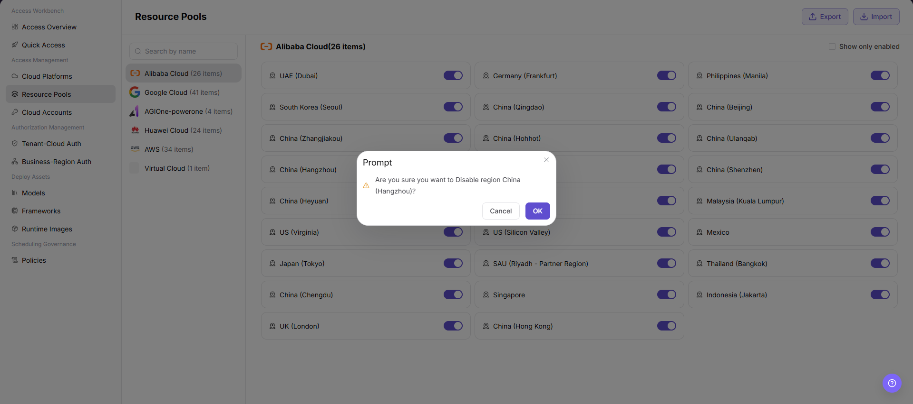

# Resource Pools

::: info Document Information
Version: v1.0
Updated: 2026-07-08
:::

## Feature Overview

`Resource Pools` is used to view and maintain accessible regional resource pools by cloud platform. It uses status switches to control whether a resource pool is enabled, helping operators manage cloud resource visibility and downstream scheduling scope.

| Item | Content |
| --- | --- |
| Applicable role | Operator |
| Navigation path | AI Infra > On-Cloud > Access Management > Resource Pools |
| Page route | /infrahub/op/access/region |
| Managed objects | Cloud platform, regional resource pools, enabled status, import and export entries |
| Typical use | Enable or disable a regional resource pool under a cloud platform |

#### Beginner View

Resource Pools is like setting an availability switch for regions under different cloud platforms. After a resource pool is enabled, it may enter the authorization and scheduling scope. After it is disabled, related deployments, authorization, or capacity display may be affected.

#### Terms

| Term | Description |
| --- | --- |
| Cloud Platform | Platform in the left list that owns resource pools, such as `Alibaba Cloud`, `Google Cloud`, or `Huawei Cloud`. |
| Resource Pool | Resource pool entry displayed by region on the current page, such as `China (Hangzhou)`. |
| Resource Pool Count | Count shown after the cloud platform name, such as `26 items`. |
| Enabled Status | Status switch on the right side of each resource pool. |
| Show only enabled | Filter that shows only currently enabled resource pools. |
| Confirmation Prompt | Secondary confirmation dialog shown before enabling or disabling. |

## Prerequisites

1. The current account has access to `Access Management > Resource Pools`.
2. The target cloud platform has been accessed, and the resource pool list can load normally.
3. Before enabling or disabling, confirm the resource pool's authorization scope, scheduling dependencies, and business impact.

## Page Description

The page title is `Resource Pools`. The left side supports searching cloud platforms by name and shows platforms with resource pool counts. The right side displays regional resource pool cards under the selected cloud platform, and each card provides a status switch. The upper-right corner provides `Export` and `Import` entries, and `Show only enabled` can be selected to filter resource pools.

Page screenshot:

## Main Operations

### Enable/Disable Resource Pool

1. Go to `AI Infra > On-Cloud > Access Management > Resource Pools`.
2. Select the target cloud platform in the left cloud platform list, such as `Alibaba Cloud`.
3. Find the target resource pool in the list on the right, and check the resource pool region name and the enabled status switch.
4. To filter currently enabled resource pools, select `Show only enabled`.
5. Click the status switch on the right side of the target resource pool to start enabling or disabling.
6. If a `Prompt` confirmation dialog appears, verify the resource pool name, current action, and impact scope. The screenshot example is `Are you sure you want to Disable region China (Hangzhou)?`.
7. Before clicking the final `OK`, confirm again. For learning or page validation only, click `Cancel` or close the dialog without applying a real change.

## Parameter Reference

| Field Name | Required | Field Type | Example | Description |
| --- | --- | --- | --- | --- |
| Cloud Platform | Yes | List item | `Alibaba Cloud` | Cloud platform that owns the resource pools. |
| Resource Pool Count | System-generated | Number | `26 items` | Number of resource pools under the current cloud platform. |
| Resource Pool Name | System-generated | Text | `China (Hangzhou)` | Resource pool name displayed by region on the current page. |
| Enabled Status | Yes | Switch | On / Off | Controls whether the resource pool can continue to be authorized, displayed, or scheduled. |
| Show only enabled | No | Checkbox | Selected / unselected | Filters the list to show only enabled resource pools. |
| Name Search | No | Input | Displayed on page | Searches cloud platform or resource pool related entries by name. |
| Import | No | Action button | `Import` | Imports resource pool related configuration and may affect real configuration. Use with caution. |
| Export | No | Action button | `Export` | Exports resource pool list or configuration data. Pay attention to sensitive information. |
| Confirmation Prompt | System-generated | Dialog | `Are you sure you want to Disable region China (Hangzhou)?` | Secondary confirmation shown before enabling or disabling. |
| Cancel | No | Action button | `Cancel` | Closes the confirmation dialog without applying the change. |
| OK | No | High-risk action | `OK` | Confirms enabling or disabling the resource pool and applies a real status change. |

## Pitfalls

- The screenshot does not show capacity, synchronization status, or availability zone fields. If these fields appear on an actual detail page, verify them according to the real page.
- The enabled status switch affects resource pool visibility and downstream scheduling boundaries. Do not judge availability only by list count.
- `Import`, `Export`, and status switching may involve real configuration or sensitive data. Do not perform these actions during learning or screenshots.

## Result Validation

| Check Item | Success Criteria | Handling If Abnormal |
| --- | --- | --- |
| Page is accessible | The `Resource Pools` page opens normally, and `Access Management > Resource Pools` is highlighted in the sidebar. | Check account permissions, navigation path, and page loading status. |
| Resource pool list loads normally | The left cloud platform list and right regional resource pool cards display normally. | Refresh the page or check cloud platform and resource pool synchronization status. |
| Target resource pool status is visible | Each resource pool shows an enabled status switch on the right. | Check list filters and page permissions. |
| Enable/disable entry is visible | The status switch on the target resource pool is visible. | Confirm whether the account has permission to change resource pool status. |
| Confirmation dialog displays normally | Switching status displays a `Prompt` dialog with the resource pool name and enable or disable action. | Check browser state, API response, and permission configuration. |
| Learning validation does not submit | Only the list, switch, and confirmation dialog are viewed; the final `OK` is not clicked. | If a final action is triggered by mistake, follow the change audit process to check the impact scope. |
| Status updates after real execution | If a real enable or disable action is performed, the list switch status should update and remain consistent with scheduling and authorization scope. | Refresh the page, and check authorization pages, scheduling policies, and related deployment status. |

## Troubleshooting Path

| Issue Type | Check First | Next Step |
| --- | --- | --- |
| Resource pool unavailable | Resource pool switch status, selected cloud platform, and `Show only enabled` filter | Check authorization pages and scheduling policies |
| User cannot see the resource pool | Tenant authorization and business-region authorization | Go to authorization pages and verify visibility scope |
| Business abnormal after disabling | Whether running deployments, scheduling policies, or authorization dependencies exist | Restore status or roll back through the change process |

## FAQ

#### Users can still select a resource pool after it is disabled

**Issue Symptom:**

The resource pool has been turned off on the page, but users can still see or select it.

**Possible Causes:**

- Authorization or scheduling data has synchronization latency.
- The user-side page cache has not been refreshed.
- Other available resource pools or same-name region mappings still exist.

**Handling:**

1. Refresh Resource Pools and confirm the switch status.
2. Check Tenant-Cloud Auth and Business-Region Auth.
3. After synchronization completes, review the user-side deployment page.

#### No confirmation prompt appears after switching status

**Issue Symptom:**

After clicking the resource pool status switch, no `Prompt` confirmation dialog appears.

**Possible Causes:**

- The current account does not have permission to change status.
- The page request failed or the dialog was closed abnormally.
- The current resource pool status does not allow switching.

**Handling:**

1. Check the current account permissions and page API response.
2. Refresh the page, then select the target cloud platform and resource pool again.
3. If the issue persists, contact the platform administrator to confirm resource pool status and change restrictions.

## Next Steps

1. Go to Tenant-Cloud Auth or Business-Region Auth to verify resource pool visibility scope.
2. Go to Policies to confirm scheduling rules after enabling or disabling.
3. Go to Access Overview to review resource pool status and resource checklist display.

## Notes

- Enabling a resource pool may let real business traffic start scheduling to that resource pool.
- Disabling a resource pool may affect existing deployments, scheduling, capacity display, and business availability.
- `OK`, `Save`, and `Submit` are high-risk final actions. Do not click them during learning or screenshots.
- Do not write real accounts, secrets, Tokens, AK/SK, intranet addresses, cloud resource IDs, resource pool internal codes, or test parameters in the document.
