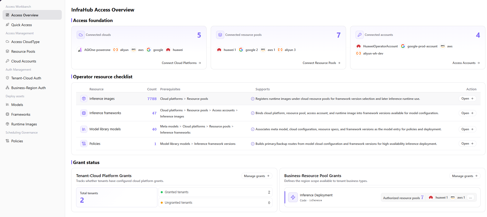

# Access Overview

:::: info Document Information
Version: v1.0
Updated: 2026-07-08
::::

## Feature Overview

`Access Overview` is used to maintain access accounts, resource pools, authorization status, deployment assets, and exception prompts, supporting multi-cloud scheduling, resource authorization, and model deployment workflows.

| Item | Content |
| --- | --- |
| Applicable role | Operator |
| Navigation path | Access Workbench > Access Overview |
| Page route | /operator/access-workbench/access-overview |
| Managed objects | Access accounts, resource pools, authorization status, deployment assets, and exception prompts |
| Typical use | Overview multi-cloud access progress and resource availability |

### Beginner View

Access Overview is like a dashboard for multi-cloud access. It does not replace specific configuration pages, but helps operators quickly see which accounts, resource pools, authorization items, and synchronization tasks are normal and which need handling.

### Terms

| Term | Description |
| --- | --- |
| Access progress | Completion status of cloud platforms, cloud accounts, resource pools, and authorization. |
| Exception task | Failed items in account validation, resource synchronization, or authorization synchronization. |
| Resource pool level | Overview of cloud resource pool capacity and utilization. |
| Authorization coverage | Scope of resources opened to tenants or business regions. |

## Prerequisites

1. At least one cloud platform or cloud account has been accessed.
2. The current account has permission to view Access Overview.
3. Resource pools, authorization, and synchronization tasks have been accessed according to plan.

## Page Description

The page summarizes cloud platform access progress, cloud account status, resource pool capacity, authorization coverage, and exception tasks. Operators can enter specific pages from the overview to handle credential failures, resource synchronization exceptions, or authorization gaps.

Page screenshot:

Used to quickly view access progress, exception tasks, resource pool levels, and authorization coverage.

## Main Operations

### Procedure

1. Go to `Access Workbench > Access Overview`.
2. View cloud platform, cloud account, resource pool, and authorization cards.
3. Locate failed accounts, failed resource pool synchronization, or unauthorized regions by exception status.
4. Click cards or details to jump to the corresponding feature page for handling.
5. Return to the overview after handling and confirm that status is restored.

### Parameters

| Field | Required | Type | Example | Description |
| --- | --- | --- | --- | --- |
| Statistics scope | Yes | Filter | `All cloud platforms` | Cloud platform or region scope counted by overview cards. |
| Cloud account status | System-generated | Enum | `Abnormal` | Aggregated status of account credentials and connectivity. |
| Resource pool level | System-generated | Percentage | `72%` | Overview of resource usage and remaining capacity. |
| Authorization coverage | System-generated | Number | `8 tenants` | Number of tenants or business regions with completed authorization. |
| Exception task | System-generated | List | `Synchronization failed` | Task type requiring operator handling. |

### Pitfalls

- Overview shows aggregated data. During troubleshooting, jump to the specific account, resource pool, or authorization page for verification.
- Statistics may have synchronization latency and should not replace the cloud provider's real-time console.
- Mask tenant names, cloud account names, and exception resource identifiers in screenshots.

### Result Validation

1. Overview cards show account, resource pool, authorization, and exception statistics.
2. Exception items can jump to the corresponding details page.
3. After exceptions are handled, overview status can update after synchronization.

## FAQ

### Overview Shows Abnormal but the Details Page Is Normal

**Issue Symptom:**

The overview card still shows abnormal, but records have recovered after entering the details page.

**Possible Causes:**

- Overview aggregated data has refresh latency.
- Exception tasks have been handled but statistical cache has not updated.
- The filter scope includes other abnormal objects.

**Handling:**

1. Refresh the overview and confirm the update time.
2. Clear filter scope and check again.
3. Wait for synchronization tasks to complete, then review.

### Overview Has No Resource Pool Level

**Issue Symptom:**

The resource pool card is empty or the level is 0.

**Possible Causes:**

- Resource pools have not synchronized.
- Cloud account validation failed.
- The current account has no permission to view resource pools.

**Handling:**

1. Check cloud account and resource pool synchronization status.
2. Confirm current account permissions.
3. Go to the resource pool page and verify resource recognition results.

## Next Steps

1. Handle abnormal cloud accounts.
2. Synchronize resource pool capacity.
3. Complete tenant and business region authorization.

## Notes

- Overview data may have synchronization latency.
- Exception items need to be handled on specific account, resource pool, or authorization pages.
- Mask cloud accounts, tenants, and resource identifiers before taking screenshots.
