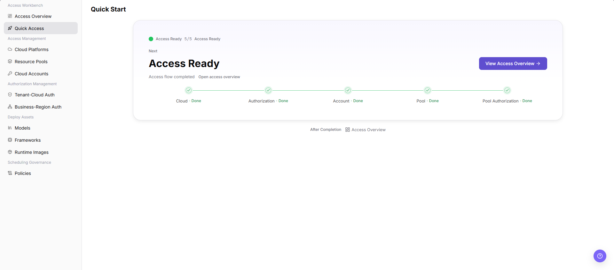

# Quick Access

::: info Document Information
Version: v1.0
Updated: 2026-07-08
:::

## Feature Overview

`Quick Access` is used in Access Workbench to view the access progress of cloud platforms, authorization, accounts, resource pools, and pool authorization. It helps operators confirm whether the cloud infrastructure access flow is complete and then open Access Overview for further checks.

| Item | Content |
| --- | --- |
| Applicable role | Operator |
| Navigation path | AI Infrastructure > On-Cloud > Access Workbench > Quick Access |
| Page route | `/infrahub/op/workbanch/quick` |
| Managed objects | Cloud platforms, authorization, accounts, resource pools, and pool authorization |
| Typical use | Confirm whether the access flow has been completed |

#### Beginner Explanation

Quick Access is like an access workflow checklist that connects Cloud, Authorization, Account, Pool, and Pool Authorization. It is suitable for step-by-step validation before a new environment goes live, but it does not replace detailed configuration on each access management page.

#### Terms Quick Reference

| Term | Description |
| --- | --- |
| Access status | Whether the current access flow has been completed, such as `Access Ready`. |
| Completion progress | Number of completed steps and total steps, such as `5/5`. |
| Access step | Flow nodes such as Cloud, Authorization, Account, Pool, and Pool Authorization. |
| Next | The next prompt or entry provided by the page based on the current status. |
| Access Overview | The page that summarizes the access foundation, operator resource checklist, and grant status. |

## Prerequisites

1. The current account has access to `Access Workbench > Quick Access`.
2. The cloud platform, authorization, account, resource pool, and pool authorization configurations to be checked are ready or accessible.
3. If you need to complete additional configuration, confirm the test tenant, business region, and resource boundaries first.

## Page Description

The page title is `Quick Start`, and the sidebar entry is `Quick Access`. The page shows `Access Ready`, completion progress, the next prompt, and access flow status, including `Cloud`, `Authorization`, `Account`, `Pool`, and `Pool Authorization`. The page provides `View Access Overview`; after completion, you can also open `Access Overview`.

Page screenshot:

## Main Operations

### Use Quick Access

1. Go to `AI Infrastructure > On-Cloud > Access Workbench > Quick Access`.
2. On the `Quick Start` page, check the `Access Ready` status and `5/5` completion progress.
3. Verify that `Cloud`, `Authorization`, `Account`, `Pool`, and `Pool Authorization` show `Done` in the flow.
4. If a step is incomplete, go to the corresponding page in the sidebar, such as `Cloud Platforms`, `Resource Pools`, `Cloud Accounts`, `Tenant-Cloud Auth`, or `Business-Region Auth`, and complete the configuration.
5. After completion, click `View Access Overview` or the lower `Access Overview` entry to view access details and follow-up checks.
6. For learning or page validation only, view the status, steps, and navigation entries. Do not perform final actions such as `Create`, `Access`, `Submit`, or `Save` on linked configuration pages.

## Parameter Reference

| Field Name | Required | Field Type | Example | Description |
| --- | --- | --- | --- | --- |
| Page title | System-generated | Text | `Quick Start` | Page title displayed for Quick Access. |
| Access status | System-generated | Status | `Access Ready` | Overall status of the current access flow. |
| Completion progress | System-generated | Number | `5/5` | Number of completed access steps and total steps. |
| Next | System-generated | Text / entry | `Access Ready` | Next prompt provided by the page based on current access status. |
| Cloud | System-generated | Step status | `Done` | Completion status of the cloud platform access step. |
| Authorization | System-generated | Step status | `Done` | Completion status of the authorization step. |
| Account | System-generated | Step status | `Done` | Completion status of the access account step. |
| Pool | System-generated | Step status | `Done` | Completion status of the resource pool access step. |
| Pool Authorization | System-generated | Step status | `Done` | Completion status of the pool authorization step. |
| View Access Overview | No | Action button | `View Access Overview` | Opens Access Overview to continue checking the access foundation, operator resources, and grant status. |

## Pitfalls

- The Quick Access page currently shows flow status and navigation entries. Specific cloud account, authorization, network, specification, or parameter configuration still needs to be verified on the corresponding management pages.
- `View Access Overview` only opens the overview page. If you continue configuring access objects from the overview page or sidebar, verify the impact scope again before any final confirmation.
- Before screenshots or external communication, redact cloud accounts, tenants, internal resource identifiers, access endpoints, Keys, Tokens, AK/SK, and internal test parameters.

## Result Validation

| Check Item | Success Signal | If Abnormal |
| --- | --- | --- |
| Page is accessible | The `Quick Start` page opens normally, and `Access Workbench > Quick Access` is highlighted in the sidebar. | Check account permissions, navigation path, and page loading status. |
| Access status displays normally | The page shows `Access Ready`, and completion progress shows `5/5` or matches the actual step status. | Refresh the page or go to the management page for the incomplete step and check configuration. |
| Flow steps display normally | `Cloud`, `Authorization`, `Account`, `Pool`, and `Pool Authorization` all show status. | Check access objects, authorization relationships, and resource synchronization status. |
| Overview entry can be opened | Clicking `View Access Overview` or `Access Overview` opens the Access Overview page. | Check target page permissions and route configuration. |
| Data is consistent with configuration | Quick Access step status is consistent with the configuration status on cloud platform, account, resource pool, and authorization pages. | Wait for synchronization to complete, or go to the corresponding page to troubleshoot incomplete items. |
| Learning validation does not submit | Only page fields and flow are viewed; no real create, access, submit, or save action is performed. | If a final action is triggered by mistake, follow the change audit process to check the impact scope. |

## FAQ

#### What if the access status is not Access Ready?

**Issue Symptom:**

The page does not show `Access Ready`, or completion progress is not `5/5`.

**Possible Causes:**

- The cloud platform, account, or resource pool has not been fully accessed.
- Authorization or pool authorization has not been completed.
- Access status has synchronization latency.

**Handling:**

1. Open the corresponding management page based on the incomplete step.
2. Check the status of cloud platform, account, resource pool, and authorization configurations.
3. After synchronization completes, return to Quick Access and review again.

#### What if no data is shown after opening Access Overview?

**Issue Symptom:**

Access Overview can be opened, but the access foundation, resource checklist, or grant status is empty.

**Possible Causes:**

- The current account does not have permission to the corresponding data.
- The access object was just configured, and statistics have not been synchronized.
- The access object is configured under another tenant, region, or resource scope.

**Handling:**

1. Confirm the current account permissions and data scope.
2. Go to the cloud platform, account, resource pool, or authorization page and check configuration.
3. Refresh Access Overview or wait for synchronization, then check again.

## Next Steps

1. Go to Access Overview to view the access foundation, operator resource checklist, and grant status.
2. For incomplete steps, go to the cloud platform, resource pool, account, or authorization page to complete configuration.
3. After confirming the access flow, go to Models, Frameworks, Runtime Images, or Policies to check deployment assets.

## Notes

- Quick Access may guide you to pages that configure real cloud resources, authorization relationships, or access tasks.
- `Create`, `Access`, `Submit`, and `Save` are high-risk final actions. Do not perform them during learning or screenshots.
- This document only describes viewing status, checking the flow, and opening details. It does not guide real configuration changes.
- Do not write real accounts, secrets, Tokens, AK/SK, internal access endpoints, cloud resource IDs, or internal test parameters in the document.
