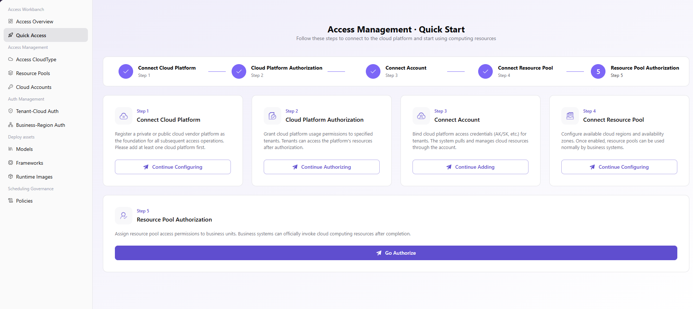

# Quick Access

::: info Document Information
Version: v1.0
Updated: 2026-07-06
:::

::: warning Security Notice
Do not expose real cloud accounts, AK/SK, Secret Key, access tokens, resource pool IDs, internal Endpoint, production instance names, or customer business identifiers in multi-cloud scheduling documentation. Use placeholders for all examples.
:::

## Feature Overview

`Quick Access` is used to maintain cloud platforms, cloud accounts, resource pools, tenant authorization, and deployment assets, supporting multi-cloud scheduling, resource authorization, and model deployment workflows.

| Item | Content |
| --- | --- |
| Applicable role | Operator |
| Navigation path | Access Workbench > Quick Access |
| Page route | /operator/access-workbench/quick-start |
| Managed objects | Cloud platforms, cloud accounts, resource pools, tenant authorization, and deployment assets |
| Typical use | Complete multi-cloud resource access through a guided workflow |

### Beginner View

Quick Access is like an access workflow checklist that connects "connect the cloud first, then synchronize resources, then authorize, and finally validate deployment". It is suitable for step-by-step validation before a new environment goes live, but it does not replace detailed configuration on each feature page.

### Terms

| Term | Description |
| --- | --- |
| Access step | Cloud platform, account, resource pool, and authorization steps in the Quick Access wizard. |
| Completion status | Whether each step is complete or requires handling. |
| Validation action | A test deployment or synchronization check used to confirm workflow closure. |
| Exception prompt | A failure reason and jump entry shown in the wizard. |

## Prerequisites

1. The current account has permission to access the Quick Access wizard.
2. Information required for cloud platforms, cloud accounts, resource pools, and authorization is ready.
3. The test tenant and business region used for validation have been confirmed.

## Page Description

The page guides operators through cloud platform access, cloud account validation, resource pool synchronization, authorization configuration, and deployment validation in sequence. Each step should return to the corresponding feature page to complete real configuration and result confirmation.

Page screenshot:

Complete access in the order of cloud platform, cloud account, resource pool, and authorization.

## Main Operations

### Procedure

1. Go to `Access Workbench > Quick Start`.
2. Follow the wizard to confirm cloud platform type and access account readiness.
3. Complete cloud account access and pass credential validation.
4. Synchronize resource pools and confirm regions, specifications, and capacity.
5. Configure tenant or business region authorization, then create a test deployment for validation.

### Parameters

| Field | Required | Type | Example | Description |
| --- | --- | --- | --- | --- |
| Step name | System-generated | Text | `Access Cloud Account` | Access stage in the wizard. |
| Completion status | System-generated | Enum | `Completed` | Used to determine whether the next step can be entered. |
| Target cloud platform | Conditionally required | Dropdown | `Alibaba Cloud` | Cloud platform currently handled by the wizard. |
| Validation action | System-generated | Text | `Create test deployment` | Used to confirm workflow closure. |
| Exception prompt | System-generated | Text | `Account validation failed` | Guides the user to the specific handling page. |

### Pitfalls

- Quick Access only provides workflow guidance. Key configurations still need to be verified on the cloud account, resource pool, and authorization pages.
- Do not skip test deployment, because authorization and scheduling issues are usually exposed during deployment.
- Mask cloud accounts, tenants, and internal resource identifiers in screenshots.

### Result Validation

1. All key wizard steps show completed.
2. Corresponding configurations are visible on the resource pool and authorization pages.
3. The test deployment can be created and enter a running or diagnosable state.

## FAQ

### The Wizard Stops at the Account Access Step

**Issue Symptom:**

The cloud account has been created, but Quick Access still indicates that the step is incomplete.

**Possible Causes:**

- Account validation has not passed.
- Wizard statistics have synchronization latency.
- The cloud platform that owns the account is inconsistent with the current wizard filter.

**Handling:**

1. Go to the cloud account page and check validation status.
2. Confirm the current cloud platform filter.
3. Refresh or wait for synchronization, then check again.

### Test Deployment Cannot Be Created

**Issue Symptom:**

Prerequisite steps show completed, but creating a test deployment fails.

**Possible Causes:**

- The resource pool is not authorized to the current tenant.
- The business region and resource pool region do not match.
- Deployment assets or runtime images are not ready.

**Handling:**

1. Check tenant-cloud authorization and business region authorization.
2. Verify resource pool region and capacity.
3. Confirm that model assets, runtime frameworks, and images are enabled.

## Next Steps

1. Standardize the access checklist.
2. Configure authorization for production tenants.
3. Go to My Deployments or the deployment page to verify service availability.

## Notes

- Quick Access is workflow guidance and does not replace detailed configuration on each feature page.
- Do not skip test deployment validation.
- Failed steps should be handled on the corresponding feature page.
