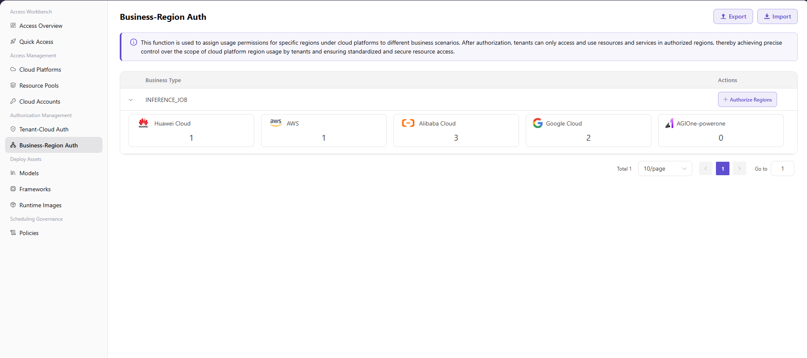

# Business Region Authorization

## Feature Overview

`Business Region Authorization` is used to maintain business regions, cloud resource pools, tenant scope, and authorization status, supporting multi-cloud scheduling, resource authorization, and model deployment workflows.

| Item | Content |
| --- | --- |
| Applicable role | Operator |
| Navigation path | Authorization Management > Business Region Authorization |
| Page route | /operator/auth-management/business-region-auth |
| Managed objects | Business regions, cloud resource pools, tenant scope, and authorization status |
| Typical use | Open resource pool capabilities to specified business regions |

### Beginner View

Business region authorization is like applying a tenant's resource usage permission to a concrete business area. Tenant authorization is only the first layer. After the business region matches, deployment requests can be scheduled to the correct cloud resources.

### Terms

| Term | Description |
| --- | --- |
| Business region | Resource area displayed to the business. |
| Authorization scope | Regions, tenants, or user collections allowed to use resource pools. |
| Resource pool mapping | Association between a business region and cloud resource pools. |
| Effective status | Whether the authorization configuration has been recognized by downstream deployment workflows. |

## Prerequisites

1. The target business region has been created.
2. Tenant cloud authorization and resource pools are ready.
3. The mapping between business regions and cloud regions has been confirmed.

## Page Description

The page is used to authorize cloud resource pools to specified business regions and control which resource ranges are available to different regions, business lines, or environments. Operators should keep business region, cloud region, and scheduling policy definitions consistent.

Page screenshot:

Used to confirm business regions, resource pools, and authorization status.

## Main Operations

### Procedure

1. Go to `Authorization Management > Business Region Authorization`.
2. Select a business region, tenant, or business line.
3. Select available cloud platforms, cloud regions, and resource pools.
4. Set enablement status, priority, or notes.
5. After saving, validate resource visibility on the deployment page by business region.

Key step screenshot:

Confirm the business region and resource scope before authorization.

### Parameters

| Field | Required | Type | Example | Description |
| --- | --- | --- | --- | --- |
| Business region | Yes | Dropdown | `East China Production` | Business region selected during user deployment. |
| Tenant | Conditionally required | Dropdown | `tenant-a` | Tenant scope to which the authorization applies. |
| Cloud region | Yes | Dropdown | `cn-shanghai` | Cloud provider region that actually hosts deployment. |
| Resource pool | Yes | Multi-select | `gpu-cn-shanghai-prod` | Resources schedulable by the business region. |
| Priority | No | Number | `10` | Selection order when multiple resource pools are available. |

### Pitfalls

- When business region names are similar, verify their codes to avoid authorizing the wrong environment.
- Cloud region and business region are not the same concept and should not be mixed directly.
- Resource pool priority changes affect scheduling results for subsequent deployments.

### Result Validation

1. The business region authorization record is enabled.
2. Users can see the target resources when selecting this business region.
3. Scheduling policies select the expected resource pool according to priority.

## FAQ

### No Available Specifications Under a Business Region

**Issue Symptom:**

After a user selects a business region, specifications or resource pools are empty.

**Possible Causes:**

- The business region is not bound to a resource pool.
- The resource pool has insufficient capacity or is disabled.
- Tenant cloud authorization is missing.

**Handling:**

1. Check business region authorization records.
2. Confirm resource pool status and capacity.
3. Return to the tenant cloud authorization page and verify upper-level authorization.

### Deployment Is Scheduled to an Unexpected Cloud Region

**Issue Symptom:**

After a user selects a business region, the deployment lands in another cloud region.

**Possible Causes:**

- The business region is bound to multiple cloud regions.
- The scheduling policy has fallback resource pools configured.
- The preferred resource pool has insufficient capacity.

**Handling:**

1. Check business region authorization and resource pool priority.
2. View fallback configuration in scheduling policies.
3. Verify scheduling reasons in deployment events.

## Next Steps

1. Maintain scheduling policies.
2. Validate the user quick deployment workflow.
3. Regularly review mappings between business regions and cloud regions.

## Notes

- Business region and cloud region are not the same concept.
- Resource pool priority affects subsequent scheduling.
- Cross-region scheduling requires latency, cost, and compliance assessment.
