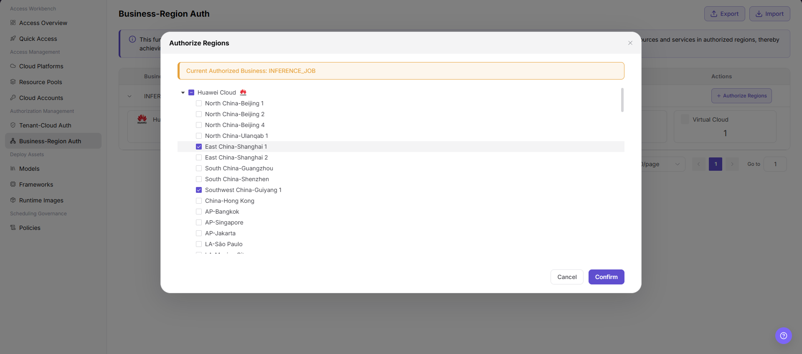

# Business-Resource Pool Authorization

## Preface

| Item            | Content                                                                                                                                                                                          |
| --------------- | ------------------------------------------------------------------------------------------------------------------------------------------------------------------------------------------------ |
| Target Audience | Operator                                                                                                                                                                                         |
| Navigation Path | Authorization Management > Business-Resource Pool Authorization                                                                                                                                  |
| Overview        | Assign the use permission of cloud platform regions to different business types, enabling refined control of tenants' access to cloud platform regions                              |

## Page Structure

### Search Area

The page top provides business type filter tags and search functionality, supporting quick location of target business types.

### Action Buttons

The page top-right provides **"Export"** and **"Import"** buttons for batch management of authorization configurations.

### Data List

The business type card list displays the configured business types (e.g., `INFERENCE_JOB` Inference Deployment), showing the cloud platform authorization statistics of each type.

## Operations

### Authorizing Regions

1. Enter the platform homepage, click the **"Authorization Management > Business-Resource Pool Authorization"** menu in the left navigation bar to enter the resource pool authorization management page.
2. After expanding the business type, the cloud platform authorized region count card grid (5 per row) is displayed below, e.g., Huawei Cloud `1` / AWS `1` / Alibaba Cloud `3` / Google Cloud `2` / AGIOne-powerone `0`, for quick viewing of authorization statistics.
3. Click the **"+ Authorize Region"** button on the right side of the business type to pop up the "Authorize Region" window.

4. The blue information bar at the top of the window displays **"Current Authorized Business: Inference Deployment"**.
5. In the tree structure, check the regions to be authorized by cloud platform group (e.g., China East 2 (Shanghai), China Hong Kong, Singapore, etc. under Alibaba Cloud). Unchecked regions are not authorized by default.
6. After confirming the selection is correct, click the **"Confirm"** button to complete the region authorization; to discard, click **"Cancel"**.

> Note: This function is used to assign the use permission of specific regions under the cloud platform to different business scenarios. After the authorization is completed, the tenant can only access and use the resources and services of the authorized regions, so as to achieve precise control of the tenant's use of the cloud platform regions and ensure the standardization and security of resource access.

#### Parameters

| Term | Type | Example | Description |
|------|------|---------|-------------|
| Business Type | Radio | `Inference Deployment` | Required. Identifies the business scenario that requires resource pool authorization |
| Cloud Platform | Checkbox | `Alibaba Cloud` / `Amazon` | Required. Select the cloud platform to be authorized (grouped by tree structure) |
| Region | Checkbox | `China East 2 (Shanghai)` / `China Hong Kong` | Required. Select the specific regions to be authorized under the selected cloud platform |
