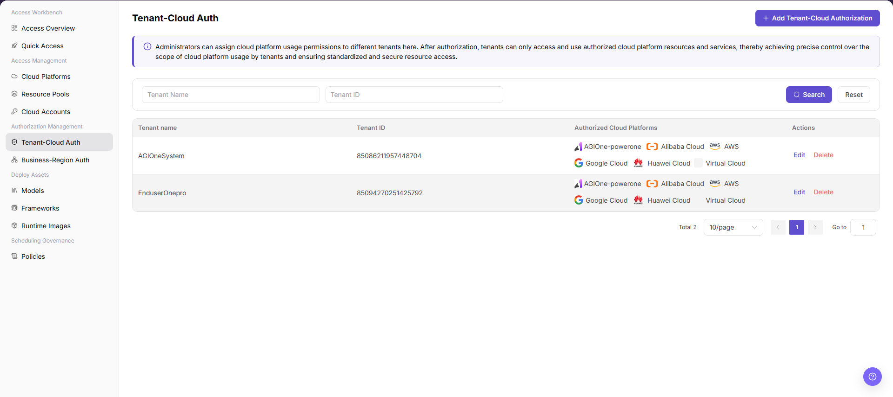
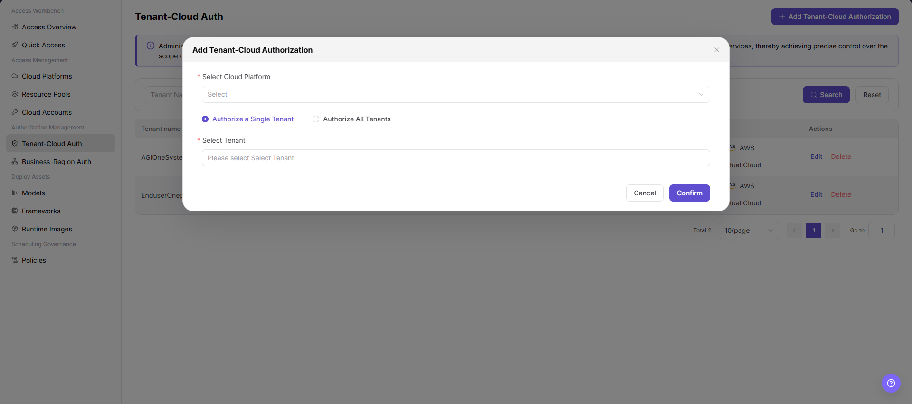

# Tenant-Cloud Auth

::: info Document Information
Version: v1.0
Updated: 2026-07-20
:::

## Feature Overview

`Tenant-Cloud Auth` is used to assign cloud platform usage permissions to different tenants. After authorization, tenants can only access and use authorized cloud platform resources and services, which helps control the cloud platform scope available to each tenant.

| Item | Content |
| --- | --- |
| Applicable role | Operator |
| Navigation path | AI Infra > On-Cloud > Authorization Management > Tenant-Cloud Auth |
| Page route | /infrahub/op/auth/platform-auth |
| Managed objects | Tenant, Tenant ID, authorized cloud platforms, and actions |
| Typical use | Authorize selected cloud platforms for one tenant or all tenants |

#### Beginner View

Tenant-cloud authorization works like issuing a cloud platform access pass to a tenant. A cloud platform being connected does not mean every tenant can use it. Only authorized tenants can access the corresponding cloud platform resources and services.

#### Terms

| Term | Description |
| --- | --- |
| Tenant | Organization or account scope authorized to use cloud platform resources and services. |
| Tenant ID | Unique identifier used on the page to distinguish tenants. |
| Authorized Cloud Platforms | Cloud platform scope assigned to the tenant. |
| Authorize a Single Tenant | Add authorization only for the selected tenant. |
| Authorize All Tenants | Authorize the selected cloud platform for all tenants. This has a wider impact scope. |

## Prerequisites

1. The target tenant has been created and can be selected from the tenant list.
2. The cloud platform to be authorized has been connected and is available.
3. The authorization target, cloud platform, and impact scope have been confirmed.

## Page Description

This page is used to view and maintain authorization relationships between tenants and cloud platforms. The list supports filtering by `Tenant Name` and `Tenant ID`, displays `Tenant name`, `Tenant ID`, `Authorized Cloud Platforms`, and `Actions`, and provides entries such as `Edit` and `Delete`.

Page screenshot:

## Main Operations

### Add Tenant-Cloud Authorization

1. Go to `AI Infra > On-Cloud > Authorization Management > Tenant-Cloud Auth`.
2. Click `Add Tenant-Cloud Authorization`.
3. In the dialog, select `Select Cloud Platform` as required by the page.
4. Select `Authorize a Single Tenant` or `Authorize All Tenants`. If you select single-tenant authorization, also fill in `Select Tenant`.
5. Before clicking the final `Confirm`, verify the cloud platform, authorization target, and impact scope again.
6. For learning or page validation only, click `Cancel` or close the dialog without submitting real authorization configuration.

Key step screenshot:

## Parameter Reference

| Field | Required | Type | Example | Description |
| --- | --- | --- | --- | --- |
| Tenant Name | No | Text | `Sample Tenant` | Filters authorization records by tenant name. Do not enter a real customer name in examples. |
| Tenant ID | No | Text/Number | `1000000000000000` | Filters authorization records by tenant identifier. The example value is for documentation only. |
| Authorized Cloud Platforms | Yes | List/Multiple values | `Alibaba Cloud` | Displays or selects the cloud platform scope available to the tenant. |
| Select Cloud Platform | Yes | Dropdown | `Alibaba Cloud` | Selects the cloud platform to authorize when adding authorization. |
| Authorization Mode | Yes | Radio | `Authorize a Single Tenant` | Selects whether to authorize one tenant or all tenants. |
| Select Tenant | Conditionally required | Dropdown | `Sample Tenant` | Required when `Authorize a Single Tenant` is selected. |
| Search | No | Button | `Search` | Queries authorization records with the current filters. |
| Reset | No | Button | `Reset` | Clears filters and restores the list display. |
| Edit | No | Action entry | `Edit` | Modifies an existing authorization. Confirm the impact scope before editing. |
| Delete | No | Action entry | `Delete` | Deletes authorization and may affect tenant resource availability. Use with caution. |
| Cancel | No | Button | `Cancel` | Closes the dialog without saving the current configuration. |
| Confirm | Yes | Button | `Confirm` | Submits the authorization configuration. Review carefully before clicking. |

## Pitfalls

- `Authorize All Tenants` expands the available cloud platform scope. Confirm that it matches the intended authorization boundary before submitting.
- `Confirm` is the final action that submits authorization. For learning or page validation only, cancel or close the dialog.
- `Edit` and `Delete` may affect real deployments, resource scheduling, cost ownership, and business availability.

## Result Validation

| Check Item | Success Criteria | Troubleshooting |
| --- | --- | --- |
| Page is accessible | The `Tenant-Cloud Auth` page and authorization list are displayed. | Check menu permissions, route, and login status. |
| Authorization list loads | The list displays tenant name, tenant ID, authorized cloud platforms, and action entries. | Check filters, data permissions, and API status. |
| Add entry is visible | `Add Tenant-Cloud Authorization` is displayed in the upper-right corner. | Check operator permissions and page configuration. |
| Add dialog opens | The dialog displays `Select Cloud Platform`, authorization mode, `Select Tenant`, `Cancel`, and `Confirm`. | Refresh the page and retry. If the issue persists, contact the administrator. |
| Filters work | Entering tenant name or tenant ID and clicking `Search` refreshes the list, and `Reset` clears filters. | Check filter values and returned data. |
| Authorization can be tracked | If a real submission is made, the new authorization record appears in the list and the authorized cloud platform matches the selection. | Return to the list and verify tenant, cloud platform, and authorization scope. |

## Troubleshooting

| Issue Type | Check First | Next Step |
| --- | --- | --- |
| Target tenant cannot be found | Whether the tenant has been created and whether the tenant name or tenant ID is correct. | Return to tenant management and confirm tenant status. |
| Cloud platform cannot be found | Whether the cloud platform has been connected and is available. | Return to the cloud platform access page and check access status. |
| Authorization is still unavailable after submission | Whether the authorization target, authorized cloud platform, and downstream business-region configuration are consistent. | Re-enter the deployment flow from the tenant perspective to verify. |
| Authorization scope is too broad | Whether `Authorize All Tenants` was selected by mistake. | Cancel submission or narrow the authorization scope through editing. |

## FAQ

#### Tenant Deployment Page Cannot See Resources

**Issue Symptom:**

After authorization, users still cannot select target cloud platform resources when creating a deployment.

**Possible Causes:**

- The wrong authorization target was selected.
- The target cloud platform is not connected or is in an abnormal state.
- Downstream business-region, resource pool, or deployment asset configuration has not synchronized yet.

**Handling:**

1. Check tenant name, tenant ID, and authorized cloud platform.
2. Confirm cloud platform access status and resource configuration.
3. Log in again from the tenant perspective and verify the deployment page.

#### Authorization Does Not Take Effect After Saving

**Issue Symptom:**

The authorization record exists, but downstream pages still show the old scope.

**Possible Causes:**

- Authorization cache or synchronization task has not refreshed.
- The wrong tenant was selected as the authorization target.
- The downstream page is still restricted by business-region, resource pool, or permission policies.

**Handling:**

1. Return to the list and confirm the authorized cloud platform and target tenant.
2. Wait for or trigger authorization synchronization.
3. Check business-region authorization, resource pool status, and user permissions.

## Next Steps

1. Continue confirming tenant-available regions on the business-region authorization page.
2. Check the model deployment or resource selection page from the tenant perspective.
3. Regularly review configurations such as `Authorize All Tenants` to avoid overly broad authorization.

## Notes

- Adding tenant-cloud authorization may change the cloud platforms, cloud accounts, resource pools, and regions that tenants can access.
- Authorization changes may affect real deployments, resource scheduling, cost ownership, and business availability.
- `Confirm`, `Save`, and `Submit` are high-risk final actions. This document only describes field review and pre-submission checks, and does not guide users to submit during testing or learning.
- Do not write real tenant names, accounts, passwords, keys, tokens, AK/SK, endpoints, cloud resource IDs, or internal test parameters.
