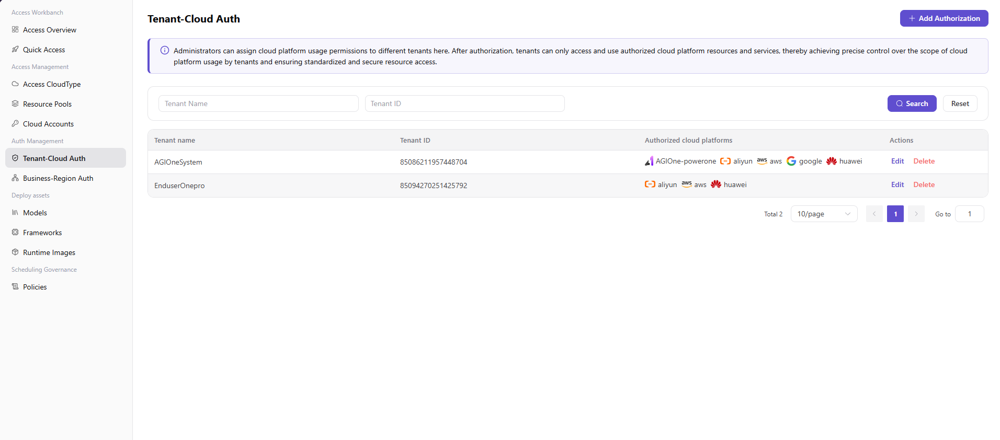

# Tenant Cloud Authorization

:::: info Document Information
Version: v1.0
Updated: 2026-07-08
::::

## Feature Overview

`Tenant Cloud Authorization` is used to maintain tenants, cloud accounts, resource pools, regions, and available permissions, supporting multi-cloud scheduling, resource authorization, and model deployment workflows.

| Item | Content |
| --- | --- |
| Applicable role | Operator |
| Navigation path | Authorization Management > Tenant Cloud Authorization |
| Page route | /operator/auth-management/tenant-cloud-auth |
| Managed objects | Tenants, cloud accounts, resource pools, regions, and available permissions |
| Typical use | Authorize cloud resource capabilities to specified tenants |

### Beginner View

Tenant cloud authorization is like assigning resource shelves to tenants. A resource pool existing only means "the warehouse has inventory". Only after authorization is complete can the tenant use these cloud resources during deployment.

### Terms

| Term | Description |
| --- | --- |
| Tenant | Organization or account scope authorized to use cloud resources. |
| Authorization scope | Cloud platforms, accounts, resource pools, and regions that the tenant is allowed to use. |
| Resource pool | Resource collection summarized by cloud account, region, and resource type. |
| Validity period | Time boundary for authorization to take effect and expire. |

## Prerequisites

1. The target tenant has been created.
2. Authorizable cloud platforms, cloud accounts, and resource pools have been accessed.
3. Authorization scope, validity period, and revocation strategy have been confirmed.

## Page Description

The page is used to configure available cloud platforms, cloud accounts, resource pools, and resource scope by tenant. Operators should confirm tenant ownership, permission boundaries, and resource quotas to avoid overly broad authorization or authorization to the wrong region.

Page screenshot:

Used to view tenants, cloud accounts, resource pools, and validity periods.

## Main Operations

### Procedure

1. Go to `Authorization Management > Tenant Cloud Authorization`.
2. Select the target tenant and view existing authorization scope.
3. Select available resources by cloud platform, cloud account, resource pool, and region.
4. Set enablement status, validity period, or notes.
5. After saving, validate from the tenant perspective whether the corresponding resources can be selected on the deployment page.

Key step screenshot:

Follow the least-privilege principle when adding authorization.

### Parameters

| Field | Required | Type | Example | Description |
| --- | --- | --- | --- | --- |
| Tenant | Yes | Dropdown | `tenant-a` | Tenant authorized to use cloud resources. |
| Cloud platform | Yes | Dropdown | `Alibaba Cloud` | Cloud platform covered by the authorization. |
| Resource pool | Yes | Multi-select | `gpu-cn-shanghai-prod` | Resource collections the tenant can use. |
| Validity period | No | Date range | `2026-07-01 to 2026-12-31` | Controls the temporary authorization boundary. |
| Authorization status | Yes | Enum | `Enabled` | Controls whether the authorization takes effect. |

### Pitfalls

- Tenant authorization does not mean the business region is already available. Configure business region authorization when necessary.
- Do not reuse customer-dedicated resources across tenants in the authorization scope.
- Before revoking authorization, confirm whether the tenant has running deployments.

### Result Validation

1. The tenant authorization list shows the target cloud platform and resource pool.
2. The user deployment page can show authorized resources.
3. Unauthorized tenants cannot select this resource pool.

## FAQ

### Tenant Deployment Page Cannot See Resources

**Issue Symptom:**

After authorization, users still cannot select the target resource pool when creating a deployment.

**Possible Causes:**

- Business region authorization has not been configured.
- The resource pool is not enabled or capacity is 0.
- The user account does not belong to the target tenant or lacks permissions.

**Handling:**

1. Check business region authorization.
2. Confirm resource pool status and capacity.
3. Verify the user's tenant and menu permissions.

### Authorization Does Not Take Effect After Saving

**Issue Symptom:**

The authorization record exists, but downstream pages still show the old scope.

**Possible Causes:**

- Authorization cache or synchronization task has not refreshed.
- Authorization status is disabled.
- The wrong tenant was selected as the authorization object.

**Handling:**

1. Confirm authorization status and target tenant.
2. Wait for or trigger authorization synchronization.
3. Log in again from the user perspective to verify.

## Next Steps

1. Configure business region authorization.
2. Set quotas or scheduling policies for the tenant.
3. Guide users to create cloud model deployments.

## Notes

- Tenant authorization is not the same as business region authorization.
- Configure authorization scope by the minimum necessary principle.
- Confirm impact on running deployments before revoking authorization.
