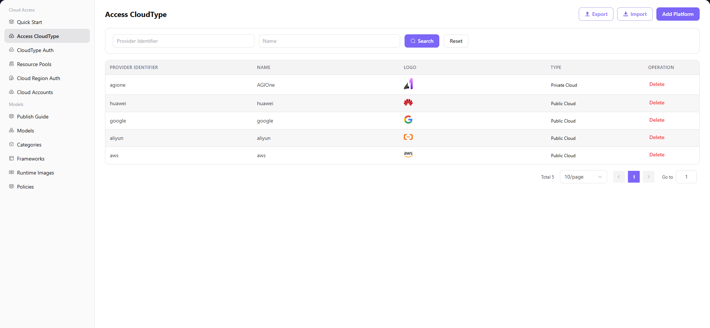

# Access CloudType

## Introduction

| Item                 | Content                                                                                                                |
| -------------------- | ---------------------------------------------------------------------------------------------------------------------- |
| Applicable Role      | Operator                                                                                                               |
| Navigation Path      | Cloud Access > Access CloudType                                                                                        |
| Function Description | Manage public and private cloud vendor platform information to lay the foundation for subsequent cloud resource access |

## Page Structure

### Search Area

The page top provides search and filter functions, supporting quick positioning of target cloud platforms by Provider Identifier and Name.

### Action Area

The upper right corner provides **"Export"**, **"Import"**, and **"Add Platform"** buttons for batch configuration management.

### Data List

The data table area displays the list of accessed cloud platforms, including platform identifier, name, logo, type, and operation columns.

### Page Screenshot

## Operations

### Add Platform

1. On the platform home page, click **"Cloud Access > Access CloudType"** in the left navigation menu to enter the cloud platform management page.
2. Click the **"Add Platform"** button in the upper right corner to open the "Add Platform" dialog.
3. Configure cloud platform information:
   - Select **Cloud Platform Type** (Public Cloud / Private Cloud)
   - Fill in / select **Provider Identifier**
   - Configure **Multi-language Display Name** (fill in names for English and Simplified Chinese environments separately)
   - (Required for Private Cloud) **Link Address**
   - Upload **Logo** image
4. After confirming all information is correct, click the **"Confirm"** button to complete the addition.

#### Parameters

| Field | Type | Example | Description |
|-------|------|---------|-------------|
| Cloud Platform Type | Single Select | `Public Cloud` / `Private Cloud` | Required, identifies the cloud platform type |
| Provider Identifier | Text / Dropdown | `aliyun` / `agione-powerone` | Required, unique identifier of the cloud platform |
| Display Name (Multi-language) | Text | `aliyun` / `Aliyun` | Required, configure display names for English and Simplified Chinese environments separately |
| Link Address | Text | `http://test.metis.opr` | Required for Private Cloud, access address of the private cloud platform |
| Logo | Image | `Aliyun Logo` | Optional, cloud platform icon for display |

## Other Operations

| Operation | Steps |
|-----------|-------|
| Delete Platform | Click the **"Delete"** button of the target cloud platform → **This operation is irreversible**, please proceed with caution |
| Export / Import Configuration | Click the **"Export"** / **"Import"** button in the upper right corner → Batch manage cloud platform configurations |

## Notes

- Before adding a cloud platform, ensure the platform type (Public/Private Cloud) is selected correctly
- The Provider Identifier is unique and cannot be modified after creation
- The Link Address for Private Cloud platforms is used for system access to that platform; please ensure the address is accessible
- Logo images are recommended to use PNG format with transparent background for the best display effect
- **The delete operation is irreversible**. After deletion, all associated resources under that platform will not function properly. Please proceed with caution.