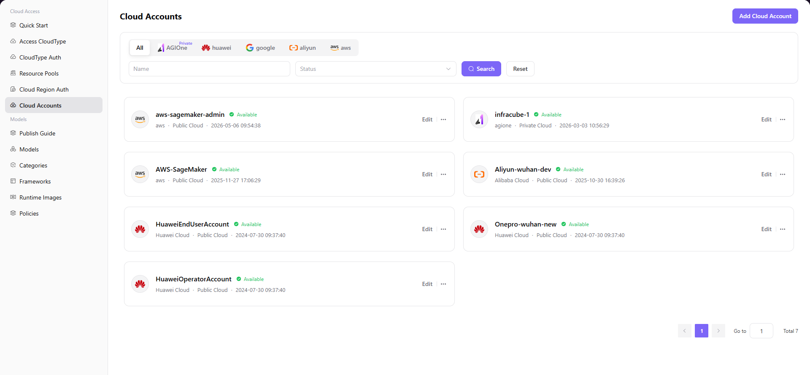

# Cloud Accounts

## Introduction

| Item                 | Content                                                                                                      |
| -------------------- | ------------------------------------------------------------------------------------------------------------ |
| Applicable Role      | Operator                                                                                                     |
| Navigation Path      | Cloud Access > Cloud Accounts                                                                                |
| Function Description | Manage cloud platform access credentials (AK/SK) to pull and manage cloud resources through these accounts |

## Page Structure

### Search Area

The page top provides cloud platform filter tabs (All, Private, AGIOne, huawei, google, aliyun, aws), account name search box, status dropdown selection, and **"Search"** and **"Reset"** operation buttons.

### Action Area

The upper right corner provides **"Add Cloud Account"** button for adding new accounts.

### Data List Description

The account card list displays connected cloud accounts as cards, showing account name, cloud platform, status, type, and creation time.

### Page Screenshot

## Operations

### Add Cloud Account

1. Navigate to the platform homepage, click **"Cloud Access > Cloud Accounts"** in the left sidebar to enter the Cloud Accounts management page.
2. Click the **"Add Cloud Account"** button in the upper right corner to open the "Add Account" dialog.
3. Configure account information:
   - Fill in the **Account Name** to identify the cloud account
   - Select the **Cloud Platform** from the dropdown (e.g., Aliyun, Amazon, Huawei Cloud, etc.)
   - Enter the target cloud platform's **Access Key ID**
   - Enter the target cloud platform's **Access Key Secret**
4. After confirming all information is correct, click **"Confirm"** to complete the addition.

#### Parameters

| Field | Type | Example | Description |
|-------|------|---------|-------------|
| Account Name | Text | `aliyun-wh-dev` | Required, custom account identifier |
| Cloud Platform | Dropdown | `Aliyun` | Required, select the target cloud platform |
| Access Key ID | Text | `your-access-key-id` | Required, cloud platform access credential ID |
| Access Key Secret | Text | `your-access-key-secret` | Required, cloud platform access credential key |

## Other Operations

| Operation      | Steps                                                                                                                                                                                                       |
| -------------- | ----------------------------------------------------------------------------------------------------------------------------------------------------------------------------------------------------------- |
| Edit account   | Click the **"..."** (more) button in the upper right corner of the target account card → Select **"Edit"** → Modify account information → Click **"Confirm"**                                               |
| Delete account | Click the **"..."** (more) button in the upper right corner of the target account card → Select **"Delete"** → Confirm operation (**Data cannot be recovered after deletion, please operate with caution**) |

## Notes

- When adding a cloud account, please ensure the Access Key ID and Access Key Secret match those in the cloud platform console. Otherwise, resource pulling will fail.
- **The delete operation is irreversible**. Data cannot be recovered after deletion. Please operate with caution.
- It is recommended to regularly check account status to ensure account credentials are valid and can normally access cloud platform resources.
