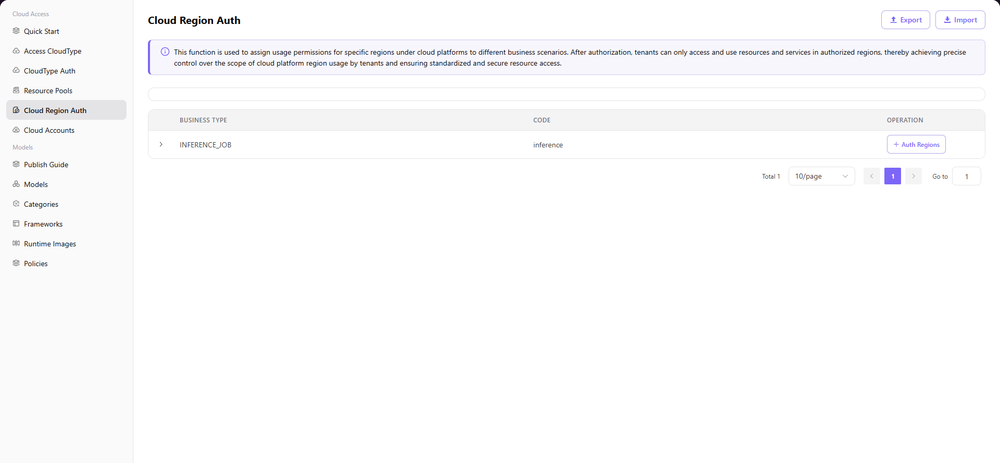

# Cloud Region Auth

## Introduction

| Item                 | Content                                                                                                      |
| -------------------- | ------------------------------------------------------------------------------------------------------------ |
| Applicable Role      | Operator                                                                                                     |
| Navigation Path      | Cloud Access > Cloud Region Auth                                                                             |
| Function Description | Assign cloud platform region usage permissions to different business types for precise control over tenant access scope |

## Page Structure

### Search Area

The page top provides business type filter tabs and search functionality to quickly locate target business types.

### Action Area

The upper right corner provides **"Export"** and **"Import"** buttons for batch management of authorization configuration.

### Data List Description

The business type card list displays configured business types (e.g., `INFERENCE_JOB`), showing cloud platform authorization statistics for each type.

### Page Screenshot

## Operations

### Authorize Regions

1. Navigate to the platform homepage, click **"Cloud Access > Cloud Region Auth"** in the left sidebar to enter the Cloud Region Auth page.
2. Find the target business type (e.g., `"inference"`), click the **"Auth Regions"** button on the right side to open the "Auth Regions" dialog.
3. In the dialog, check the cloud platform regions you need to authorize (e.g., Amazon Europe (Frankfurt), Aliyun East China 2 (Shanghai), etc.).
4. After confirming the selection is correct, click **"Confirm"** to complete region authorization.

#### Parameters

| Field | Type | Example | Description |
|-------|------|---------|-------------|
| Business Type | Text | `inference` | Required, identifies the business scenario for resource pool authorization |
| Cloud Platform | Multi-select | `Aliyun` / `Amazon` | Required, select the cloud platform to authorize |
| Region | Multi-select | `East China 2 (Shanghai)` / `Europe (Frankfurt)` | Required, select the specific regions to authorize |

## Other Operations

| Operation | Steps |
|-----------|-------|
| Export / Import configuration | Click **"Export"** / **"Import"** button in the upper right corner → Batch management of resource pool authorization configuration |
| View authorization statistics | View the number of authorized regions for each cloud platform under the business type card |

## Notes

- After resource pool authorization is completed, tenants can only access and use resources and services in authorized regions. Please configure with caution.
- The Export/Import functions are used for batch management of resource pool authorization configuration. Please ensure the imported file format is correct to avoid overwriting existing data.