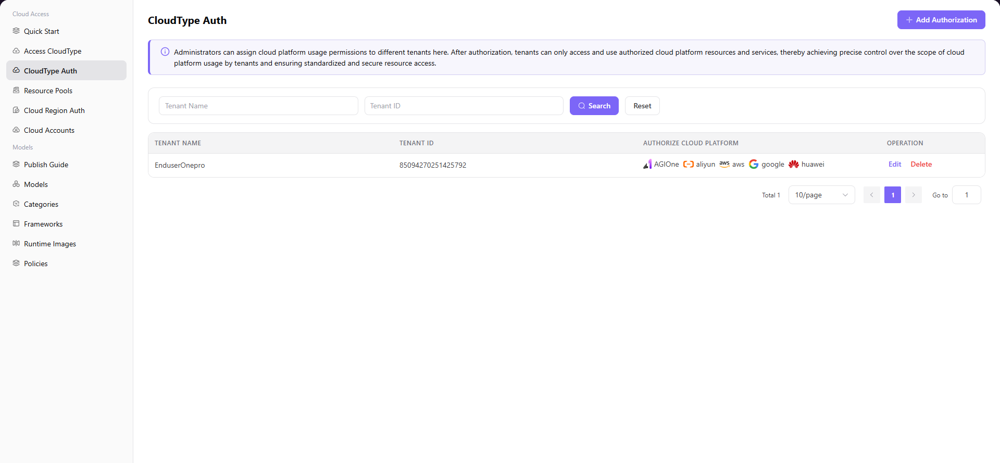

# CloudType Auth

## Introduction

| Item                 | Content                                                                                                 |
| -------------------- | ------------------------------------------------------------------------------------------------------- |
| Applicable Role      | Operator                                                                                                |
| Navigation Path      | Cloud Access > CloudType Auth                                                                           |
| Function Description | Assign cloud platform usage permissions to different tenants for precise control over cloud usage scope |

## Page Structure

### Search Area

The page top provides Tenant Name and Tenant ID filter input fields with **"Search"** and **"Reset"** buttons.

### Action Area

The upper right corner provides **"Add Authorization"** button. The notice area displays current function description.

### Data List Description

The data table area displays the list of authorized tenants, including tenant name, tenant ID, authorized cloud platforms, and operation columns.

### Page Screenshot

## Operations

### Add Authorization

1. On the platform home page, click **"Cloud Access > CloudType Auth"** in the left navigation menu to enter the cloud platform authorization management page.
2. Click the **"Add Authorization"** button in the upper right corner to open the "Add Authorization" dialog.
3. In the "Select Cloud Platform" dropdown list, check the cloud platforms to be authorized (e.g., Aliyun, AGIOne-powerone).
4. Select the authorization scope:
   - If authorizing for a specified tenant, select **Single Tenant Authorization**, and fill in the target tenant name in the "Select Tenant" input field
   - If authorizing for all tenants, select **Authorize All Tenants**
5. After confirming all configurations are correct, click the **"Confirm"** button to complete the authorization.

#### Parameters

| Field                 | Type                  | Example                                             | Description                                                                     |
| --------------------- | --------------------- | --------------------------------------------------- | ------------------------------------------------------------------------------- |
| Select Cloud Platform | Multi-select Dropdown | `Aliyun`, `AGIOne-powerone`                         | Required, supports selecting multiple cloud platforms simultaneously            |
| Authorization Scope   | Single Select         | Single Tenant Authorization / Authorize All Tenants | Required, determines the authorization target                                   |
| Select Tenant         | Text                  | `dushuangyan01`                                     | Required when using Single Tenant Authorization, fill in the target tenant name |

## Other Operations

| Operation | Steps |
|-----------|-------|
| Edit Authorization | Find the target tenant row in the list → Click **"Edit"** button → Modify cloud platform selections (tenant cannot be edited) → Click **"Confirm"** |
| Delete Authorization | Find the target tenant row in the list → Click **"Delete"** button → **This operation is irreversible**, please proceed with caution |

## Notes

- Before authorization, ensure the target tenant exists and the cloud platform is correctly accessed to the system
- When selecting "Authorize All Tenants" as the authorization scope, newly registered tenants will automatically obtain usage permissions for that cloud platform
- **The delete authorization operation is irreversible**. After deletion, the related tenant will no longer be able to access that cloud platform. Please proceed with caution
- Cloud platform authorization is a prerequisite for tenants to use cloud resources. Unauthorized tenants cannot access any cloud platform resources