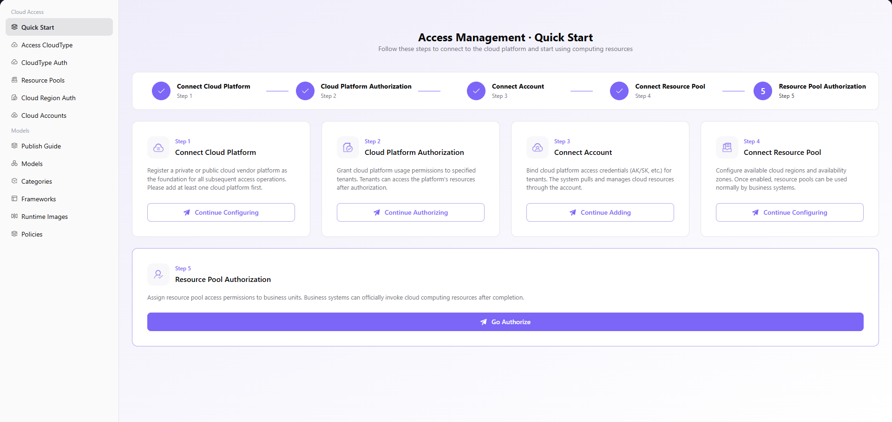

# Quick Start

## Introduction

| Item                 | Content                                                                           |
| -------------------- | --------------------------------------------------------------------------------- |
| Applicable Role      | Operator                                                                          |
| Navigation Path      | Cloud Access > Quick Start                                                        |
| Function Description | A quick start page that guides users through cloud platform access in 5 steps |

## Page Structure

### Search Area

N/A (this page is a guide page, no search functionality required).

### Action Area

Each step card provides corresponding operation buttons: **"Continue Configuring"**, **"Continue Authorizing"**, **"Continue Adding"**, or **"Go Authorize"**.

### Data List Description

The step flow area displays a 5-step guide process, including step number, step name, and operation button.

### Page Screenshot

## Operations

Follow the page guidance and complete the following 5 steps in order:

### Step 1: Connect Cloud Platform

Click **"Continue Configuring"** to register or add a public or private cloud vendor platform as the foundation for all subsequent access operations.

### Step 2: Cloud Platform Authorization

Click **"Continue Authorizing"** to grant cloud platform usage permissions to specified tenants. Tenants can access the platform's resources after authorization.

### Step 3: Connect Account

Click **"Continue Adding"** to bind cloud platform access credentials (AK/SK, etc.) for tenants. The system pulls and manages cloud resources through the account.

### Step 4: Connect Resource Pool

Click **"Continue Configuring"** to configure available cloud regions and availability zones. Once enabled, resource pools can be used normally by business systems.

### Step 5: Resource Pool Authorization

Click **"Go Authorize"** to assign resource pool access permissions to business units. Business systems can officially invoke cloud computing resources after completion.

## Notes

- Before performing access operations, ensure you have administrator permissions for the target cloud platform
- Cloud platform authorization must be performed for specific tenants. Unauthorized tenants cannot use the corresponding cloud resources
- When accessing accounts, keep AK/SK credentials properly and avoid leakage
- After enabling resource pool regions, do not arbitrarily disable them to avoid affecting online business