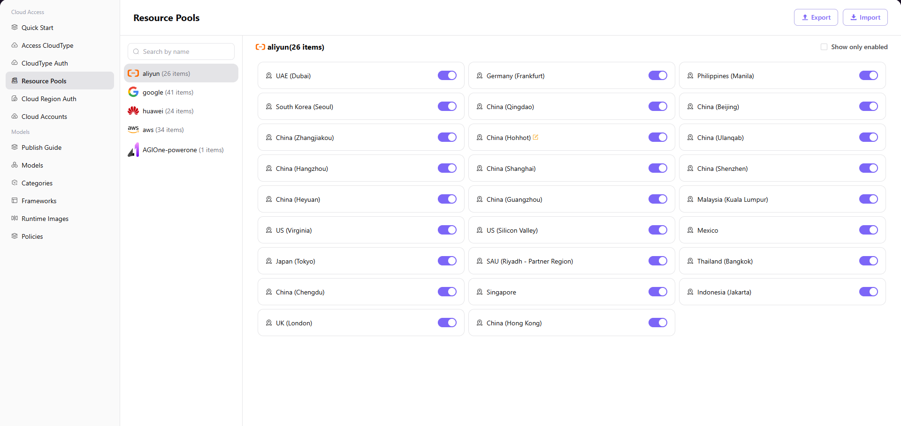

# Resource Pools

## Introduction

| Item                 | Content                                                                                                      |
| -------------------- | ------------------------------------------------------------------------------------------------------------ |
| Applicable Role      | Operator                                                                                                     |
| Navigation Path      | Cloud Access > Resource Pools                                                                                |
| Function Description | Configure enable/disable states for cloud provider regions and edit region display names for unified multi-cloud management |

## Page Structure

### Search Area

The top toolbar provides **"Show only enabled"** filter checkbox to filter regions by enabled state.

### Action Area

The upper right corner provides **"Export"** and **"Import"** buttons for batch management of resource pool configuration.

### Data List Description

The page uses a dual-column layout with cloud provider list on the left and region cards on the right:

- **Left Cloud Provider Panel**: Displays connected cloud platforms (google, huawei, aws, aliyun) with region count statistics for each
- **Right Region Management Area**: Shows all regions under the selected cloud platform as cards, including region name, enable/disable switch, and edit operation entry

### Page Screenshot

## Operations

### Enable / Disable Resource Pool Regions

1. Navigate to the platform homepage, click **"Cloud Access > Resource Pools"** in the left sidebar to enter the Resource Pools management page.
2. Select the target cloud provider on the left (e.g., Aliyun, Huawei Cloud, etc.).
3. In the region list on the right, find the region you need to enable/disable and click the switch button on the right side of the region card:
   - When the switch is in the "on" state, the region is enabled
   - Click the switch to toggle the region's enable/disable state

### Edit Region Display Name

1. Navigate to the platform homepage, click **"Cloud Access > Resource Pools"** in the left sidebar to enter the Resource Pools management page.
2. Select the target cloud provider on the left and find the region you need to edit.
3. Click the edit icon on the region card to open the "Edit Name" dialog.
4. Configure multilingual display names:
   - Fill in the display name for **English** environment (e.g., `China (Shanghai)`)
   - Fill in the display name for **Chinese Simplified** environment (e.g., `华东2（上海）`)
5. After confirming the configuration is correct, click **"Confirm"** to complete the modification.

## Other Operations

| Operation | Steps |
|-----------|-------|
| Show only enabled | Check the **"Show only enabled"** checkbox in the upper right corner → Only shows enabled regions |
| Export / Import configuration | Click **"Export"** / **"Import"** button in the upper right corner → Batch management of resource pool configuration |

## Notes

- When a region switch is enabled, the resource pool for that region will be available for normal use by the business system. Please operate with caution.
- When editing region display names, you need to configure names for both English and Chinese Simplified environments to ensure correct display on multilingual interfaces.
- The Export/Import functions are used for batch management of resource pool configuration. Please ensure the imported file format is correct to avoid overwriting existing data.