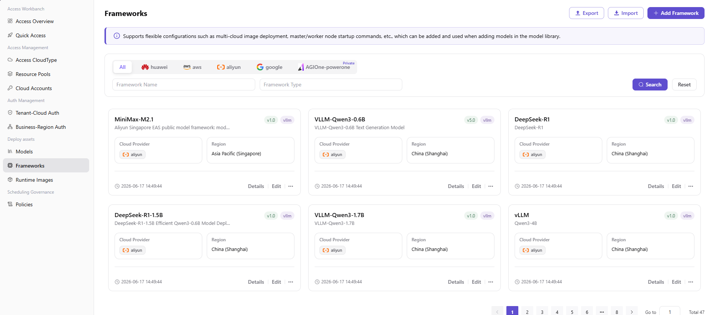
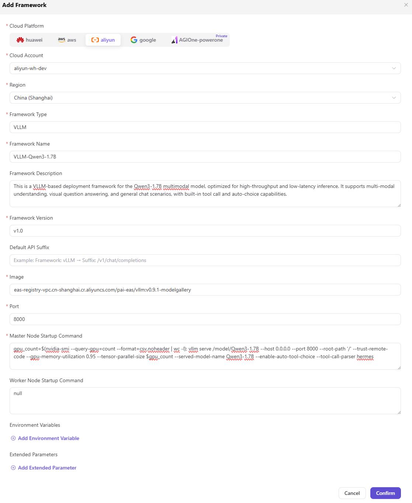

# Inference Frameworks

## Preface

| Item            | Content                                                                                                                                                                                  |
| --------------- | ---------------------------------------------------------------------------------------------------------------------------------------------------------------------------------------- |
| Target Audience | Operator                                                                                                                                                                                 |
| Navigation Path | Deployment Assets > Inference Frameworks                                                                                                                                                |
| Overview        | Manage the inference runtime environment configuration of models, define framework type, version, image address, port, and startup command, providing basic runtime environment support for model deployment |

## Page Structure

### Search Area

The page top provides cloud platform filter (All / AGIONE / Huawei Cloud / Google Cloud / Alibaba Cloud), framework name search box, framework type search box, and **"Search"** and **"Reset"** buttons.

### Action Buttons

The page top-right provides **"Export"**, **"Import"**, and **"Add Framework"** buttons for batch configuration management and framework creation.

### Data List

The data table displays the framework list, including framework name, description, version, framework type, cloud platform, region, creation time, and action columns (Details / Edit / ...).

## Operations

### Adding a Framework

1. Enter the platform homepage, click the **"Deployment Assets > Inference Frameworks"** menu in the left navigation bar to enter the inference frameworks page.
2. Click the **"Add Framework"** button at the top right of the page to pop up the "Add Framework" window.

3. In the **"Basic Information"** area, fill in:
   - **"Framework Icon"**: Click **"Select Image"** to upload the framework logo (supports jpg/png/svg, file ≤ 1MB, optimal size 64x64).
   - **"Framework Name"** (Multilingual): Simplified Chinese (e.g., `vllm`) / English (e.g., `vllm`) two tabs maintained independently.
   - **"Framework Type"** (Multi-select Enum): vllm / tgi / sglang / ollama / asr / tts / sdk-stable-diffusion / comfyui, at least 1 must be selected.
   - **"Framework Description"** (Multilingual): Simplified Chinese / English two tabs maintained independently, supports rich text format.
4. In the **"Runtime Environment"** area, fill in:
   - **"Image"**: Click the **"Select Image"** button to single-select the target image from the image list (e.g., `eas-registry-vpc.cn-shanghai.cr.aliyuncs.com/pai-eas/vllmv:0.9.1-modelgallery`). Hover the mouse over the image to view the version.
   - **"Port"**: Fill in the service port exposed by the framework at runtime (default `8000`).
   - **"Startup Command"** (Multi-select Form): Maintain the startup commands of the framework in list form (e.g., `--port 8000 --model {model_name} --trust-remote-code`). Each command item contains Protocol (e.g., http) / Command Content, supporting add / delete.
5. After confirming all configurations are correct, click the **"Save"** button to complete the framework addition; to discard, click **"Cancel"**.

#### Parameters - Basic Information

| Term | Type | Example | Description |
|------|------|---------|-------------|
| Framework Icon | Upload | — | Required. Supports jpg/png/svg, file ≤ 1MB, optimal 64x64 |
| Framework Name (Multilingual) | Text | Chinese `vllm` / English `vllm` | Required. Two tabs maintained independently |
| Framework Type | Multi-select | `vllm`, `tgi`, `sglang` | Required. At least 1 must be selected |
| Framework Description (Multilingual) | Rich Text | — | Optional. Two tabs maintained independently |

#### Parameters - Runtime Environment

| Term | Type | Example | Description |
|------|------|---------|-------------|
| Image | Radio | `eas-registry-vpc.cn-shanghai.cr.aliyuncs.com/pai-eas/vllmv:0.9.1-modelgallery` | Required. Select from the image list |
| Port | Number | `8000` | Required. The service port exposed by the framework |
| Startup Command | List | `--port 8000 --model {model_name} --trust-remote-code` | Required. Multiple commands are supported |

## Other Operations

| Operation | Steps |
|-----------|-------|
| Edit Framework | Click the target framework's **"Edit"** button → Modify the framework type, name, description, etc. → Click **"Confirm"** |
| View Details | Click the target framework's **"Details"** button → View basic information and version configuration in the "Framework Information" and "Version Information" tabs → Click the back arrow at the top left to exit |
| Add Version | Click the target framework's **"..."** (More) button → Select **"Add Version"** → Fill in the version number, image, port, startup command, etc. → Click **"Confirm"** |
| Uninstall Framework | Click the target framework's **"..."** (More) button → Select **"Uninstall"** → Confirm operation (**Data cannot be recovered after uninstallation. Please operate with caution.**) |
| Export / Import Configuration | Click the **"Export"** / **"Import"** buttons at the top right of the page → Batch management of inference framework configurations |

## Notes

- **Deletion operations are irreversible.** Please operate with caution.
- When configuring the image address, ensure that the image has been correctly pushed to the container image repository of the corresponding cloud platform.
- The startup command needs to be configured according to the actual model and framework requirements. Incorrect startup commands may cause deployment failure.
- In multi-cloud scenarios, ensure that the account permissions of each cloud platform are sufficient (at least permissions to read the image repository and call GPU instances are required).
