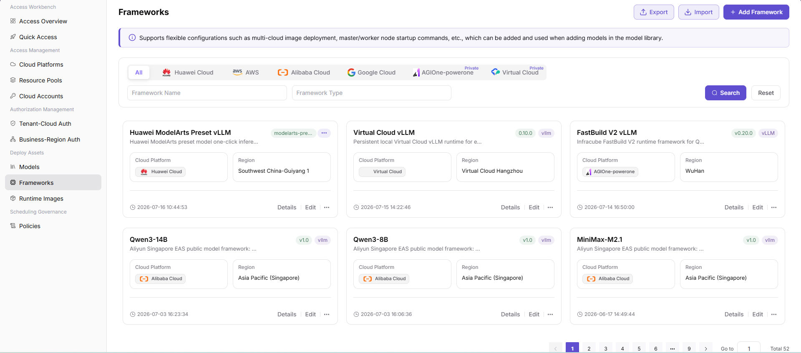
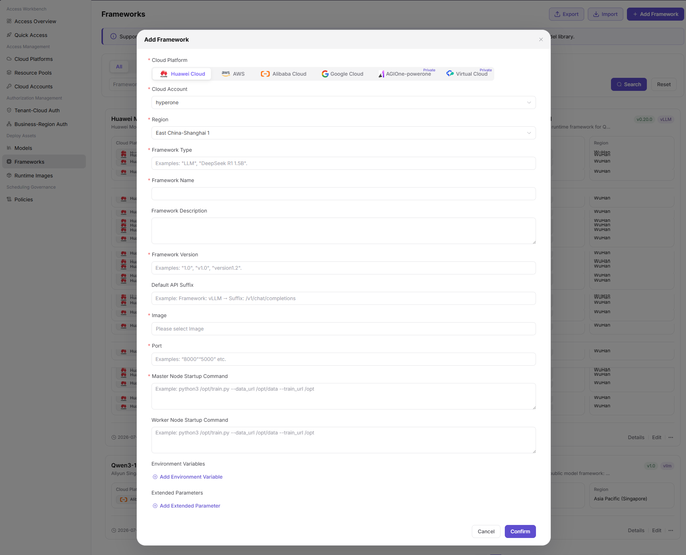

# Framework Assets

:::: info Document Information
Version: v1.0
Updated: 2026-07-08
::::

## Feature Overview

`Framework Assets` is used to maintain runtime frameworks, framework versions, startup commands, ports, and image relationships, supporting multi-cloud scheduling, resource authorization, and model deployment workflows.

| Item | Content |
| --- | --- |
| Applicable role | Operator |
| Navigation path | Deployment Assets > Frameworks |
| Page route | /operator/deploy-assets/frameworks |
| Managed objects | Runtime frameworks, framework versions, startup commands, ports, and image relationships |
| Typical use | Maintain runtime frameworks used during model deployment |

### Beginner View

A deployment framework is like the starter for a model service. It defines how the model starts, which port it listens on, which environment variables it needs, and how it works with runtime images and model assets.

### Terms

| Term | Description |
| --- | --- |
| Runtime framework | Framework or service process that hosts model inference services. |
| Startup command | Command that loads the model and starts the service after the container starts. |
| Service port | Port listened on by the model service. |
| Framework version | Version identifier for framework capabilities and compatibility. |

## Prerequisites

1. The target runtime framework, startup command, and service port have been confirmed.
2. Compatible runtime images and resource specifications are ready.
3. Health check and environment variable requirements have been confirmed.

## Page Description

The page is used to maintain cloud deployment frameworks, including framework type, startup command, service port, health check, default environment variables, and compatible models. Operators should ensure that frameworks match runtime images, model assets, and cloud resource specifications.

Page screenshot:

Used to view framework names, runtime environments, and availability status.

## Main Operations

### Procedure

1. Go to `Deployment Assets > Deployment Frameworks`.
2. Filter records by framework type, enablement status, or keyword.
3. When adding a framework, fill in the name, startup command, port, and health check.
4. Associate compatible runtime images, model types, or resource specifications.
5. After saving, create a deployment with a test model to validate startup results.

Key step screenshot:

When adding, verify startup command, port, and health check.

### Parameters

| Field | Required | Type | Example | Description |
| --- | --- | --- | --- | --- |
| Framework name | Yes | Text | `vllm-openai` | Framework name displayed on the deployment page. |
| Startup command | Yes | Text | `python -m vllm.entrypoints.openai.api_server` | Command used by the container to start the model service. |
| Service port | Yes | Number | `8000` | Port listened on by the model service. |
| Health check path | No | Text | `/health` | Used to determine whether the service is ready. |
| Compatible image | Conditionally required | Multi-select | `vllm-runtime:latest` | Runtime images that can be used with this framework. |

### Pitfalls

- Do not hardcode real model paths, keys, or internal download addresses in startup commands.
- If the port is inconsistent with the port exposed by the runtime image, deployment may succeed but the service may be inaccessible.
- Framework changes affect subsequent new deployments. Whether running instances are affected must be confirmed according to platform mechanisms.

### Result Validation

1. The framework record is enabled.
2. The deployment page can select this framework and compatible images.
3. Test deployment events show that service health checks pass.

## FAQ

### Framework Startup Fails

**Issue Symptom:**

The deployment instance enters failed status or restarts repeatedly after creation.

**Possible Causes:**

- Startup command parameters are incorrect.
- The image lacks framework dependencies.
- Model path or environment variables do not match.

**Handling:**

1. View deployment events and container logs.
2. Verify startup command, port, and environment variables.
3. Revalidate with a compatible image.

### Framework Is Unavailable on the Deployment Page

**Issue Symptom:**

The framework has been maintained, but users cannot see it when creating a deployment.

**Possible Causes:**

- The framework is not enabled.
- The current model type or runtime image is not associated.
- The user's business region has no corresponding deployment asset permission.

**Handling:**

1. Confirm framework enablement status.
2. Complete model type and image associations.
3. Verify business region and tenant authorization.

## Next Steps

1. Maintain runtime images.
2. Associate model assets.
3. Create a test deployment to validate framework availability.

## Notes

- Do not hardcode keys or internal paths in startup commands.
- Ports must match the ports exposed by images.
- After framework changes, validate with a test deployment.
