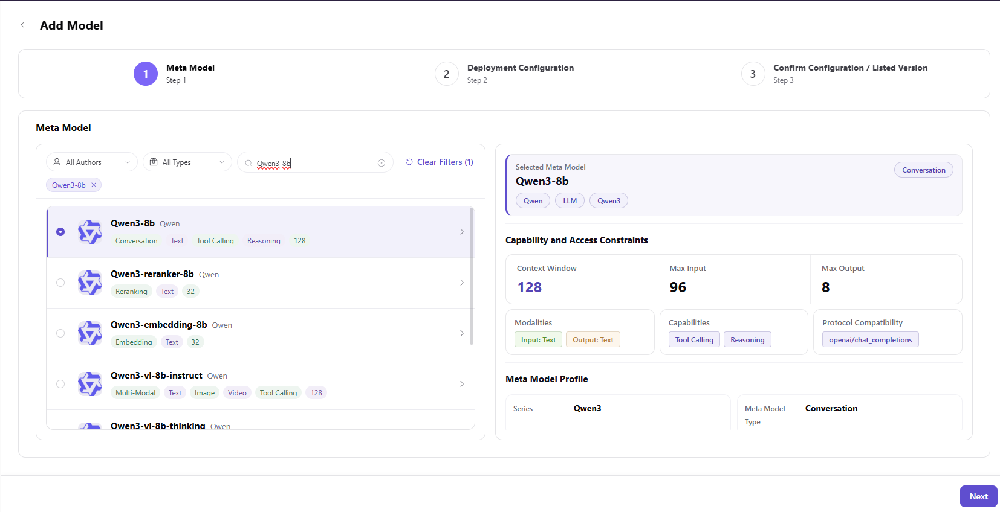
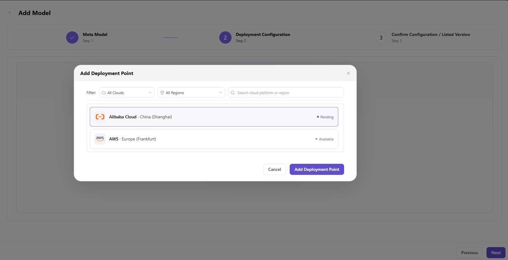
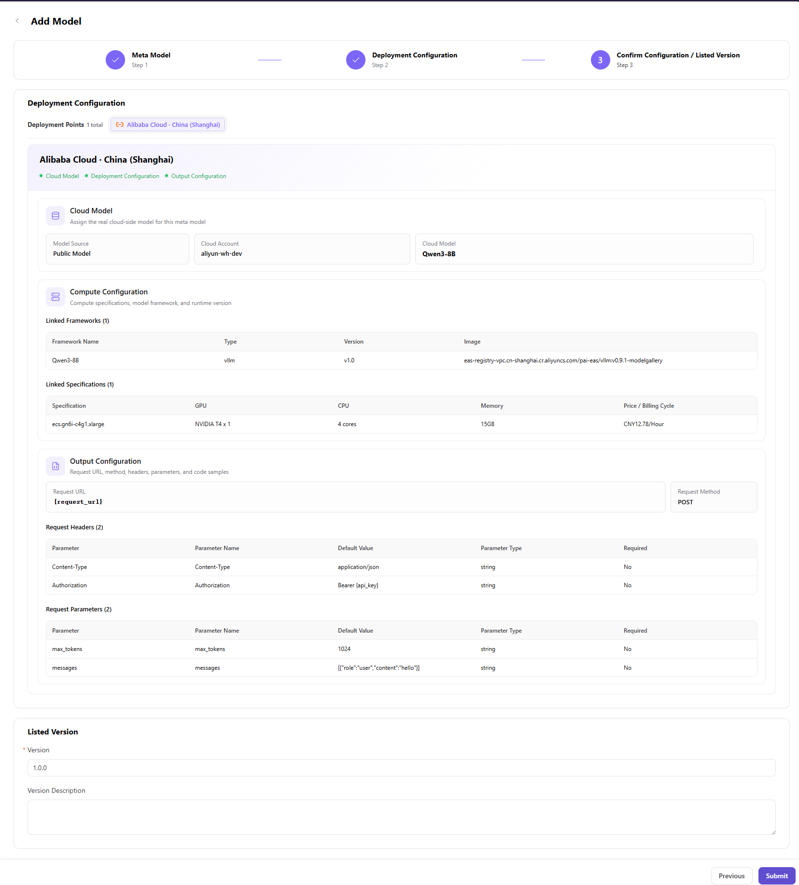

# Model Assets

::: info Document Information
Version: v1.0
Updated: 2026-07-06
:::

::: warning Security Notice
Model assets may include model IDs, providers, deployment parameters, invocation examples, and pricing criteria. Do not expose real Endpoint, API Key, internal model IDs, customer pricing policies, or unpublished model information.
:::

## Feature Overview

`Model Assets` is used to maintain deployable models, meta-models, output configurations, request parameters, and code examples, supporting multi-cloud scheduling, resource authorization, and model deployment workflows.

| Item | Content |
| --- | --- |
| Applicable role | Operator |
| Navigation path | Deployment Assets > Models |
| Page route | /operator/deploy-assets/models |
| Managed objects | Deployable models, meta-models, output configurations, request parameters, and code examples |
| Typical use | Maintain deployable cloud model assets |

### Beginner View

Model assets are like dish descriptions on a deployment menu. They tell users which models can be deployed, which meta-model each model belongs to, what invocation parameters are used, and how invocation examples are generated after deployment.

### Terms

| Term | Description |
| --- | --- |
| Meta-model | Abstract model that describes model base capabilities and protocol. |
| Output configuration | Configuration that generates invocation address, request method, request headers, and parameters after deployment. |
| Model parameters | Default request parameters passed to the model service. |
| Code example | SDK, curl, or HTTP example generated for callers. |

## Prerequisites

1. Meta-model, provider, and deployment framework are ready.
2. Request URL, default parameters, and output configuration have been confirmed.
3. Model asset authorization scope and business region have been confirmed.

## Page Description

The page is used to maintain deployable model assets, including model name, meta-model, provider, request parameters, output configuration, and code examples. Operators should ensure that model assets are consistent with deployment frameworks, runtime images, and authorized resources.

Page screenshot:

Used to view deployable models, meta-models, and deployment configurations.

## Main Operations

### Procedure

1. Go to `Deployment Assets > Models`.
2. Filter by model name, meta-model, provider, or enablement status.
3. When adding a model asset, fill in model name, meta-model, and provider information.
4. Configure request URL placeholder examples, request parameters, output fields, and code examples.
5. After saving, confirm that users can select this model on the Quick Deployment page.

Key step screenshots:

First confirm that model capabilities match the meta-model.

Deployment points determine which cloud resources the model can be deployed to.

The compute plan must be consistent with resource pool capacity and scheduling policies.

Before submission, confirm that no real keys or internal Endpoint values exist in the configuration.

### Parameters

| Field | Required | Type | Example | Description |
| --- | --- | --- | --- | --- |
| Model name | Yes | Text | `qwen-cloud-7b` | Display name of the cloud deployment asset. |
| Meta-model | Yes | Dropdown | `Qwen Text` | Associated model capability, protocol, and modality. |
| Provider | Conditionally required | Dropdown | `provider-a` | Model source or cloud provider supplier. |
| Request URL | Conditionally required | URL | `https://api.example.com/v1/chat/completions` | Use placeholders only. Real internal addresses are prohibited. |
| Default parameters | No | JSON | `{"max_tokens":1024}` | Default request parameters used during deployment invocation. |

### Pitfalls

- Before enabling a model asset, confirm that framework, image, and resource specification are all available.
- Request URL, request headers, and code examples can only use placeholders.
- Before taking a model asset offline, check whether existing user deployments depend on it.

### Result Validation

1. The model asset is visible in the list and its status is enabled.
2. The Quick Deployment page can select this model.
3. Generated invocation examples do not contain real credentials or internal addresses.

## FAQ

### Users Cannot See the Model on the Deployment Page

**Issue Symptom:**

A model asset has been created, but users cannot select it during Quick Deployment.

**Possible Causes:**

- The model asset is not enabled.
- No available framework or runtime image is bound.
- The model is not authorized to the user's business region.

**Handling:**

1. Confirm model asset enablement status.
2. Verify framework, image, and resource specification associations.
3. Check tenant and business region authorization.

### Invocation Example Is Incorrect After Deployment

**Issue Symptom:**

The service is created successfully, but the path or parameters in the invocation example are unavailable.

**Possible Causes:**

- Output configuration field mapping is incorrect.
- Meta-model protocol does not match request parameters.
- Code examples still use old-version parameters.

**Handling:**

1. Check output configuration and protocol path.
2. Verify meta-model default parameters.
3. Regenerate or update code examples.

## Next Steps

1. Maintain deployment frameworks and runtime images.
2. Configure business region authorization.
3. Create one quick deployment from the user perspective.

## Notes

- Request URL and request headers can only use placeholders.
- Check existing deployment dependencies before taking a model offline.
- Invocation examples must not contain real credentials.
