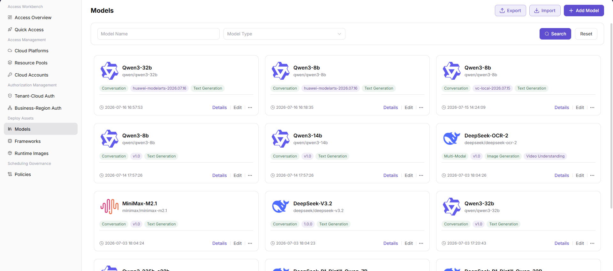
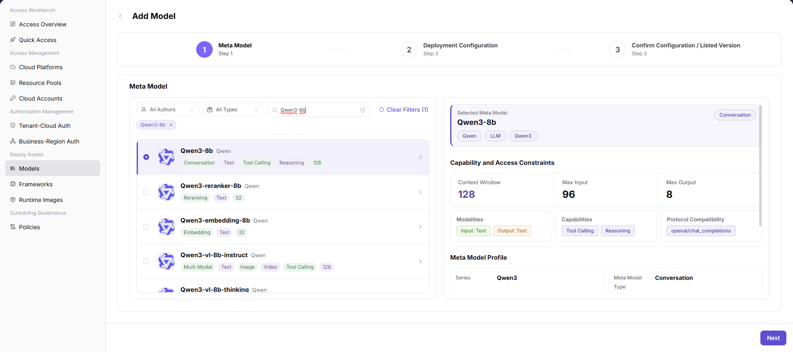
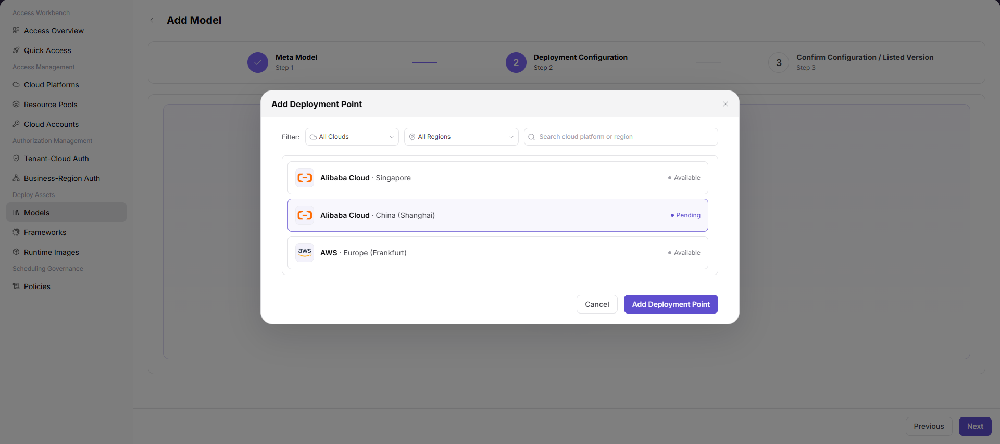
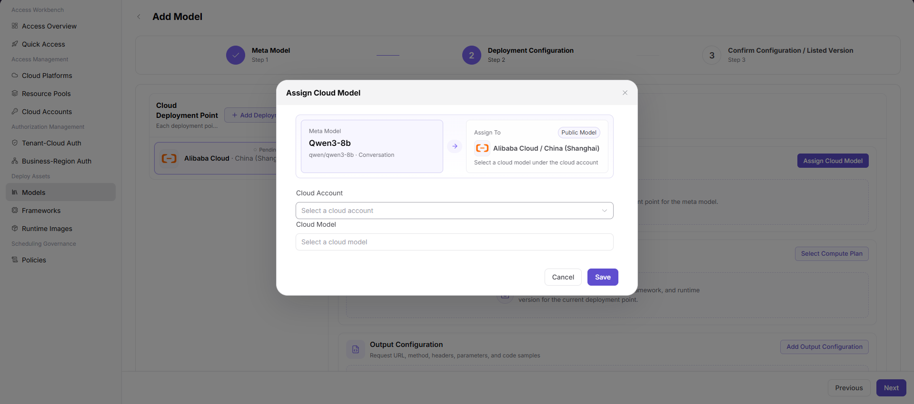
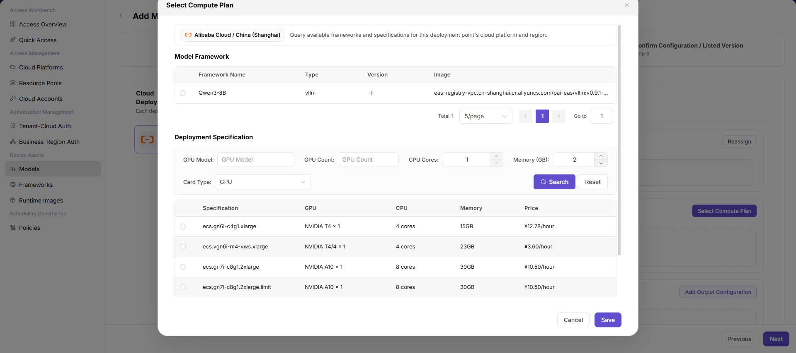
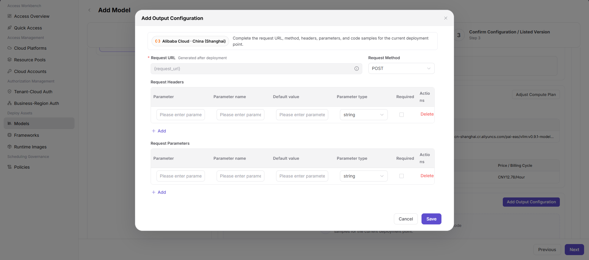
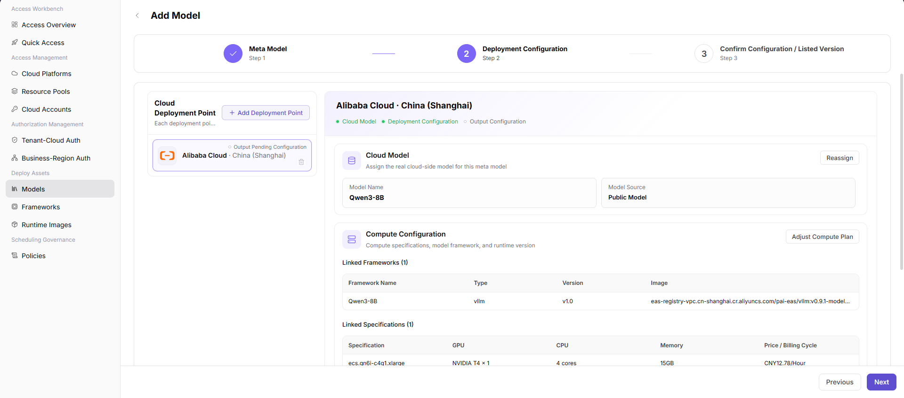

# Models

::: info Document Information
Version: v1.0
Updated: 2026-07-20
:::

## Feature Overview

`Models` is used to maintain model assets that can be deployed on cloud. Operators can view the model list and use the `Add Model` flow to select a meta model, configure cloud deployment points, assign a cloud model, select a compute plan, and complete output configuration.

| Item | Content |
| --- | --- |
| Applicable role | Operator |
| Navigation path | AI Infrastructure > On-Cloud > Deploy Assets > Models |
| Page route | `/infrahub/op/model/model` |
| Managed objects | Models, meta models, cloud deployment points, cloud models, compute configuration, and output configuration |
| Typical use | Add deployable model assets for later quick access or deployment flows |

#### Beginner Explanation

The Models page works like the model shelf in the deployment flow. `Add Model` first selects the model capability definition, then binds it to a specific cloud platform, region, cloud model, and compute configuration, and finally completes the request URL, method, parameters, and code samples generated after deployment.

#### Terms Quick Reference

| Term | Description |
| --- | --- |
| Meta Model | Base model definition that describes capabilities, modalities, protocol compatibility, and context window. |
| Cloud Deployment Point | Deployment target composed of a cloud platform and region. |
| Cloud Model | Real cloud-side model under a cloud account that can be referenced by the model asset. |
| Compute Plan | Runtime configuration such as model framework, image, CPU, memory, GPU, and specification. |
| Output Configuration | Configuration used to generate request URL, request method, request headers, request parameters, and code samples after deployment. |

## Prerequisites

1. The target meta model has been configured and can be selected in the `Meta Model` step.
2. The cloud platform, region, cloud account, and cloud model to be used have been connected.
3. The model framework, inference image, and available specifications are ready.
4. The model source, runtime configuration, output configuration, and authorization scope have been confirmed.

## Page Description

This page is used to view and add model assets. The list supports filtering by `Model Name` and `Model Type`, and provides `Search`, `Reset`, `Export`, `Import`, and `Add Model`. Model cards display model name, model identifier, model type, version, capability tags, update time, and action entries such as `Details`, `Edit`, and more actions.

Page screenshot:

## Main Operations

### Add Model

1. Go to `AI Infra > On-Cloud > Deploy Assets > Models`.
2. Click `Add Model` to open the add model page.
3. In the `Meta Model` step, filter by author, type, or keyword, select the target meta model, and verify the selected meta model, capability and access constraints, modalities, capabilities, protocol compatibility, and meta model profile.
4. Click `Next` to enter `Deployment Configuration`.
5. Click `Add Deployment Point`, select a cloud platform and region according to the page filters, and save the deployment point.
6. In the deployment point, click `Assign Cloud Model`, select `Cloud Account` and `Cloud Model`, and click `Save`.
7. Click `Select Compute Plan` or `Adjust Compute Plan`, select the model framework, image, and deployment specification, verify GPU, CPU, memory, and price/billing cycle, and click `Save`.
8. Click `Add Output Configuration`, configure request URL, request method, request headers, request parameters, parameter type, and required flag, and click `Save`.
9. Before clicking `Next` to enter `Confirm Configuration / Listed Version`, verify the model source, cloud deployment point, cloud model, compute plan, and output configuration again.
10. For learning or page validation only, stay at field review and configuration verification. Do not submit real model configuration or list a version.

Key step screenshots:

## Parameter Reference

| Field | Required | Type | Example | Description |
| --- | --- | --- | --- | --- |
| Model Name | Yes | Text | `Sample Model` | Model name displayed in the Models list and details. |
| Model Type | No | Dropdown/Tag | `Conversation` | Used to filter or identify the model capability type. |
| Meta Model | Yes | Single select | `Sample Meta Model` | Base model definition selected in the first add model step. |
| Cloud Deployment Point | Yes | List/Selection | `Sample Cloud - Sample Region` | Each deployment point binds one cloud platform and region. |
| Cloud Account | Conditionally required | Dropdown | `Sample Cloud Account` | Cloud account selected when assigning a cloud model. |
| Cloud Model | Conditionally required | Dropdown | `Sample Cloud Model` | Cloud-side model that can be bound to the current model. |
| Model Framework | Yes | Single select/Table | `Sample Framework` | Framework that can run the model. |
| Type | No | Text | `vllm` | Model framework type. |
| Version | No | Text | `v1.0` | Framework or model version. |
| Image | Yes | Text | `registry.example.com/runtime:tag` | Runtime image address. Use placeholders only in documentation. |
| GPU Model | No | Text | `Sample GPU` | Used to filter deployment specifications. |
| GPU Count | No | Number | `1` | Used to filter deployment specifications. |
| CPU Cores | No | Number | `4` | CPU configuration in a deployment specification. |
| Memory (GB) | No | Number | `16` | Memory configuration in a deployment specification. |
| Card Type | No | Dropdown | `GPU` | Card type used when filtering specifications. |
| Specification | Yes | Single select | `example.spec` | Actual deployment specification name. |
| Price / Billing Cycle | No | Text | `--` | Price or billing cycle shown on the page. Confirm cost impact before configuration. |
| Request URL | Yes | Text | `{request_url}` | Generated after deployment. Do not write real internal addresses. |
| Request Method | Yes | Dropdown | `POST` | Request method in output configuration. |
| Request Headers | No | Table | `Authorization` | Request header configuration. Do not write real credentials. |
| Request Parameters | No | Table | `temperature` | Request parameter configuration. |
| Parameter type | No | Dropdown | `string` | Type of a request header or request parameter. |
| Required | No | Checkbox | `Yes` | Marks whether a parameter is required. |
| Save | Yes | Button | `Save` | Saves the current dialog or configuration block. |
| Next | Yes | Button | `Next` | Moves to the next configuration step. |

## Pitfalls

- Adding a model is a multi-step configuration. Mismatches between meta model, cloud model, framework, image, and specification may cause later deployment failures.
- Image addresses, request URLs, request headers, default parameter values, and code samples must use placeholders or sanitized content.
- `Import` may update model assets in bulk, and `Export` may contain sensitive operational configuration. Do not perform real import or export during learning or validation.
- The screenshots do not show a standalone storage path field, so this page does not document storage path as a confirmed UI field.

## Result Validation

| Check Item | Success Criteria | Troubleshooting |
| --- | --- | --- |
| Page is accessible | The `Models` page and model card list are displayed. | Check menu permissions, route, and login status. |
| Model list loads | The list displays model name, model type, version, tags, and action entries. | Check filters, data permissions, and API status. |
| Add entry is visible | `Add Model` is displayed in the upper-right corner. | Check operator permissions and page configuration. |
| Add flow opens | The `Meta Model`, `Deployment Configuration`, and `Confirm Configuration / Listed Version` flow opens. | Refresh the page and retry. If the issue persists, contact the administrator. |
| Required fields and validation prompts work | Meta model, deployment point, cloud account, cloud model, compute plan, and output configuration can be completed according to page prompts. | Complete the prompted fields and verify cloud platform, account, and resource status. |
| No real submission during learning | No real save, submit, or listing action is performed. | If submitted by mistake, immediately check affected model assets, deployment points, and output configuration. |
| Real submission can be tracked | The new model appears in the list, and status, deployment point, framework, and output configuration can be viewed. | Return to model details and verify downstream deployment flow. |

## FAQ

#### Users Cannot See the Model on the Deployment Page

**Issue Symptom:**

A model asset has been created, but users cannot select it in the quick access or deployment flow.

**Possible Causes:**

- Model configuration is incomplete or no version has been listed.
- Cloud deployment point, cloud model, compute plan, or output configuration is missing.
- Tenant-cloud authorization or business-region authorization is incomplete.

**Handling:**

1. Check deployment points, cloud model, compute plan, and output configuration in model details.
2. Confirm whether model confirmation or listing has been completed.
3. Verify tenant and business-region authorization.

#### Invocation Example Is Incorrect After Deployment

**Issue Symptom:**

The service is created successfully, but the URL, request method, headers, or parameters in the invocation example are unavailable.

**Possible Causes:**

- Output configuration field mapping is incorrect.
- Required request headers or request parameters are missing.
- Code samples still use old-version parameters or unsanitized content.

**Handling:**

1. Check request URL, request method, request headers, and request parameters in output configuration.
2. Verify parameter type, default value, and required flag.
3. Save output configuration again and regenerate the invocation example.

## Next Steps

1. Review deployment points, compute plan, and output configuration on the model details page.
2. Configure or check Tenant-Cloud Auth and Business-Region Auth.
3. Validate from the user perspective that the model can be selected in quick access or deployment flows.

## Notes

- Adding a model may register real model files, image addresses, cloud models, and runtime configuration.
- Incorrect model source, image, file path, or runtime framework may cause deployment failure, resource waste, or exposure of sensitive model assets.
- `Save`, `Submit`, `OK`, and `List` are high-risk final actions. This document only describes field review and pre-submission checks, and does not guide users to submit during testing or learning.
- Do not write real model repository URLs, keys, tokens, AK/SK, internal storage paths, cloud resource IDs, internal endpoints, or internal test parameters.
