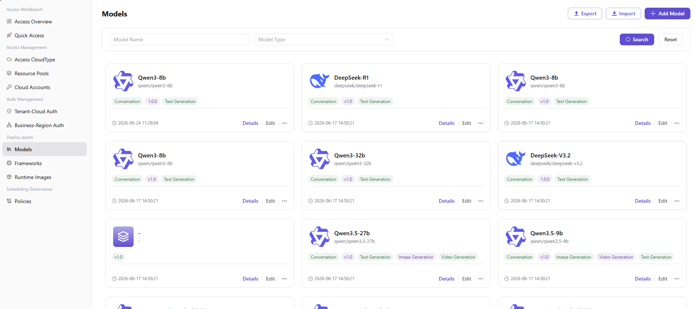
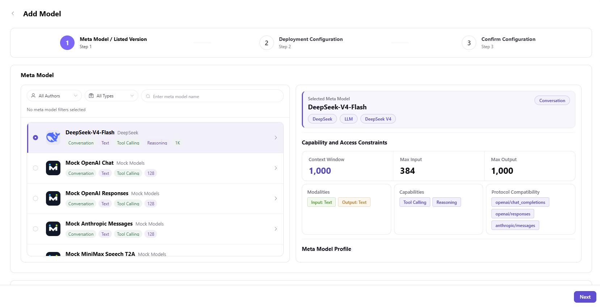
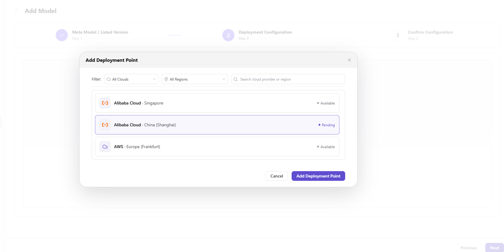
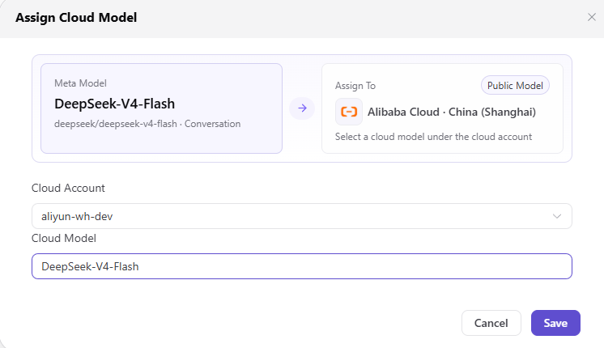
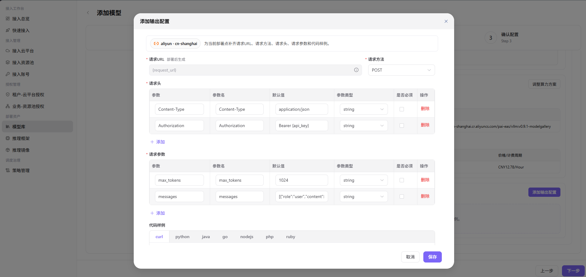
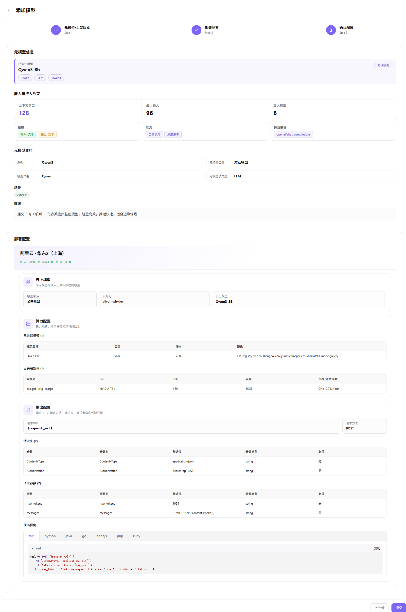

# Model Library

## Preface

| Item            | Content                                                                                                                |
| --------------- | ---------------------------------------------------------------------------------------------------------------------- |
| Target Audience | Operator                                                                                                               |
| Navigation Path | Deployment Assets > Model Library                                                                                       |
| Overview        | Manage all onboarded AI models, supporting model addition, editing, detail viewing, deletion, and other operations    |

## Page Structure

### Search Area

The page top supports search by model name, filter by model type, and **"Search"** and **"Reset"** buttons.

### Action Buttons

The page top-right provides **"Add Model"**, **"Export"**, and **"Import"** buttons for model creation and batch configuration management.

### Data List

The model list displays all models in card format, showing model name, description, type, version, tag, creation time, and other information. The pagination control supports pagination browsing, displaying 10 items per page.

## Operations

### Adding a Model

1. Enter the platform homepage, click the **"Deployment Assets > Model Library"** menu in the left navigation bar to enter the model library page.
2. Click the **"Add Model"** button at the top right of the page to enter the model addition process (3 steps).

#### **Step 1: Meta-model / Onboarding Version**:

- **"Meta-model Filter"**: Locate the target meta-model in the filter (All Authors / All Types / Keyword Search). The selected meta-model will be displayed as a tag below the filter, and the tag can be clicked to delete.
- **"Meta-model Selection"**: Single-select the target meta-model in the meta-model list (e.g., `Qwen3-8b`). The right side displays the meta-model details (Capabilities and Access Constraints: context window 128 / max input 96 / max output 8 / modalities: input: text output: text / capabilities: tool calling, deep thinking / protocol compatibility: openai/chat_completions; meta-model information: series Qwen3 / meta-model type: Chat Model / model author: Qwen / meta-model subtype: LLM / scenario: text generation / description).
- **"Onboarding Version"**: Fill in the **"Version"** (e.g., `1.0.0`) and **"Version Description"** (rich text).

- Click **"Next"**.

#### **Step 2: Deployment Configuration**:

- **"Cloud Deployment Point"**: Manage deployment points on the left (each deployment point is bound to a cloud platform + region), and you can click **"+ Add Deployment Point"** to add a new one.

- **"Cloud Model"**: Click the **"Assign Cloud Model"** button to configure the cloud model under the meta-model and cloud account (e.g., `aliyun-wh-dev` / `Qwen3-8B`), and click **"Save"**.

- **"Compute Configuration"**: Click the **"Select Compute Plan"** button, single-select the target model framework (e.g., `Qwen3-8B` / vllm / v1.0 / `eas-registry-vpc.cn-shanghai.cr.aliyuncs.com/pai-eas/vllmv:0.9.1-modelgallery`) and deployment specification (e.g., `ecs.gn6i-c4g1.xlarge` / NVIDIA T4 x 1 / 4 cores / 15GB / CNY12.78/Hour), and click **"Save"**.

- **"Output Configuration"**: Click the **"Add Output Configuration"** button, configure the request URL (automatically generated after deployment, template `{request_url}`), request method (e.g., `POST`), request headers (Content-Type: application/json / Authorization: Bearer {api_key}), request parameters (max_tokens: 1024 / messages: [{"role":"user","content":"hello"}]), and multilingual code samples (curl / python / java / go / nodejs / php / ruby), and click **"Save"**.

- Click **"Next"**.

#### **Step 3: Confirm Configuration**: Verify the overall template configuration information (Meta-model Information / Capabilities and Access Constraints / Meta-model Information / Deployment Configuration: Cloud Model + Compute Configuration + Output Configuration). After confirming that it is correct, click **"Submit"** to complete the model addition; to modify, click **"Previous"** to return to the corresponding step.

#### Parameters - Meta-model / Onboarding Version (Step 1)

| Term | Type | Example | Description |
|------|------|---------|-------------|
| Meta-model | Radio | `Qwen3-8b` (unique identifier `qwen/qwen3-8b`) | Required. Select the base meta-model |
| Onboarding Version - Version | Text | `1.0.0` | Required. The model onboarding version number |
| Onboarding Version - Version Description | Rich Text | — | Optional. Explain the update content of this version |

#### Parameters - Deployment Configuration (Step 2)

| Term | Type | Example | Description |
|------|------|---------|-------------|
| Cloud Deployment Point | List | `Alibaba Cloud · China East 2 (Shanghai)` | Required. Each deployment point is bound to a cloud platform + region |
| Cloud Account | Dropdown | `aliyun-wh-dev` | Required. The cloud account used for model deployment |
| Cloud Model | Dropdown | `Qwen3-8B` | Required. Identify the cloud model under the cloud account |
| Model Framework | Radio | `Qwen3-8B` / vllm / v1.0 / `eas-registry-vpc.cn-shanghai.cr.aliyuncs.com/pai-eas/vllmv:0.9.1-modelgallery` | Required. Model framework and runtime version |
| Deployment Specification | Radio | `ecs.gn6i-c4g1.xlarge` / NVIDIA T4 x 1 / 4 cores / 15GB / CNY12.78/Hour | Required. GPU model / quantity / CPU cores / memory |
| Request URL | URL | `{request_url}` (generated after deployment) | Required. Model invocation endpoint |
| Request Method | Dropdown | `POST` | Required. HTTP request method |
| Request Header - Content-Type | Text | `application/json` | Required. Request content type |
| Request Header - Authorization | Text | `Bearer {api_key}` | Required. Access credential |
| Request Parameter - max_tokens | Number | `1024` | Required. Maximum number of generated tokens |
| Request Parameter - messages | Array | `[{"role":"user","content":"hello"}]` | Required. Conversation message content |

## Other Operations

| Operation | Steps |
|-----------|-------|
| Edit Model | Click the **"..."** (More) button on the top-right of the target model card → Select **"Edit"** → Modify model information, model introduction, deployment configuration, and output configuration step by step → Click **"Submit"** |
| View Model Details | Click the target model card to enter the detail page → Switch between "Model Information", "Deployment Configuration", "Output Configuration", and "Version Record" tabs to view the information → Click the back arrow at the top left to exit |
| Delete Model | Click the **"..."** (More) button on the top-right of the target model card → Select **"Delete"** → **This action is irreversible. Please operate with caution.** |
| Export / Import Configuration | Click the **"Export"** / **"Import"** buttons at the top right of the page → Batch management of model configurations |

## Notes

- The model deletion operation is irreversible. Please operate with caution.
- Before adding a model, ensure that the cloud platform, cloud account, and inference framework have been correctly configured.
- After the model is published, it will be visible to the public. Please ensure that the information is accurate.
