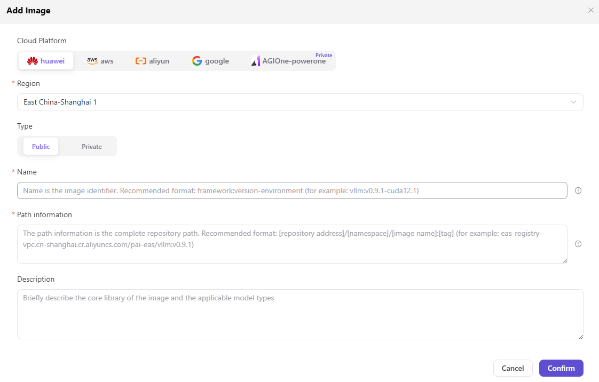

# Runtime Images

## Feature Overview

`Runtime Images` is used to maintain container images, image tags, framework dependencies, and applicable resource types, supporting multi-cloud scheduling, resource authorization, and model deployment workflows.

| Item | Content |
| --- | --- |
| Applicable role | Operator |
| Navigation path | Deployment Assets > Runtime Images |
| Page route | /operator/deploy-assets/runtime-images |
| Managed objects | Container images, image tags, framework dependencies, and applicable resource types |
| Typical use | Maintain runtime environment images used for cloud deployment |

### Beginner View

A runtime image is like the runtime package for a model service. It contains framework dependencies, drivers, inference services, and base tools. When images do not match, services may fail to start even if resources are sufficient.

### Terms

| Term | Description |
| --- | --- |
| Runtime image | Container environment used for model deployment. |
| Image tag | Image version identifier, such as `v1.0.0`. |
| Pull permission | Repository authorization required for cloud instances to pull images. |
| Dependency version | Runtime dependency versions such as framework, driver, and Python packages. |

## Prerequisites

1. Image repository address, tag, and pull credentials are ready.
2. The image is compatible with the framework, driver, and accelerator card type.
3. The resource pool can reach the image repository over the network.

## Page Description

The page is used to maintain runtime images available for cloud model deployment, including image address, version tag, framework compatibility, driver requirements, and enablement status. Operators should maintain an image matrix by framework and accelerator card type.

Page screenshot:

Used to view image names, tags, status, and applicable frameworks.

## Main Operations

### Procedure

1. Go to `Deployment Assets > Runtime Images`.
2. Filter by framework, image tag, status, or keyword.
3. When adding an image, fill in the image repository address, tag, compatible frameworks, and driver requirements.
4. Confirm that image repository credentials or pull permissions have been configured.
5. After saving, create a test deployment with the corresponding framework to validate image pulling.

Key step screenshot:

Before adding, confirm that the image source is trusted and contains no sensitive credentials.

### Parameters

| Field | Required | Type | Example | Description |
| --- | --- | --- | --- | --- |
| Image name | Yes | Text | `vllm-runtime` | Display name on the deployment page. |
| Image address | Yes | Text | `registry.example.com/ai/vllm:latest` | Use a placeholder repository address and avoid real internal addresses. |
| Compatible framework | Yes | Multi-select | `vLLM` | Deployment frameworks that can use the image. |
| Driver requirement | No | Text | `CUDA 12.x` | Accelerator card and runtime requirements. |
| Enablement status | Yes | Enum | `Enabled` | Controls whether it can be selected on the deployment page. |

### Pitfalls

- Do not rely on `latest` for image tags long term. Production should use fixed versions.
- Do not write image repository credentials into documentation or screenshots.
- Driver, CUDA, or NPU runtime mismatch can cause instance startup failure.

### Result Validation

1. The image record is enabled.
2. The deployment framework can associate this image.
3. Test deployment events show that image pull and service startup succeed.

## FAQ

### Image Pull Fails

**Issue Symptom:**

Deployment events show image pull or authentication failure.

**Possible Causes:**

- Image address or tag is incorrect.
- Image repository credentials are invalid.
- The resource pool network cannot access the repository.

**Handling:**

1. Verify image address and tag.
2. Update repository credentials or pull keys.
3. Check network connectivity from the resource pool to the repository.

### Image Can Be Pulled but the Service Fails to Start

**Issue Symptom:**

After the image is pulled successfully, the container exits or the health check fails.

**Possible Causes:**

- The image lacks framework dependencies.
- Driver or runtime versions do not match.
- Startup command is inconsistent with the image directory structure.

**Handling:**

1. View container logs.
2. Verify framework dependencies and driver versions.
3. Adjust the startup command or switch to a compatible image.

## Next Steps

1. Associate deployment frameworks.
2. Maintain model assets.
3. Create a test deployment with the target resource pool.

## Notes

- Production images should use fixed tags.
- Do not write repository credentials into documentation or screenshots.
- After image updates, validate pull and startup with a test deployment.
