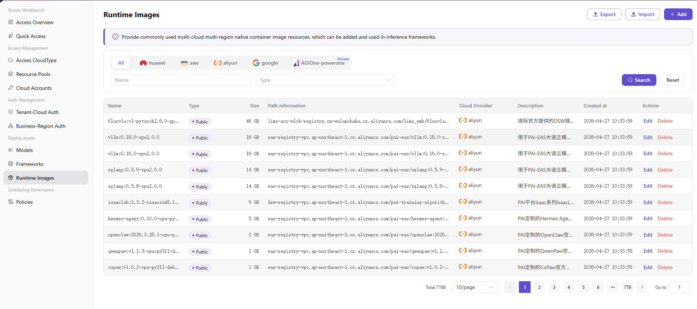
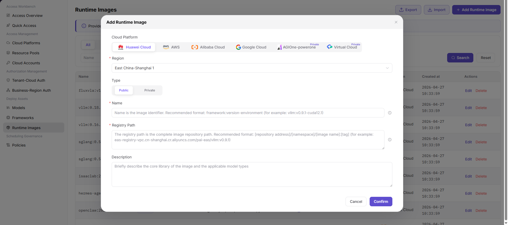

# Runtime Images

::: info Document Information
Version: v1.0
Updated: 2026-07-20
:::

## Feature Overview

`Runtime Images` is used to maintain native container image resources commonly used across multiple clouds and regions. Operators can add runtime images by cloud platform and region, so inference frameworks or model deployment flows can select them later.

| Item | Content |
| --- | --- |
| Applicable role | Operator |
| Navigation path | AI Infrastructure > On-Cloud > Deploy Assets > Runtime Images |
| Page route | `/infrahub/op/model/image` |
| Managed objects | Cloud platform, region, image name, image type, image size, registry path, and action entries |
| Typical use | Add runtime images that can be used by inference frameworks and model deployments |

#### Beginner Explanation

A runtime image works like the runtime package for a model service. It usually contains framework dependencies, drivers, service programs, and base tools. If the image path or version does not match, later deployments may fail to pull the image or start the service.

#### Terms Quick Reference

| Term | Description |
| --- | --- |
| Cloud Platform | Cloud platform to which the image belongs or on which it can be used. |
| Region | Cloud platform region where the image is located or can be pulled. |
| Type | Image visibility scope. The page supports `Public` and `Private`. |
| Name | Image identifier. It is recommended to include framework, version, and environment. |
| Registry Path | Complete image repository path, usually including repository address, namespace, image name, and tag. |

## Prerequisites

1. The target cloud platform and region have been connected and are available.
2. The image to be registered has been built and confirmed to be pullable by the target resource environment.
3. Image name, registry path, image type, and description have been sanitized.
4. If the image repository requires credentials, maintain them in the platform security configuration instead of documentation.

## Page Description

This page is used to view and add runtime images. The list supports filtering by cloud platform tab, `Name`, and `Type`, and provides `Search`, `Reset`, `Export`, `Import`, and `Add Runtime Image`. The table displays `Name`, `Type`, `Size`, `Registry Path`, `Cloud Platform`, `Created at`, and `Actions`, with entries such as `Edit` and `Delete`.

Page screenshot:

## Main Operations

### Add Runtime Image

1. Go to `AI Infrastructure > On-Cloud > Deploy Assets > Runtime Images`.
2. Click `Add Runtime Image` to open the add runtime image dialog.
3. Select `Cloud Platform`, and then select `Region` as required by the page.
4. Select `Public` or `Private` under `Type`.
5. Fill in `Name`, `Registry Path`, and `Description`.
6. Before clicking the final `Confirm`, verify the cloud platform, region, image type, name, and registry path again.
7. For learning or page validation only, click `Cancel` or close the dialog without submitting real image configuration.

Key step screenshot:

## Parameter Reference

| Field Name | Required | Field Type | Example | Description |
| --- | --- | --- | --- | --- |
| Cloud Platform | Yes | Tab/Single select | `Alibaba Cloud` | Selects the cloud platform to which the image belongs or on which it can be used. |
| Region | Yes | Dropdown | `East China-Shanghai 1` | Selects the region where the image is located or available. |
| Type | Yes | Segmented control | `Public` | Selects public or private image. |
| Name | Yes | Text | `framework:v1.0-runtime` | Image identifier. It is recommended to include framework, version, and environment. |
| Registry Path | Yes | Multiline text | `registry.example.com/namespace/image:tag` | Complete image repository path. Use placeholders only in documentation. |
| Description | No | Multiline text | `Sample runtime image description` | Briefly describes the core library and applicable model types. Do not write internal sensitive information. |
| Size | No | Text | `16 GB` | Image size displayed in the list. |
| Created at | No | Date time | `2026-07-20 10:00:00` | Image creation time displayed in the list. |
| Search | No | Button | `Search` | Queries image records with the current filters. |
| Reset | No | Button | `Reset` | Clears filters and restores the list display. |
| Export | No | Button | `Export` | Exports image records and may contain sensitive operational configuration. |
| Import | No | Button | `Import` | Imports image records in bulk and may change multiple configurations. |
| Edit | No | Action entry | `Edit` | Modifies an existing image configuration. Confirm the impact scope before editing. |
| Delete | No | Action entry | `Delete` | Deletes an image record and may affect later deployment selection. |
| Cancel | No | Button | `Cancel` | Closes the dialog without saving the current configuration. |
| Confirm | Yes | Button | `Confirm` | Submits the runtime image configuration. Review carefully before clicking. |

## Pitfalls

- Use fixed image tags in registry paths and avoid relying on unstable tags such as `latest` for long-term use.
- Image repository credentials, pull keys, tokens, and internal network addresses should not be written into documentation, screenshots, or tickets.
- An incorrect cloud platform, region, or image path may cause later image pull failures during deployment.
- The screenshots do not show startup command, runtime parameters, applicable framework, or pull credential fields, so this page does not document them as confirmed UI fields.

## Result Validation

| Check Item | Success Signal | If Abnormal |
| --- | --- | --- |
| Page is accessible | The `Runtime Images` page and image list are displayed. | Check menu permissions, route, and login status. |
| Runtime image list loads | The table displays name, type, size, registry path, cloud platform, created time, and action entries. | Check filters, data permissions, and API status. |
| Add entry is visible | `Add Runtime Image` is displayed in the upper-right corner. | Check operator permissions and page configuration. |
| Add dialog opens | The dialog displays cloud platform, region, type, name, registry path, description, cancel, and confirm. | Refresh the page and retry. If the issue persists, contact the administrator. |
| Required fields and validation prompts work | Missing required fields trigger page validation prompts, and the flow can continue after they are completed. | Complete cloud platform, region, type, name, and registry path as prompted. |
| No real submission during learning | The final `Confirm` is not clicked and no real image configuration is written. | If submitted by mistake, immediately check the image list and downstream framework references. |
| Real submission can be tracked | The new runtime image appears in the list, and type, cloud platform, registry path, and created time can be viewed. | Return to the list or details page to verify configuration and validate pulling with a test deployment. |

## Troubleshooting

| Issue Type | Check First | Next Step |
| --- | --- | --- |
| Image pull fails | Whether cloud platform, region, registry path, and image tag are correct. | Validate pulling with a test deployment and check repository access permissions. |
| Image record is not visible | Filters, cloud platform tab, and data permissions. | Click `Reset` and search again. If the issue persists, contact the administrator. |
| Service startup fails | Image content, framework dependencies, driver version, and startup configuration. | Return to Frameworks or Models to verify runtime configuration. |
| Image is deleted or changed by mistake | Operation records and affected model deployment scope. | Pause related deployment changes and restore or add the correct image again. |

## FAQ

#### Image Pull Fails

**Issue Symptom:**

Deployment events show image pull or authentication failure.

**Possible Causes:**

- Registry path or tag is incorrect.
- Image repository credentials are invalid or not configured.
- The target resource environment cannot access the image repository.

**Handling:**

1. Verify cloud platform, region, and registry path.
2. Update repository credentials or pull permissions in platform security configuration.
3. Check network connectivity from the resource environment to the image repository.

#### Image Can Be Pulled but the Service Fails to Start

**Issue Symptom:**

After the image is pulled successfully, the container exits, restarts repeatedly, or the health check fails.

**Possible Causes:**

- The image lacks framework dependencies.
- Driver or runtime versions do not match.
- The startup command in the inference framework is inconsistent with the image directory structure.

**Handling:**

1. View deployment events and container logs.
2. Verify image dependencies, driver version, and runtime environment.
3. Adjust inference framework configuration or switch to a compatible image.

## Next Steps

1. Select or reference the runtime image in Frameworks.
2. Verify whether the image can be used in compute plans when adding a model in Models.
3. Use a test deployment to validate image pull, service startup, and health check results.

## Notes

- Adding a runtime image may affect selectable images and inference task runtime environments for model deployment.
- Incorrect registry path, tag, startup command, or runtime parameter may cause deployment failure, resource waste, or service exceptions.
- Image repository credentials may contain sensitive information and must not be written into documentation.
- `Confirm`, `Save`, and `Submit` are high-risk final actions. This document only describes field review and pre-submission checks, and does not guide users to submit during testing or learning.
- Do not write real image repository credentials, tokens, AK/SK, internal registry addresses, cloud resource IDs, or internal test parameters.
