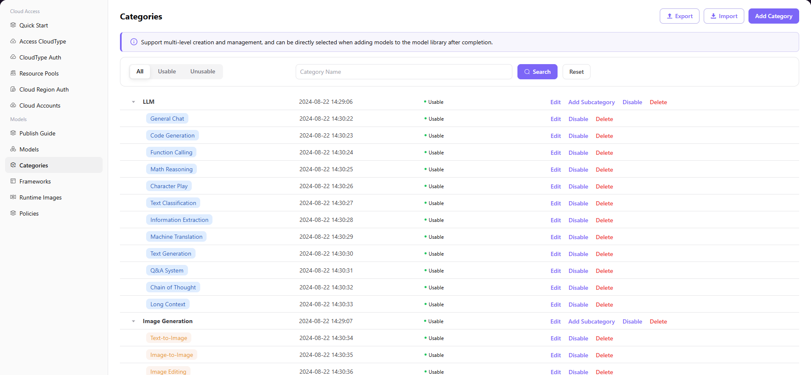

# Categories

## Introduction

| Item                 | Content                                                                                                      |
| -------------------- | ------------------------------------------------------------------------------------------------------------ |
| Applicable Role      | Operator                                                                                                     |
| Navigation Path      | Models > Categories                                                                                          |
| Function Description | Manage the model's classification system, supporting multi-level category creation and management |

## Page Structure

### Search Area

The page top supports searching by category name, with status filter options (All, Usable, Unusable).

### Action Area

The upper right corner provides **"Export"**, **"Import"**, and **"Add Category"** buttons for batch configuration management and category creation.

### Data List Description

The category tree displays all categories in a tree structure, supporting expand/collapse for level 1 and level 2 categories.

### Page Screenshot

## Operations

### Add Category

1. Enter the platform homepage, click **"Models > Categories"** in the left navigation bar to enter the Category Management page.
2. Click the **"Add Category"** button in the top right corner to open the **"Add Category"** window.
3. Configure category information:
   - Fill in **Code** (such as `image generation`)
   - Configure **Multi-language Display Name** (fill in names for English and Simplified Chinese respectively)
   - Configure **Color Identifier** (supports quick configuration or custom configuration)
4. Click **"Confirm"** to complete the addition.

#### Parameters

| Field | Type | Example | Description |
|-------|------|---------|-------------|
| Code | Text | `image generation` / `text-to-image` | Required, unique category identifier |
| Display Name (Multi-language) | Text | `Image Generation` / `文生图` | Required, configure display names for English and Simplified Chinese respectively |
| Color Configuration | Single Select | `Quick Configuration` / `Custom Configuration` | Optional, used to set the display color of category tags |

## Other Operations

| Operation | Steps |
|-----------|-------|
| Edit Category | Click the **"Edit"** button on the target category → Modify code, multi-language display name, color configuration, etc. → Click **"Confirm"** |
| Add Subcategory | Click the **"Add Subcategory"** button on the target level 1 category → Fill in code, multi-language display name, etc. → Click **"Confirm"** |
| Enable / Disable | Click the **"Disable"** / **"Enable"** button on the target category → Confirm the status change |
| Delete Category | Click the **"Delete"** button on the target category → **This operation is irreversible, please proceed with caution** |
| Export / Import Config | Click the **"Export"** / **"Import"** button in the top right corner → Batch manage category configurations |

## Notes

- Deleting a category is irreversible, please proceed with caution.
- When adding a subcategory, its code must be unique under the parent category.
- After disabling a category, models under that category will not be able to use the category for filtering.