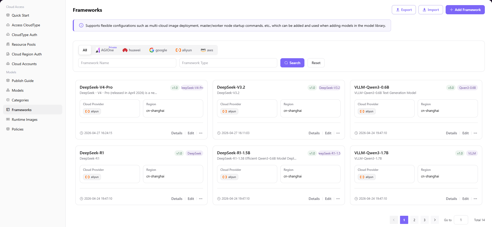

# Frameworks

## Introduction

| Item                 | Content                                                                                                                               |
| -------------------- | ------------------------------------------------------------------------------------------------------------------------------------ |
| Applicable Role      | Operator                                                                                                                             |
| Navigation Path      | Models > Frameworks                                                                                                                   |
| Function Description | Manage inference runtime environment configurations for models, defining framework type, version, image address, port, and startup command |

## Page Structure

### Search Area

The page top provides cloud platform filter (All / Private AGIOne / huawei / google / aliyun / aws), Framework Name search box, Framework Type search box, with **"Search"** and **"Reset"** buttons.

### Action Area

The upper right corner provides **"Export"**, **"Import"**, and **"Add Framework"** buttons for batch configuration management and framework creation.

### Data List Description

The data table displays framework list including Framework Name, Description, Version, Framework Type, Cloud Provider, Region, Creation Time, and operation columns (Details / Edit / ...).

### Page Screenshot

## Operations

### Add Framework

1. Navigate to **Models > Frameworks** in the left sidebar to enter the Frameworks management page.
2. Click the **"Add Framework"** button in the upper right corner to open the "Add Framework" dialog.
3. Configure basic information:
   - Select **Cloud Platform** (e.g., aliyun, huawei, aws, etc.)
   - Select **Cloud Account**
   - Select **Region**
   - Enter **Framework Type** (e.g., `VLLM`)
   - Enter **Framework Name** (e.g., `VLLM-Qwen3-1.7B`)
   - Enter **Description**
   - Enter **Version** (e.g., `v1.0`)
   - (Optional) Enter **Default API Suffix**
4. Configure deployment information:
   - Enter **Image Address**
   - Enter **Port Number** (e.g., `8000`)
   - Enter **Master Node Start Command**
   - Enter **Worker Node Start Command**
   - (Optional) configure **Environment Variables** and **Extended Parameters**
5. Confirm all information is correct, then click **"Confirm"** to complete the addition.

#### Parameters

| Field | Type | Example | Description |
|-------|------|---------|-------------|
| Cloud Platform | Single-select | `aliyun` | Required, supports multiple cloud providers |
| Cloud Account | Dropdown | `aliyun-wh-dev` | Required, select an integrated cloud account |
| Region | Dropdown | `cn-shanghai` | Required, select the region for framework deployment |
| Framework Type | Text | `VLLM` | Required, identifies the inference framework type |
| Framework Name | Text | `VLLM-Qwen3-1.7B` | Required, custom framework identifier |
| Description | Text | — | Optional, describes framework purpose and characteristics |
| Version | Text | `v1.0` | Required, identifies framework version |
| Default API Suffix | Text | `/v1/chat/completions` | Optional, framework's default API endpoint suffix |
| Image Address | Text | `eas-registry-vpc.cn-shanghai.cr.aliyuncs.com/pai-eas/vllm:v0.9.1-modelgallery` | Required, container image address used by the framework |
| Port Number | Number | `8000` | Required, service listening port |
| Master Node Start Command | Text | `vllm serve /model/Qwen3-1.7B ...` | Required, command executed when master node starts |
| Worker Node Start Command | Text | `vllm serve /model/Qwen3-1.7B ...` | Required, command executed when worker node starts |
| Environment Variables | Key-value | — | Optional, environment variables required for framework runtime |
| Extended Parameters | Text | — | Optional, additional parameters for framework runtime |

## Other Operations

| Operation | Steps |
|-----------|-------|
| Edit Framework | Click target framework's **"Edit"** button → Modify framework type, name, description, etc. → Click **"Confirm"** |
| View Details | Click target framework's **"Details"** button → View basic info and version configuration in "Framework Info" and "Version Records" tabs → Click back arrow to exit |
| Add Version | Click target framework's **"..."** (more) button → Select **"Add Version"** → Enter version number, image, port, startup command, etc. → Click **"Confirm"** |
| Uninstall Framework | Click target framework's **"..."** (more) button → Select **"Uninstall"** → Confirm operation (**Uninstall is irreversible, please operate with caution**) |
| Export / Import Config | Click **"Export"** / **"Import"** button in upper right corner → Batch management of inference framework configuration |

## Notes

- **Deletion operations are irreversible**, please operate with caution.
- When configuring image addresses, ensure the image has been correctly pushed to the container image registry of the corresponding cloud platform.
- Startup commands need to be configured according to actual model and framework requirements; incorrect startup commands may cause deployment failures.
- In multi-cloud scenarios, ensure cloud account permissions are sufficient (at minimum requires read access to image registry and GPU instance invocation permissions).