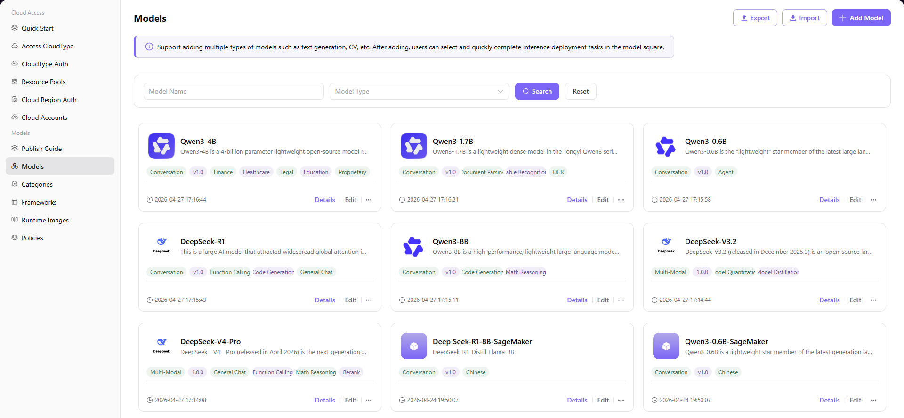

# Models

## Introduction

| Item                 | Content                                                                                                      |
| -------------------- | ------------------------------------------------------------------------------------------------------------ |
| Applicable Role      | Operator                                                                                                     |
| Navigation Path      | Models > Models                                                                                              |
| Function Description | Manage all registered AI models, supporting operations such as adding, editing, viewing details, and deleting |

## Page Structure

### Search Area

The page top supports searching by model name and filtering by model type, with **"Search"** and **"Reset"** buttons.

### Action Area

The upper right corner provides **"Add Model"**, **"Export"**, and **"Import"** buttons for model creation and batch configuration management.

### Data List Description

The model list displays all models in card format, showing model name, description, type, version, tags, creation time, and other information. Pagination control supports browsing with 10 items per page.

### Page Screenshot

## Operations

### Add Model

1. Enter the platform homepage, click **"Models > Models"** in the left navigation bar to enter the Models page.
2. Click the **"Add Model"** button in the top right corner to enter the model adding flow.
3. In the pop-up window, fill in the **Model Information Configuration** form:
   - Select **Model Type** (such as Conversation, Multi-Modal, Image, etc.)
   - Fill in **Model Name**, **Model Description**, **Model Tags**
   - Upload **Model Image**
   - Fill in **Version Number** and **Version Description**
   - Click **"Next"**
4. In the editor, fill in the model's detailed introduction, including Introduction, Key Advantages, Use Cases, etc., and click **"Next"**.
5. In the **Model Entry Configuration** area, click **"Add Entry"** to configure model storage information:
   - Select **Cloud Platform** (such as Alibaba Cloud, Huawei Cloud, etc.)
   - Select **Cloud Account**
   - Select **Region**
   - Select **Model Source** (Self-owned Object Storage / ModelScope / HuggingFace / Public Model)
   - Enter **Public Model Name**
   - Click **"Save"**
6. In the **Deployment Configuration** area, click **"Add Configuration"** to configure the model runtime environment:
   - Select associated **Model Framework**
   - Select deployment **Specification** (GPU model, quantity, CPU, memory, etc.)
   - Click **"Save"**
   - Click **"Next"**
7. In the **Output Configuration** area, click **"Add Configuration"** to configure API interface information:
   - Fill in **Request URL**, **Request Method**
   - Configure **Request Headers** (such as Content-Type, Authorization)
   - Configure **Request Parameters** (such as max_tokens, messages)
   - View and copy **Code Examples** in different languages
   - Click **"Save"**
   - Click **"Next"**
8. Preview model information, introduction, deployment and output configuration. Confirm all information is correct, then click **"Submit"** to complete the model adding.

#### Parameters - Model Information Configuration

| Field | Type | Example | Description |
|-------|------|---------|-------------|
| Model Type | Single Select | Conversation | Required. Supports Multi-Modal, Conversation, Image, Speech, Video, Embedding, Rerank, etc. |
| Model Name | Text | `Qwen3-1.7B` | Required |
| Model Description | Text | — | Optional, used to explain model purpose and features |
| Model Tags | Dropdown Select | `Text Generation` | Optional, used for classification identification |
| Model Image | Image Upload | — | Optional, used for Model Marketplace display |
| Version Number | Text | `1.0.0` | Required |
| Version Description | Text | — | Optional, describing updates in this version |

#### Parameters - Model Entry Configuration

| Field | Type | Example | Description |
|-------|------|---------|-------------|
| Cloud Platform | Dropdown Select | `Alibaba Cloud` | Required |
| Cloud Account | Dropdown Select | `aliyun-wh-dev` | Required |
| Region | Dropdown Select | `China East 2 (Shanghai)` | Required |
| Model Source | Single Select | `Public Model` | Required. Supports Self-owned Object Storage / ModelScope / HuggingFace / Public Model |
| Public Model Name | Text | `Qwen3-1.7B` | Required, select the corresponding public model |

#### Parameters - Deployment Configuration

| Field | Type | Example | Description |
|-------|------|---------|-------------|
| Model Framework | Multi-Select | `VLLM-Qwen3-1.7B` | Required, select the model's corresponding inference framework |
| Deployment Specification | Select Box | `ecs.gn7i-c16g1.4xlarge` | Required, select GPU model, quantity, CPU, memory, and other configurations |

#### Parameters - Output Configuration

| Field | Type | Example | Description |
|-------|------|---------|-------------|
| Request URL | URL | `{request_url}` | Required |
| Request Method | Dropdown Select | `GET` / `POST` | Required |
| Request Headers | List | `Content-Type: application/json` | Required, supports adding multiple request headers |
| Request Parameters | List | `max_tokens: 1024` | Required, supports adding multiple request parameters |
| Code Examples | Code Box | `curl`, `python`, `java`, etc. | Optional, provides calling examples in different languages |

## Other Operations

| Operation              | Steps                                                                                                                                                                                            |
| ---------------------- | ------------------------------------------------------------------------------------------------------------------------------------------------------------------------------------------------ |
| Edit Model             | Click the **"..."** (more) button on the target model card → Select **"Edit"** → Modify model information, introduction, deployment configuration, output configuration → Click **"Submit"**     |
| View Model Details     | Click the target model card to enter the details page → Switch between **"Model Info"**, **"Deployment Config"**, **"Output Config"**, **"Version Records"** tabs → Click the back arrow to exit |
| Delete Model           | Click the **"..."** (more) button on the target model card → Select **"Delete"** → **This operation is irreversible, please proceed with caution**                                               |
| Export / Import Config | Click the **"Export"** / **"Import"** button in the top right corner → Batch manage model configurations                                                                                         |

## Notes

- Deleting a model is irreversible, please proceed with caution.
- Before adding a model, please ensure cloud platform, cloud account, and inference framework are properly configured.
- Once a model is published, it will be visible to others. Please ensure the information is accurate.