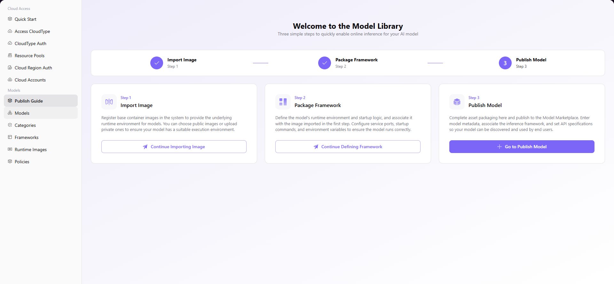

# Publish Guide

## Introduction

| Item                 | Content                                                                                                      |
| -------------------- | ------------------------------------------------------------------------------------------------------------ |
| Applicable Role      | Operator                                                                                                     |
| Navigation Path      | Models > Publish Guide                                                                                       |
| Function Description | Provide a quick start flow for the model library, guiding through three steps: image import, framework packaging, and model publishing |

## Page Structure

### Search Area

N/A (this page is a guide page with step-by-step flow, no search functionality required).

### Action Area

Each step provides corresponding action buttons: **"Continue Importing Image"**, **"Continue Defining Framework"**, **"Go to Publish Model"**.

### Data List Description

The main content area displays the Publish Guide flow with three guided steps: Step 1 (Import Image), Step 2 (Package Framework), and Step 3 (Publish Model).

### Page Screenshot

## Operations

### Model Library Quick Start Flow

1. Enter the platform homepage, click **"Models > Publish Guide"** in the left navigation bar to enter the Publish Guide page.
2. Follow the page guidance to complete the following 3 steps:

**Step 1: Import Image**
- Click the **"Continue Importing Image"** button to register base container images, providing underlying runtime environment support for models (you can choose public images or upload private ones).

**Step 2: Package Framework**
- Click the **"Continue Defining Framework"** button to define the model's runtime environment and startup logic, associate the imported image, configure service ports, startup commands, and environment variables.

**Step 3: Publish Model**
- Click the **"Go to Publish Model"** button to enter model metadata, associate the inference framework, set API specifications, complete asset packaging, and publish to the Model Marketplace.

## Notes

- Importing images is the first step of the publishing process. You must complete image import before packaging the framework.
- When defining the framework, you need to associate the imported image to ensure the environment configuration is correct.
- Before publishing the model, please confirm all configuration information is accurate. Once published, the model will be visible to others.