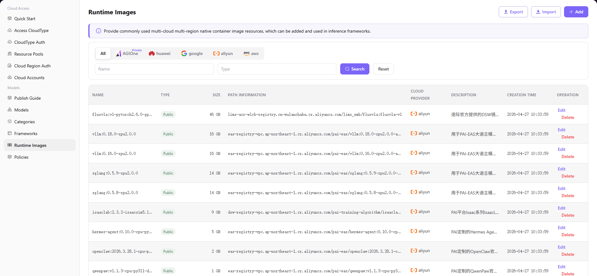

# Runtime Images

## Introduction

| Item                 | Content                                                                                                                               |
| -------------------- | ------------------------------------------------------------------------------------------------------------------------------------- |
| Applicable Role      | Operator                                                                                                                              |
| Navigation Path      | Models > Runtime Images                                                                                                               |
| Function Description | Provide commonly used multi-cloud multi-region container image resources for use in inference frameworks as the foundation for model deployment |

## Page Structure

### Search Area

The page top provides cloud platform filter (All / Private AGIOne / huawei / google / aliyun / aws), Name search box, Type search box, with **"Search"** and **"Reset"** buttons.

### Action Area

The upper right corner provides **"Export"**, **"Import"**, and **"Add"** buttons for batch configuration management and image addition.

### Data List Description

The data table displays runtime images including NAME, TYPE, SIZE, PATH INFORMATION, CLOUD PROVIDER, DESCRIPTION, CREATION TIME, and operation columns (Edit / Delete).

### Page Screenshot

## Operations

### Add Runtime Image

1. Navigate to **Models > Runtime Images** in the left sidebar to enter the Runtime Images management page.
2. Click the **"Add"** button in the upper right corner to open the "Add Image" dialog.
3. Configure image information:
   - Select **Cloud Platform** (e.g., aliyun, huawei, aws, etc.)
   - Select **Region**
   - Select **Type** (Public Image / Private Image)
   - Enter **Name** (e.g., `ppu-training`)
   - Enter **Path Information** (container image address)
   - (Optional) enter **Description** explaining the image's core libraries and applicable model types
4. Confirm all information is correct, then click **"Confirm"** to complete the addition.

#### Parameters

| Field | Type | Example | Description |
|-------|------|---------|-------------|
| Cloud Platform | Single-select | `aliyun` | Required, supports multiple cloud providers |
| Region | Dropdown | `cn-shanghai` | Required, select the region the image belongs to |
| Type | Single-select | `Public Image` / `Private Image` | Required, identifies the image's public/private attribute |
| Name | Text | `fluxvla:v1-pytorch2.6.0-gpu-py310-cu126-ubuntu22.04` | Required, custom image identifier |
| Path Information | Text | `sw-registry-vpc.cn-shanghai.cr.aliyuncs.com/pai` | Required, complete container image address |
| Description | Text | — | Optional, describes image purpose, core libraries, and applicable scenarios |

## Other Operations

| Operation              | Steps                                                                                                                                              |
| ---------------------- | -------------------------------------------------------------------------------------------------------------------------------------------------- |
| Edit Image             | Click target image's **"Edit"** button → Modify cloud platform, region, name, path information, etc. → Click **"Confirm"**                         |
| Delete Image           | Click target image's **"Delete"** button → Confirm operation (**Deletion is irreversible, data cannot be recovered, please operate with caution**) |
| Export / Import Config | Click **"Export"** / **"Import"** button in upper right corner → Batch management of runtime image configuration                                   |

## Notes

- **Deletion operations are irreversible**, please operate with caution.
- When adding images, ensure the image path is correct and the image has been properly pushed to the target cloud platform's container registry.
- For private images, ensure your cloud account has proper permissions to access the image repository.
- Multiple images may have similar names but different regions or types; confirm before performing operations.