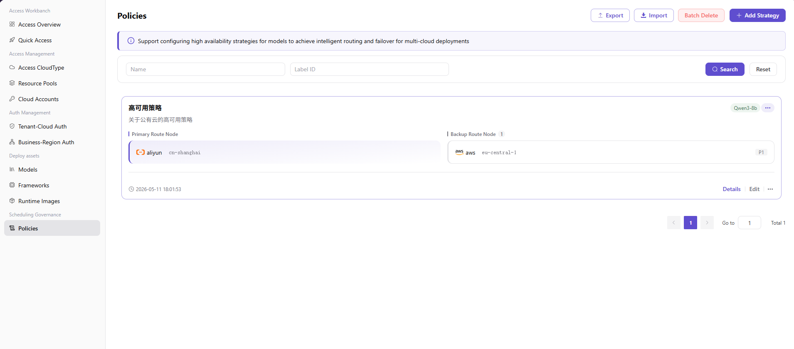

# Scheduling Policies

::: info Document Information
Version: v1.0
Updated: 2026-07-08
:::

## Feature Overview

`Scheduling Policies` is used to maintain scheduling rules, resource priorities, region preferences, quotas, and fallback policies, supporting multi-cloud scheduling, resource authorization, and model deployment workflows.

| Item | Content |
| --- | --- |
| Applicable role | Operator |
| Navigation path | Scheduling Governance > Scheduling Policies |
| Page route | /operator/scheduling-governance/policies |
| Managed objects | Scheduling rules, resource priorities, region preferences, quotas, and fallback policies |
| Typical use | Govern resource selection and scheduling rules for cross-cloud model deployment |

### Beginner View

A scheduling policy is like the route rule for multi-cloud deployment. It decides which resource pool is preferred, how to fall back when capacity is insufficient, and whether different tenants or business regions can schedule across clouds.

### Terms

| Term | Description |
| --- | --- |
| Scheduling policy | Rule that determines how deployment requests select cloud resources. |
| Priority | Sorting basis when multiple resources are available. |
| Fallback policy | Alternative selection when the preferred resource is unavailable. |
| Quota | Upper limit that controls tenant or business resource usage. |

## Prerequisites

1. Resource pools, tenant authorization, and business region authorization have been completed.
2. Preferred resource pools, fallback resource pools, and capacity thresholds have been confirmed.
3. Cross-region scheduling policies have been assessed for cost and compliance impact.

## Page Description

The page is used to maintain multi-cloud deployment scheduling rules, including resource priority, region preference, capacity thresholds, fallback policies, and applicable scope. Operators should configure policies according to resource pool levels, business region authorization, and SLA requirements.

Page screenshot:

Used to view policy priority, resource scope, and enablement status.

## Main Operations

### Procedure

1. Go to `Scheduling Governance > Scheduling Policies`.
2. Filter policies by tenant, business region, resource pool, or status.
3. When adding a policy, set applicable scope, preferred resource pool, and priority.
4. Configure capacity thresholds, failure fallback, and constraints.
5. After saving, view the actual scheduling result through a test deployment.

### Parameters

| Field | Required | Type | Example | Description |
| --- | --- | --- | --- | --- |
| Policy name | Yes | Text | `prod-gpu-fallback` | Scheduling policy display name. |
| Applicable scope | Yes | Multi-select | `tenant-a / East China Production` | Tenant or business region where the policy applies. |
| Preferred resource pool | Yes | Dropdown | `gpu-cn-shanghai-prod` | Resource pool scheduled first. |
| Fallback resource pool | No | Multi-select | `gpu-cn-hangzhou-backup` | Alternative resources when the preferred resource is unavailable. |
| Capacity threshold | No | Number | `80%` | Triggers degradation or fallback after the threshold is exceeded. |

### Pitfalls

- Fallback resource pools must have tenant and business region authorization completed.
- Scheduling priority changes affect only subsequent deployments. Running instances need separate handling according to platform capabilities.
- Cross-region fallback may affect latency, cost, and data compliance boundaries.

### Result Validation

1. The policy record is enabled and bound to the correct applicable scope.
2. Test deployment events show that the expected resource pool is hit.
3. When the preferred resource is unavailable, the fallback policy handles it or returns a clear failure reason.

## FAQ

### Deployment Does Not Hit the Preferred Resource Pool

**Issue Symptom:**

The scheduling result lands in a fallback resource pool or another cloud region.

**Possible Causes:**

- Preferred resource pool capacity is insufficient.
- Business region authorization does not include the preferred resource pool.
- Policy priority is lower than other rules.

**Handling:**

1. Check resource pool capacity and enablement status.
2. Verify tenant and business region authorization.
3. View scheduling policy priority and deployment events.

### Fallback Policy Does Not Take Effect

**Issue Symptom:**

Deployment fails directly when the preferred resource pool is unavailable.

**Possible Causes:**

- No fallback resource pool is configured.
- The fallback resource pool is not authorized or not enabled.
- Constraints prohibit cross-region or cross-cloud fallback.

**Handling:**

1. Add fallback resource pool configuration.
2. Confirm fallback resource pool authorization and capacity.
3. Check policy constraints.

## Next Steps

1. Monitor resource pool levels.
2. Review business region authorization.
3. Regularly validate scheduling policies with test deployments.

## Notes

- Fallback resource pools must be authorized.
- Priority changes affect subsequent deployment scheduling.
- Cross-region fallback may increase latency and cost.
