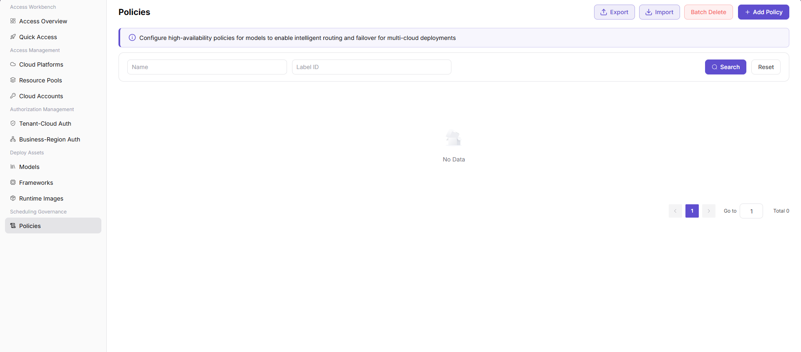
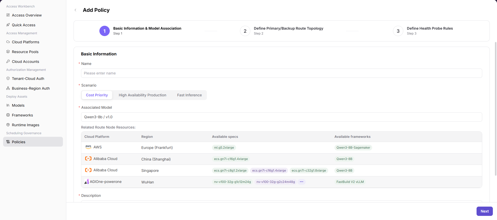
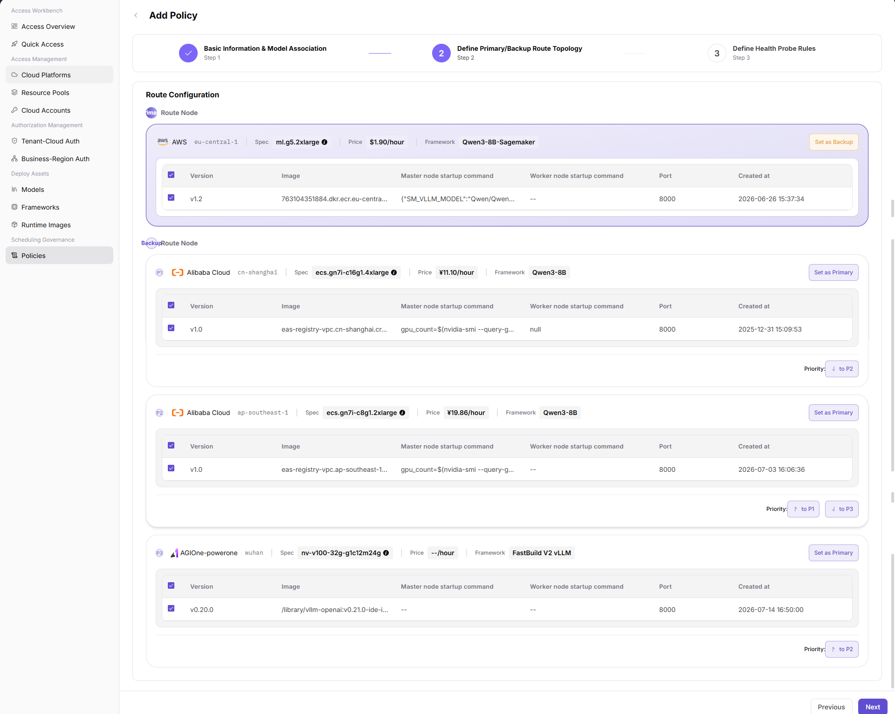
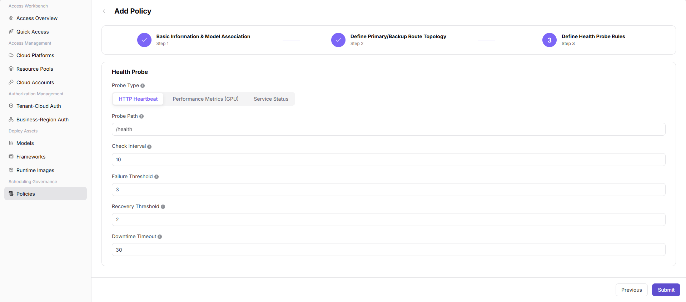

# Policies

::: info Document Information
Version: v1.0
Updated: 2026-07-21
:::

## Feature Overview

`Policies` is used to configure high-availability policies for models. It supports intelligent routing and failover for multi-cloud deployments through primary and backup routes, priority, and health probe rules.

| Item | Content |
| --- | --- |
| Applicable role | Operator |
| Navigation path | AI Infrastructure > On-Cloud > Scheduling Governance > Policies |
| Page route | `/infrahub/op/schedule/policy` |
| Managed objects | Policy name, Label ID, scenario, associated model, route topology, health probe rules, and action entries |
| Typical use | Add high-availability model policies and configure primary/backup routes, priority, and health probe rules |

#### Beginner Explanation

Policies work like routing and health check rules for model deployment. They decide which route node a model service uses first, which nodes act as backup routes, and how health probes detect service issues and trigger failover.

#### Terms Quick Reference

| Term | Description |
| --- | --- |
| Policy | High-availability routing configuration for a model, including basic information, model association, primary/backup routes, and health probe rules. |
| Scenario | Scheduling objective for the policy. The page supports `Cost Priority`, `High Availability Production`, and `Fast Inference`. |
| Associated Model | Model and version bound to the policy. It determines the route node resources that can be selected later. |
| Primary Route | Route node used first by the policy. |
| Backup Route | Backup route node used when the primary route is unavailable or needs failover. |
| Health Probe | Probe method and threshold rules used to determine whether the service is available. |

## Prerequisites

1. Cloud platforms, resource pools, models, frameworks, and runtime images have been connected and are available.
2. The target model, version, available specs, available frameworks, image, and startup commands have been verified.
3. Policy name, Label ID, and description have been sanitized and do not contain real customer, tenant, business, or internal test information.
4. Primary/backup routes, priority, and health probe thresholds have been evaluated against availability, cost, and latency requirements.

## Page Description

This page is used to view and add high-availability model policies. The list supports filtering by `Name` and `Label ID`, and provides `Search`, `Reset`, `Export`, `Import`, `Batch Delete`, and `Add Policy`. When no records are available, the page displays `No Data`.

Page screenshot:

The add policy flow contains three steps: `Basic Information & Model Association`, `Define Primary/Backup Route Topology`, and `Define Health Probe Rules`.

## Main Operations

### Add Policy

1. Go to `AI Infrastructure > On-Cloud > Scheduling Governance > Policies`.
2. Click `Add Policy` in the policies list to open the `Add Policy` page.
3. In `Basic Information & Model Association`, fill in `Name`, select `Scenario`, and select `Associated Model`.
4. Review `Related Route Node Resources`, including `Cloud Platform`, `Region`, `Available specs`, and `Available frameworks`, and then fill in `Description`.

5. Click `Next` to go to `Define Primary/Backup Route Topology`.
6. In `Route Configuration`, select route nodes and use `Set as Backup`, `Set as Primary`, or priority controls to adjust primary/backup relationships and ordering.
7. Review `Spec`, `Price`, `Framework`, `Version`, `Image`, `Master node startup command`, `Worker node startup command`, `Port`, and `Created at` for each route node.

8. Click `Next` to go to `Define Health Probe Rules`.
9. Select `Probe Type`. The page supports `HTTP Heartbeat`, `Performance Metrics (GPU)`, and `Service Status`.
10. Fill in or review `Probe Path`, `Check Interval`, `Failure Threshold`, `Recovery Threshold`, and `Downtime Timeout`.

11. Before clicking the final `Submit`, verify the policy rules, primary/backup routes, priority, health probe, and impact scope again.
12. For learning or page validation only, click `Previous` or close the page without submitting real policy configuration.

## Parameter Reference

| Field Name | Required | Field Type | Example | Description |
| --- | --- | --- | --- | --- |
| Name | Yes | Text | `policy-cost-priority-demo` | Policy display name. Use sanitized examples or non-sensitive business-readable names. |
| Label ID | No | Text | `label-demo` | List filter field used to search policies by label identifier. |
| Scenario | Yes | Segmented control | `Cost Priority` | Selects the policy objective. The page supports cost priority, high availability production, and fast inference. |
| Associated Model | Yes | Select | `Sample Model / v1.0` | Selects the model and version bound to the policy. |
| Cloud Platform | No | Table field | `Sample Cloud Platform` | Cloud platform to which the related route node resource belongs. |
| Region | No | Table field | `Sample Region` | Region where the related route node resource is located. |
| Available specs | No | Table field | `gpu.example` | Resource specs available for the current model. |
| Available frameworks | No | Table field | `Sample Framework` | Inference frameworks available for the current model. |
| Description | Yes | Multiline text | `Sample policy description` | Describes the policy purpose. Do not write real customer, tenant, business, or internal test parameters. |
| Route Node | Yes | Selection | `Primary Route Node` | Node selected in route configuration for the policy. |
| Primary Route | Yes | Operation state | `Primary` | Route node used first by the policy. |
| Backup Route | No | Operation state | `Backup` | Backup route node used when the primary route is unavailable. |
| Priority | No | Ordering control | `P1` | Adjusts the priority order of backup routes or candidate nodes. |
| Spec | No | Display field | `gpu.example` | Resource spec used by the route node. |
| Price | No | Display field | `Sample price/hour` | Cost reference for the route node. Real amount details are not shown in documentation. |
| Framework | No | Display field | `Sample Framework` | Inference framework used by the route node. |
| Version | No | Table field | `v1.0` | Image or runtime configuration version. |
| Image | No | Table field | `registry.example.com/namespace/image:tag` | Image address example. Use placeholders only and do not write real registry addresses. |
| Master node startup command | No | Table field | `--model-path /models/example` | Master node startup command. Use placeholder examples only. |
| Worker node startup command | No | Table field | `--worker` | Worker node startup command. Do not write internal startup parameters. |
| Port | No | Number | `8000` | Service listening port. |
| Created at | No | Date time | `2026-07-21 10:00:00` | Creation time of the route node or version configuration. |
| Probe Type | Yes | Segmented control | `HTTP Heartbeat` | Health probe type. The page supports HTTP heartbeat, GPU performance metrics, and service status. |
| Probe Path | No | Text | `/health` | HTTP heartbeat probe path. |
| Check Interval | No | Number | `10` | Frequency for running health probes. |
| Failure Threshold | No | Number | `3` | Number of consecutive failures before the service is considered abnormal. |
| Recovery Threshold | No | Number/Rule | `2` | Rule or threshold for determining service recovery. |
| Downtime Timeout | No | Number | `30` | Timeout before the service is judged as down. |
| Search | No | Button | `Search` | Queries policy records with the current filters. |
| Reset | No | Button | `Reset` | Clears filters and restores the list display. |
| Export | No | Button | `Export` | Exports policy records and may contain sensitive operational configuration. |
| Import | No | Button | `Import` | Imports policy records in bulk and may change multiple policy configurations. |
| Batch Delete | No | Button | `Batch Delete` | Deletes policies in bulk. Confirm the impact scope before using it. |
| Previous | No | Button | `Previous` | Returns to the previous configuration step. |
| Next | No | Button | `Next` | Validates the current step and moves to the next step. |
| Submit | Yes | Button | `Submit` | Final action that submits the policy configuration. Review carefully before clicking. |

## Pitfalls

- The screenshots do not show tenant scope, business scope, resource pool scope, or enabled status fields, so this page does not document them as confirmed UI fields.
- Primary/backup routes, priority, and health probe thresholds jointly affect real traffic routing and failover behavior.
- Health probes that are too strict may cause false failover, while probes that are too loose may delay failover.
- `Import` and `Batch Delete` affect multiple policy records. Do not use them during learning or page validation.
- Image addresses, startup commands, customer information, tenant information, business names, tokens, AK/SK, and internal test parameters should not be written into documentation, screenshots, or tickets.

## Result Validation

| Check Item | Success Signal | If Abnormal |
| --- | --- | --- |
| Page is accessible | The `Policies` page and policy list are displayed. | Check menu permissions, route, and login status. |
| Policy list loads | The page displays Name and Label ID filters, plus search, reset, and add entries. | Check filters, data permissions, and API status. |
| Add entry is visible | `Add Policy` is displayed in the upper-right corner. | Check operator permissions and page configuration. |
| Add page opens | Clicking the add entry opens the `Add Policy` page and displays the three-step flow. | Refresh the page and retry. If the issue persists, contact the administrator. |
| Basic information can be filled | `Name`, `Scenario`, `Associated Model`, related route node resources, and `Description` are displayed. | Complete required fields as prompted and confirm the associated model is available. |
| Route topology can be configured | Route nodes, primary/backup relationship, priority, and version configuration are displayed. | Verify the associated model, cloud platform, region, spec, framework, and image configuration. |
| Health probe can be configured | Probe type, probe path, check interval, failure threshold, recovery threshold, and downtime timeout are displayed. | Check whether the probe method and thresholds match the actual service capability. |
| No real submission during learning | The final `Submit` is not clicked and no real policy configuration is written. | If submitted by mistake, immediately check the policy list, deployment configuration, and route impact scope. |
| Real submission can be tracked | The new policy appears in the list, and later deployments can be checked for route hits and failover behavior. | Return to the list or deployment events to verify policy configuration and actual scheduling results. |

## Troubleshooting

| Issue Type | Check First | Next Step |
| --- | --- | --- |
| Policy cannot be added | User permission, menu entry, and `Add Policy` button state. | Retry with an operator account that has permission. If the issue persists, contact the administrator. |
| Associated model is unavailable | Whether the model, version, framework, and runtime image are available. | Return to Models or Frameworks to complete prerequisite assets. |
| Route node resources are empty | Cloud platform, region, spec, framework, and model association. | Verify resource pools, deploy assets, and authorization configuration. |
| Next or Submit is unavailable | Required fields, validation prompts, and selected items in the current step. | Complete fields as prompted and try again. |
| Policy does not route as expected | Primary/backup relationship, priority, health probe status, and later deployment time. | Validate route hits with a test deployment and view deployment events. |
| Failover behaves abnormally | Probe type, probe path, failure threshold, recovery threshold, and downtime timeout. | Adjust health probe rules and validate again. |

## FAQ

#### Why Does the Deployment Not Route as Expected After Adding a Policy?

**Issue Symptom:**

A later deployment does not hit the expected primary route, or it uses a backup route directly.

**Possible Causes:**

- The primary route node is not selected or priority is not configured as expected.
- The associated model, spec, framework, or image does not match deployment requirements.
- The health probe determines that the primary route is unavailable.
- The new policy only affects later deployments or newly triggered scheduling flows.

**Handling:**

1. Return to the policy details or edit page and verify primary/backup routes and priority.
2. Verify the associated model, cloud platform, region, spec, framework, and image.
3. View deployment events and health probe results.

#### Why Are Next or Submit Unavailable?

**Issue Symptom:**

`Next` or `Submit` cannot continue during configuration.

**Possible Causes:**

- Required fields are missing.
- The associated model or route node has not been selected.
- Health probe configuration does not satisfy page validation rules.
- The current account does not have permission to add or submit policies.

**Handling:**

1. Complete required fields as prompted by the page.
2. Confirm that the associated model and route node resources are available.
3. Check the health probe parameter ranges.
4. If permission is insufficient, contact the administrator to confirm operator permissions.

## Next Steps

1. Use a test deployment to validate policy hits, primary/backup routes, and failover behavior.
2. Monitor model service status, latency, cost, and availability affected by the policy.
3. Regularly review health probe thresholds, route priority, and associated model versions.

## Notes

- Adding a policy may affect real scheduling results, route selection, failover, and business availability.
- Incorrect primary/backup routes, priority, health probe thresholds, or image configuration may cause abnormal routing, false failover, deployment failure, or resource waste.
- `Submit`, `Save`, and `OK` are high-risk final actions. This document only describes field review and pre-submission checks, and does not guide users to submit during testing or learning.
- `Export` may contain sensitive operational configuration. `Import` and `Batch Delete` may change policy records in bulk, so confirm permissions and impact scope before using them.
- Do not write real tenant names, business names, customer information, accounts, secrets, tokens, AK/SK, internal resource pool codes, cloud resource IDs, image registry addresses, or internal test parameters.
