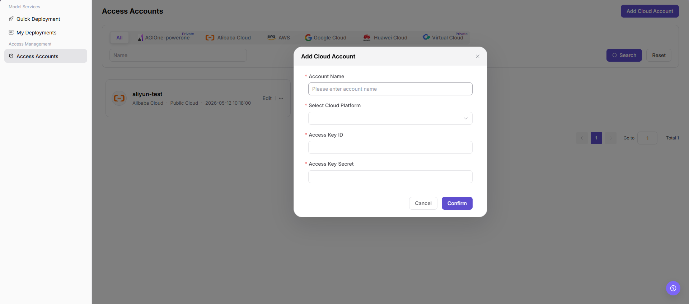

# Access Accounts

::: info Document Information
Version: v1.0
Updated: 2026-07-21
:::

## Feature Overview

`Access Accounts` is used for users to view and add cloud accounts that can be used for model deployment. Users can filter accounts by cloud platform, view account name, cloud platform, public cloud type, creation time, and action entries, and add cloud accounts when they have permission.

| Item | Content |
| --- | --- |
| Applicable role | User |
| Navigation path | AI Infrastructure > On-Cloud > Access Management > Access Accounts |
| Page route | `/infrahub/user/access/account` |
| Managed objects | Cloud account, cloud platform, Access Key ID, Access Key Secret, creation time, and action entries |
| Typical use | Add cloud accounts that can be used for Quick Deployment and view connected accounts |

#### Beginner Explanation

An access account is the credential entry that connects user-side cloud resources. After an account is added, the platform can identify available resources based on the cloud platform and credentials, and use cloud resources within the authorization scope during Quick Deployment or model service creation.

#### Terms Quick Reference

| Term | Description |
| --- | --- |
| Cloud Account | Cloud-side access account registered in the platform by the user. |
| Cloud Platform | Platform to which the cloud account belongs. The screenshots show AGIOne-powerone, Alibaba Cloud, AWS, Google Cloud, Huawei Cloud, and Virtual Cloud. |
| Access Key ID | Cloud-side access credential identifier. It is sensitive information. |
| Access Key Secret | Cloud-side access credential secret. It is highly sensitive and real values must not be written in documentation. |
| Edit | Entry for modifying an existing cloud account configuration. |

## Prerequisites

1. The current account has permission to access the `Access Accounts` page and add cloud accounts.
2. The cloud platform to be connected is selectable on the page.
3. The Access Key ID and Access Key Secret to be used have been obtained through a secure channel and confirmed as valid.
4. The authorization scope, resource visibility, and cost ownership of the new account have been confirmed, and real credentials are not recorded in documentation.

## Page Description

This page is used to view and add cloud accounts. The top of the list provides cloud platform tabs, the `Name` search field, `Search`, and `Reset`; the upper-right corner provides `Add Cloud Account`. Account cards display account name, cloud platform, public cloud type, creation time, `Edit`, and more actions.

Page screenshot:

After clicking `Add Cloud Account`, the page opens the `Add Cloud Account` dialog. Fill in the account name, select the cloud platform, and enter Access Key ID and Access Key Secret.

## Main Operations

### Add Cloud Account

1. Go to `AI Infra > On-Cloud > Access Management > Access Accounts`.
2. Click `Add Cloud Account` in the upper-right corner of the `Access Accounts` page.
3. In the `Add Cloud Account` dialog, fill in `Account Name`.
4. Select the target cloud platform in `Select Cloud Platform`.
5. Fill in `Access Key ID` and `Access Key Secret`.
6. Before clicking the final `Confirm`, verify the account name, cloud platform, credential source, and authorization scope again.
7. For learning or page validation only, click `Cancel` or close the dialog without submitting real account configuration.

## Parameter Reference

| Field | Required | Type | Example | Description |
| --- | --- | --- | --- | --- |
| Cloud platform tabs | No | Tabs | `All` | Filters the account list by cloud platform. |
| Name | No | Input | `demo-cloud-account` | Searches records by account name. Use sanitized examples only in documentation. |
| Search | No | Button | `Search` | Queries account records with the current filters. |
| Reset | No | Button | `Reset` | Clears filters and restores the list display. |
| Add Cloud Account | Yes | Button | `Add Cloud Account` | Opens the add cloud account dialog. |
| Account Name | Yes | Text | `demo-cloud-account` | Display name of the cloud account in the platform. Avoid real customer, business, or internal environment information. |
| Select Cloud Platform | Yes | Dropdown | `Sample Cloud Platform` | Selects the cloud platform to which the account belongs. |
| Access Key ID | Yes | Text | `AKIDEXAMPLE` | Cloud-side access credential identifier. Use placeholder examples only in documentation. |
| Access Key Secret | Yes | Secret text | `SECRET_EXAMPLE` | Cloud-side access secret. Real values must not be written. |
| Edit | No | Action entry | `Edit` | Modifies an existing cloud account configuration. Confirm the impact scope before editing. |
| More actions | No | Action entry | `...` | Opens more action entries provided by the page. |
| Cancel | No | Button | `Cancel` | Closes the dialog without saving the current configuration. |
| Confirm | Yes | Button | `Confirm` | Final action that submits the new cloud account configuration. Review carefully before clicking. |

## Pitfalls

- The screenshots do not show account type, authentication method, authorization scope, region, resource synchronization, or synchronization status fields, so this page does not document them as confirmed UI fields.
- Access Key ID and Access Key Secret are sensitive credentials and should not appear in documentation, screenshots, tickets, or chat records.
- Adding an account does not mean all cloud resources can be used for deployment. Actual visibility is still affected by cloud platform, authorization scope, resource pools, and quotas.
- Modifying or deleting a cloud account may affect Quick Deployment, scaling, rebuilding, and resource synchronization of existing deployments.

## Result Validation

| Check Item | Success Criteria | Troubleshooting |
| --- | --- | --- |
| Page is accessible | The `Access Accounts` page and account list are displayed. | Check menu permissions, route, and login status. |
| Cloud account list loads | The page displays cloud platform tabs, name filter, search, reset, and account cards. | Check filters, data permissions, and API status. |
| Add entry is visible | `Add Cloud Account` is displayed in the upper-right corner. | Check whether the current user has add permission. |
| Add dialog opens | Clicking the add entry displays the `Add Cloud Account` dialog. | Refresh the page and retry. If the issue persists, contact the administrator. |
| Required fields are displayed | The dialog displays account name, select cloud platform, Access Key ID, and Access Key Secret. | Check page loading status and browser console errors. |
| Validation prompts work | Missing required fields trigger page validation prompts, and the flow can continue after they are completed. | Complete account name, cloud platform, and access credentials as prompted. |
| No real submission during learning | The final `Confirm` is not clicked and no real cloud account configuration is saved. | If submitted by mistake, immediately check the account list and contact the operator. |
| Real submission can be tracked | The new cloud account appears in the list, and account name, cloud platform, and creation time can be viewed. | Return to the list to verify the account record, and verify resource visibility in Quick Deployment. |

## Troubleshooting

| Issue Type | Check First | Next Step |
| --- | --- | --- |
| Add entry is unavailable | User permission, menu entry, and page configuration. | Retry with an account that has permission. If the issue persists, contact the administrator. |
| Cloud platform is unavailable | Whether the cloud platform is connected and whether the current user has permission. | Contact the operator to verify cloud platform access and authorization scope. |
| Credential validation fails | Access Key ID, Access Key Secret, cloud platform selection, and credential validity period. | Obtain credentials again through a secure channel and confirm cloud-side permissions. |
| New account is not visible in the list | Filters, cloud platform tab, and submission result. | Click `Reset` and search again. If the issue persists, contact the administrator. |
| Resources are not visible in Quick Deployment | Cloud account authorization scope, resource pool, region, and quota. | Contact the operator to verify resource visibility and deployment permissions. |

## FAQ

#### Why Are Account Resources Not Visible in Quick Deployment After Adding the Account?

**Issue Symptom:**

The cloud account appears in the list, but the corresponding resources are not available on the Quick Deployment page.

**Possible Causes:**

- The cloud account credentials have only been saved, and resource authorization or synchronization is not complete.
- The account authorization scope does not include the target region or resource type.
- Resource pools, quotas, or deployment permissions are not opened to the current user.

**Handling:**

1. Return to the Access Accounts page and confirm the cloud platform and creation time of the account.
2. Click `Reset` to clear filters and check the account again.
3. Contact the operator to verify authorization scope, resource pools, regions, and quotas.

#### How Can Credentials Be Entered Safely?

**Issue Symptom:**

Adding a cloud account requires Access Key ID and Access Key Secret, but the user is unsure how to handle sensitive information.

**Possible Causes:**

- Credential source has not been confirmed through a secure channel.
- Real secrets were pasted into documentation, screenshots, or tickets.
- Credential permissions are too broad or the validity period does not meet requirements.

**Handling:**

1. Enter credentials only in the platform dialog and do not keep real values in documentation or communication records.
2. Use least-privilege credentials and set validity and rotation policies according to organizational security requirements.
3. If credentials have been exposed, stop using them immediately and rotate them according to the security process.

## Next Steps

1. Return to `Quick Deployment` to confirm whether the corresponding cloud platform and region resources are visible.
2. Go to `My Deployments` to check whether later deployment tasks can use this account.
3. Regularly check cloud account permissions, credential validity, and resource visibility.

## Notes

- Adding a cloud account may save real cloud-side authentication information and affect resource visibility, deployment scheduling, and cost ownership.
- Incorrect credentials or authorization scope may cause resources to be invisible, deployment failures, incorrect cost ownership, or security risks.
- `Confirm`, `Save`, and `Submit` are high-risk final actions. This document only describes field review and pre-submission checks, and does not guide users to submit during testing or learning.
- Do not write real accounts, passwords, secrets, tokens, AK/SK, endpoints, cloud resource IDs, internal addresses, or internal test parameters.
