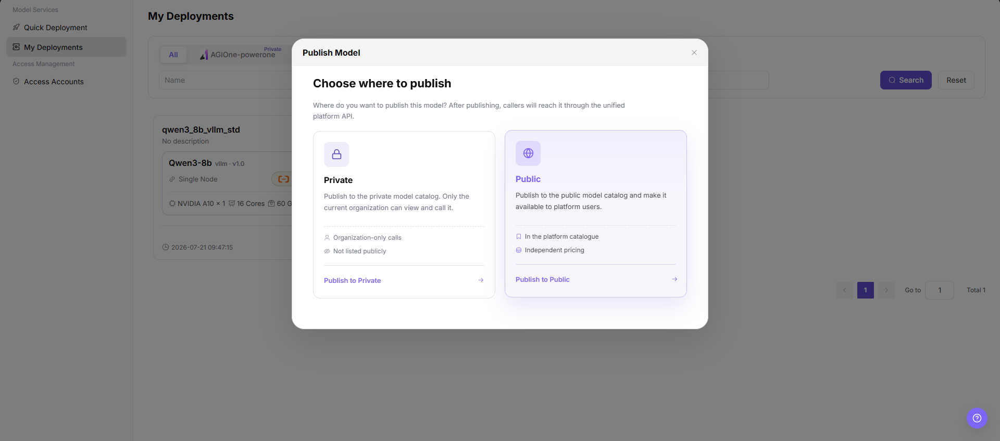

# My Deployments

::: info Document Information
Version: v1.0
Updated: 2026-07-21
:::

## Feature Overview

`My Deployments` is used for users to view created cloud model services and start model publishing from eligible deployment records. The publishing flow first asks users to choose where to publish, and then redirects to the publish model page under `Model Services > Studio > My Models`.

| Item | Content |
| --- | --- |
| Applicable role | User |
| Navigation path | AI Infrastructure > On-Cloud > Model Services > My Deployments |
| Page route | `/infrahub/user/model/deployment` |
| Managed objects | Deployment name, model name, deployment status, cloud platform, region, resource specification, publish region, and action entries |
| Typical use | Publish a model from an existing deployment and continue configuring basic information, billing, and rate limits |

#### Beginner Explanation

My Deployments is the list of running model services. Users can verify whether a deployment is running, whether the model and resources are expected, and then choose `Publish` from more actions to publish the model to a private or public area.

#### Terms Quick Reference

| Term | Description |
| --- | --- |
| Deployment Record | One cloud model service deployment task displayed in the list. |
| Publish | Moves the deployment output into the model publishing flow so it can enter a private or public model catalog. |
| Publish Region | Target scope for publishing the model. The screenshots show `Private` and `Public`. |
| Private | Publishes to the private model catalog. Only the current organization can view and call it. |
| Public | Publishes to the public model catalog, makes it available to platform users, and supports independent pricing and billing. |
| Publish Model Page | Page under `Studio > My Models` that opens after the publish region is selected. |

## Prerequisites

1. The current account has permission to view `My Deployments` and publish models.
2. The target deployment record has been created, and deployment status, model, cloud platform, region, and resource specification have been confirmed.
3. Model publish scope, call method, billing configuration, and later user access boundaries have been confirmed.
4. Sensitive information has been sanitized before publishing. Do not record real Endpoint, API Key, pricing strategy, or internal resource identifiers in documentation.

## Page Description

This page is used to view deployment records and enter the publishing flow. The list supports filtering by cloud platform tabs, `Name`, `Status`, and `Model Name`, and provides `Search` and `Reset`. Deployment cards display deployment name, description, running status, model name, inference engine, version, deployment mode, cloud platform, region, GPU, CPU, memory, cost, creation time, and action entries.

Page screenshot:

More actions include `Publish`, `Delete`, `Monitoring Information`, and `API Call Details`.

## Main Operations

### Publish Model

1. Go to `AI Infra > On-Cloud > Model Services > My Deployments`.
2. In the deployment list, find the target deployment and verify deployment name, running status, model name, cloud platform, region, GPU, CPU, memory, and cost information.
3. Click the more actions entry in the lower-right corner of the target deployment, and then select `Publish`.

4. In the `Publish Model` dialog, review `Choose where to publish`.
5. Select `Private` or `Public` according to the publish target.
6. After clicking `Publish to Private` or `Publish to Public`, the page redirects to the `Publish Model` page under `Model Services > Studio > My Models`.

7. On the `Publish Model` page, continue checking `Basic Information`, `Billing Configuration`, and `Rate Limit Configuration`.
8. In `Model Source/Meta Model Information`, verify `Meta Model`, `Model Source`, `Request URL`, `API Key`, `Model source ID`, and `Region`.
9. For learning or page validation only, stay in the review flow and do not perform the final `Publish`, `Submit`, `Save`, or next-step high-risk configuration.

## Parameter Reference

| Field | Required | Type | Example | Description |
| --- | --- | --- | --- | --- |
| Name | No | Input | `demo-deployment` | Filters records by deployment name. Use sanitized examples only. |
| Status | No | Dropdown | `Running` | Filters records by deployment status. |
| Model Name | No | Input | `demo-model` | Filters deployment records by model name. |
| Deployment Name | No | Card field | `demo_deployment` | Deployment record display name. Avoid real business or customer information. |
| Deployment Status | No | Status tag | `Running` | Shows whether the deployment is available. |
| Model Name | No | Card field | `Sample Model` | Model bound to the deployment record. |
| Deployment Mode | No | Card field | `Single Node` | Deployment mode used by the current deployment. |
| Cloud Platform | No | Card field | `Sample Cloud Platform` | Cloud platform where the deployment is located. |
| Region | No | Card field | `Sample Region` | Region where the deployment is located. |
| Resource Specification | No | Card field | `Sample GPU / CPU / Memory` | Resources used by the deployment. |
| Cost | No | Display field | `Sample cost/hour` | Deployment cost reference. Real amount details are not recorded in documentation. |
| Publish Entry | Yes | Action entry | `Publish` | Opens the publish region selection dialog. |
| Publish Region | Yes | Selection card | `Private` | Selects whether the model is published to Private or Public. |
| Private | No | Publish region | `Publish to Private` | Publishes to the private model catalog for organization-only visibility and calls. |
| Public | No | Publish region | `Publish to Public` | Publishes to the public model catalog for platform users. |
| Redirect Target | Yes | Page redirect | `Studio > My Models > Publish Model` | Target page after selecting the publish region. |
| Meta Model | Yes | Select | `Sample Model` | Meta model information on the publish model page. |
| Model Source | Yes | Dropdown | `AGIOne` | Source of the model being published. |
| Request URL | Yes | URL | `https://api.example.com/predict/demo` | Upstream request address. Use placeholder URLs only in documentation. |
| API Key | Yes | Secret text | `<redacted>` | API key is sensitive and must be redacted in documentation. |
| Model source ID | Yes | Text | `demo-model-id` | Model name or identifier sent to the upstream provider. |
| Region | No | Dropdown | `Sample Region` | Region field on the publish model page. |

## Pitfalls

- Only eligible deployments may display `Publish`. If the entry is unavailable, check deployment status, permissions, and the page menu first.
- Selecting the wrong publish region may publish the model to the wrong site, region, or business scope.
- Publishing to Public may affect external model visibility, invocation method, billing configuration, and later user access.
- The screenshots show Request URL and API Key fields. Documentation, screenshots, and tickets must redact them.
- `Delete`, stopping a deployment, final publish, submit, or save may affect real services or model visibility. Do not perform them during learning or validation.

## Result Validation

| Check Item | Success Criteria | Troubleshooting |
| --- | --- | --- |
| Page is accessible | The `My Deployments` page and deployment list are displayed. | Check menu permissions, route, and login status. |
| Deployment list loads | The page displays cloud platform tabs, Name, Status, Model Name filters, and deployment cards. | Check filters, data permissions, and API status. |
| Target deployment status is visible | The target deployment displays running status, model name, cloud platform, region, and resource specification. | Clear filters and search again. If it is still unavailable, contact the operator. |
| Publish entry is visible | `Publish` is displayed in more actions. | Check deployment status, model permission, and publishing permission. |
| Publish region can be selected | The `Publish Model` dialog displays Private and Public. | Refresh the page and retry. If the issue persists, contact the administrator. |
| Redirect target is correct | After selecting the publish region, the page opens the `Publish Model` page under `Studio > My Models`. | Check route, permissions, and publish region configuration. |
| Publish model fields are visible | Basic information, billing configuration, rate limit configuration, and model source information are displayed. | Check page loading status and model publishing permission. |
| No final submission during learning | No final publish, submit, or save is performed, and model visibility is not changed. | If submitted by mistake, immediately check model publishing status and contact the operator. |

## Troubleshooting

| Issue Type | Check First | Next Step |
| --- | --- | --- |
| Deployment record cannot be found | Cloud platform tabs, Name, Status, and Model Name filters. | Click `Reset` and search again. |
| Publish entry is unavailable | Deployment status, current account permission, and whether the model can be published. | Contact the operator to verify publishing permission and deployment status. |
| Region selection dialog cannot open | Browser state, page API, and target deployment record. | Refresh the page and retry. If the issue persists, contact the administrator. |
| No permission after redirect | Studio, My Models, and Publish Model permissions. | Contact the administrator to grant model publishing permission. |
| Publish model fields are abnormal | Meta model, model source, Request URL, API Key, and model source ID. | Return to the deployment record to verify source configuration and avoid exposing real credentials. |

## FAQ

#### Why Is Publish Missing from More Actions?

**Issue Symptom:**

The deployment card is visible, but `Publish` is not displayed in more actions.

**Possible Causes:**

- The current deployment status does not meet publishing conditions.
- The current account does not have model publishing permission.
- The model or deployment source does not support publishing.

**Handling:**

1. Verify deployment status, model name, and deployment region.
2. Confirm whether the current account has permission to publish models.
3. Contact the operator to verify deployment source and publishing policy.

#### Why Does Redirect Fail After Selecting Publish Region?

**Issue Symptom:**

After clicking `Publish to Private` or `Publish to Public`, the publish model page does not open.

**Possible Causes:**

- Permission for Studio or My Models is insufficient.
- Publish region configuration is unavailable.
- Page route or API is abnormal.

**Handling:**

1. Refresh the page and select the publish region again.
2. Check whether `Studio > My Models` can be opened directly.
3. Contact the administrator to verify publish region, page permissions, and API status.

## Next Steps

1. Continue completing basic information, billing configuration, and rate limit configuration on the `Publish Model` page.
2. Before publishing, confirm publish region, visibility scope, invocation method, and billing strategy again.
3. After publishing, return to `My Models` or the model catalog to check model status and visibility.

## Notes

- Publishing a model may affect external model visibility, invocation method, billing configuration, and later user access.
- Selecting the wrong publish region may publish the model to the wrong site, region, or business scope.
- The redirected `Publish`, `Submit`, and `Save` actions are high-risk final actions. This document only describes the review and redirect flow, and does not guide users to execute them during testing or learning.
- Do not write real accounts, secrets, tokens, AK/SK, Endpoint, API Key, customer names, pricing strategies, cloud resource IDs, Request URL, or internal test parameters.
