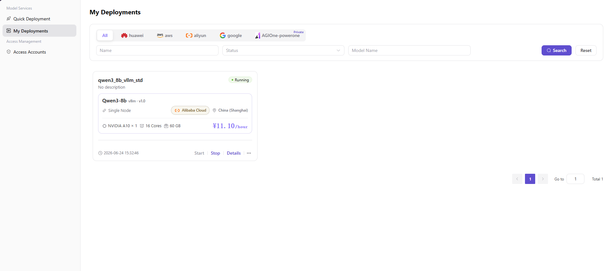
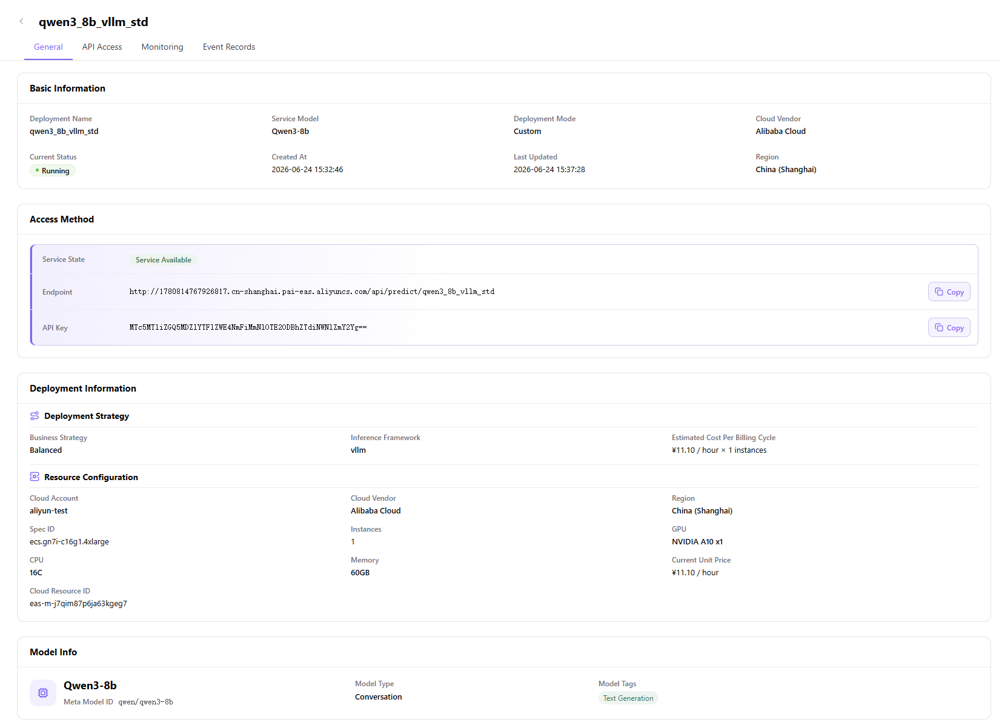
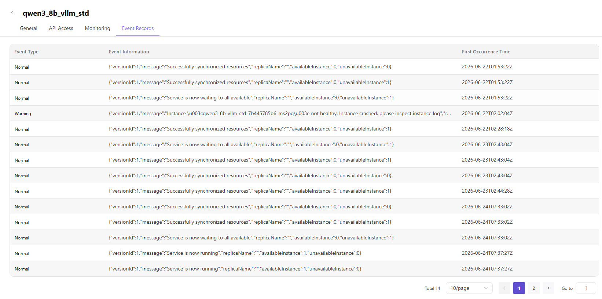
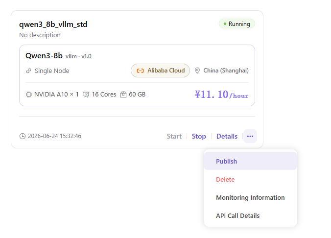
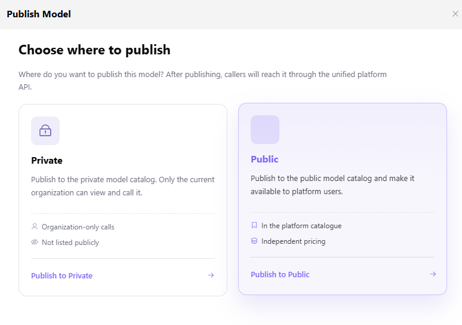

# My Deployments

## Preface

| Item            | Content                                                                                                                                                                                                                            |
| --------------- | ---------------------------------------------------------------------------------------------------------------------------------------------------------------------------------------------------------------------------------- |
| Target Audience | User                                                                                                                                                                                                                               |
| Navigation Path | Model Services > My Deployments                                                                                                                                                                                                    |
| Overview        | The entry for users to view and manage deployed model instances, supporting status query, detail view (4 sub-tabs: **General** / **API Access** / **Monitoring** / **Event Records**), start/stop control, publishing, and deletion |

## Page Structure

"My Deployments" consists of 2 major blocks: ① Deployment task list (with filters and Tabs) → ② Deployment details page (4 sub-tabs).

### Deployment Task List

- The top contains **6 cloud platform Tabs** (All / huawei / aws / aliyun / google / AGIOne-powerone[Private]), with "All" selected by default
- Below is the **three-field filter** (Name / Status / Model Name), with **"Search"** (purple) and **"Reset"** buttons
- The main area is a **deployment task card list**, each card contains: deployment name + status badge (● Running / ● Starting / ● Stopped, etc.) + model info (model name / inference engine · version) + deployment metadata (deployment mode / cloud platform / region) + resource spec (GPU × N / N cores / N GB) + current unit price (¥/hour) + creation time
- 4 direct actions at the bottom of the card: **"Start"** / **"Stop"** / **"Details"** / **"..."** (more)
- The **"..."** (more) menu at the top right of the card contains 4 items: **Publish** / **Delete** / Monitoring Information / API Call Details
- The bottom shows pagination controls (Total N / N/page / ‹ / 1 / › + Go to N input box)

### Deployment Details Page (4 Sub-Tabs)

Click the **"Details"** link of any deployment card in the list → enter the details page. The page top shows the deployment name (e.g., `qwen3_8b_vllm_std`), with a back arrow at the top left to return to the list. The details page contains 4 sub-tabs:

- **General** (default, highlighted in purple) — 4 cards: **Basic Information** (4×2 field grid) + **Access Method** (with status badge + Endpoint + API Key + Copy buttons) + **Deployment Information** (**Deployment Strategy** + **Resource Configuration** 2 sub-areas) + **Model Info** (model name + Meta Model ID / Model Type / Model Tags)
- **API Access** — Top small text `aliyun  Region: cn-shanghai` identifier + **Request URL** / **Request Method** POST / **Request Headers** table (Content-Type / Authorization, 5 columns: Parameter / Parameter Name / Default Value / Parameter Type / Required) + **Request Parameters** table (same 5 columns) + **Code Examples** (7 language Tabs: curl / python / java / go / nodejs / php / ruby + Copy button)
- **Monitoring** — 2 Tab groups (**Monitoring Dimension**: Basic / Performance / GPU + **Monitoring Period**: 1 Minute / 15 Minutes / 1 Hour / 1 Day) + 12 line charts (Basic 6 + Performance 2 + GPU 4)
- **Event Records** — 3-column table (**Event Type** / **Event Information** JSON / **First Occurrence Time** ISO 8601) + pagination (Total N / N/page / Go to N)

## Operations

### Query and Filter Deployment Tasks

1. Enter the platform homepage, click the **"Model Services > My Deployments"** menu in the left navigation bar to enter the My Deployments page.
2. The page top displays the **"All"** Tab by default (highlighted in purple). The other 5 cloud platform Tabs are: **huawei** / **aws** / **aliyun** / **google** / **AGIOne-powerone** (with **Private** tag).
3. Click the target cloud platform Tab (e.g., **aliyun**), the system will display only the deployment tasks under that cloud platform.
4. Use the three-field filter in the search bar:
   - **"Name"** text box: enter the deployment task name keyword;
   - **"Status"** dropdown: filter by deployment status;
   - **"Model Name"** text box: enter the deployed model name keyword.
5. Click the purple **"Search"** button to apply the filter conditions; click the **"Reset"** button to clear all filter conditions.
6. When the list is empty, an empty state illustration + **"No data"** prompt is displayed. The bottom provides pagination controls (**"Go to"** page number input box + current page number + **"‹"** / **"›"** arrows + **"Total N"** record count prompt).

#### Parameters - List Filtering

| Term | Type | Example | Description |
|------|------|---------|-------------|
| Cloud Platform Tab | Radio | `All` / `huawei` / `aws` / `aliyun` / `google` / `AGIOne-powerone` (Private) | Required. Filter by cloud platform |
| Name | Text | `qwen3_8b_vllm_std` | Optional. Deployment task name keyword |
| Status | Dropdown | `Running` / `Starting` | Optional. Filter by deployment status |
| Model Name | Text | `Qwen3-8b` | Optional. Deployed model name keyword |
| Page Number | Number | `1` | Required. Current page number (jumped via **"Go to"** input box) |

### View Deployment Details (4 Sub-Tabs)

Click the **"Details"** link of the target deployment card in the "My Deployments" list → enter the deployment details page (the page top shows the deployment name, with a back arrow at the top left to return to the list; the details page contains 4 sub-tabs).

#### Sub-Tab 1: General (default)

The page shows 4 cards:

- **Basic Information** card (4×2 field grid):
   - **Deployment Name** (e.g., `qwen3_8b_vllm_std`) / **Service Model** (e.g., `Qwen3-8b`) / **Deployment Mode** (e.g., `Custom` / `Single Node`) / **Cloud Vendor** (e.g., `Alibaba Cloud`)
   - **Current Status** (e.g., `● Running` green / `● Starting`) / **Created At** (e.g., `2026-06-24 15:32:46`) / **Last Updated** (e.g., `2026-06-24 15:37:28`) / **Region** (e.g., `China (Shanghai)`)

- **Access Method** card (light purple background, **Service Available** green badge):
   - **Service State**: green **Service Available** badge (shown after deployment completion)
   - **Endpoint** (e.g., `http://1780814767926817.cn-shanghai.pai-eas.aliyuncs.com/api/predict/qwen3_8b_vllm_std`) + Copy button
   - **API Key** (e.g., `MTc5MTliZGQ5MDZlYTFlZWFiNmFiNmNlOTE2ODBhZTdlNWNlZmY2Yg==`) + Copy button

- **Deployment Information** card (with **"Deployment Strategy"** and **"Resource Configuration"** 2 sub-areas):
   - **Deployment Strategy**: **Business Strategy** (e.g., `Balanced` / `Cost-Effective`) / **Inference Framework** (e.g., `vllm` / `sglang`) / **Estimated Cost Per Billing Cycle** (e.g., `¥11.10 / Hour × 1 instances`)
   - **Resource Configuration**: **Cloud Account** (e.g., `aliyun-test`) / **Cloud Vendor** (e.g., `Alibaba Cloud`) / **Region** (e.g., `cn-shanghai`) / **Spec ID** (e.g., `ecs.gn7i-c16g1.4xlarge`) / **Instances** (e.g., `1`) / **GPU** (e.g., `NVIDIA A10 x1`) / **CPU** (e.g., `16C`) / **Memory** (e.g., `60GB`) / **Current Unit Price** (e.g., `¥11.10 / hour`) / **Cloud Resource ID** (e.g., `eas-m-j7qim87p6ja63kgeg7`)

- **Model Info** card: model name / **Meta Model ID** (e.g., `qwen/qwen3-8b`) / **Model Type** / **Model Tags**

#### Sub-Tab 2: API Access

Top small text **"aliyun  Region: cn-shanghai"** (cloud account and region identifier). The page shows 4 sections:

- **Request URL**: Auto-generated after deployment completion (placeholder while deploying; the Access Method card shows the "auto-generate access address" hint)
- **Request Method**: `POST`
- **Request Headers** table (5 columns: Parameter / Parameter Name / Default Value / Parameter Type / Required):

  | Parameter | Parameter Name | Default Value | Parameter Type | Required |
  | --- | --- | --- | --- | --- |
  | Content-Type | Content-Type | `application/json` | string | true |
  | Authorization | Authorization | `Bearer {api_key}` | string | true |

- **Request Parameters** table (same 5 columns):

  | Parameter | Parameter Name | Default Value | Parameter Type | Required |
  | --- | --- | --- | --- | --- |
  | max_tokens | max_tokens | `1024` | string | true |
  | messages | messages | `[{"role":"user","content":"hello"}]` | string | true |

- **Code Examples** area (7 language Tabs + Copy button at top right): curl / python / java / go / nodejs / php / ruby

#### Sub-Tab 3: Monitoring

The page top contains 2 Tab groups + 12 line charts:

- **Monitoring Dimension** Tab (3 choices): **Basic** (default) / Performance / GPU
- **Monitoring Period** Tab (4 choices): **1 Minute** (default) / 15 Minutes / 1 Hour / 1 Day
- **Line charts** grid (dynamically switched by dimension):
  - **Basic** (6 charts): CpuUtil (%) / CpuCoresUsage (core) / MemUtil (%) / MemUsage (MiB) / InboundTraffic (count/s) / OutboundTraffic (count/s)
  - **Performance** (2 charts): QPS (count/s) / AvgResponseTime (μs)
  - **GPU** (4 charts): GpuUtil (%) / GpuMemUtil (%) / GpuMemTotal (MiB) / GpuMemUsage (MiB)

> Note: When the deployment just started (as shown in the screenshot), all 12 line charts may be empty (no data); wait for the monitoring data collection to complete.

#### Sub-Tab 4: Event Records

The event table (3 columns: Event Type / Event Information / First Occurrence Time) is displayed in reverse chronological order, example events:

| Event Type | Event Information | First Occurrence Time |
| --- | --- | --- |
| Normal | `{"versionId":"1","message":"Service is now waiting to all available","replicaName":"","availableInstance":0,"unavailableInstance":1}` | 2026-06-22T01:53:22Z |
| Normal | `{"versionId":"1","message":"Successfully synchronized resources","replicaName":"","availableInstance":0,"unavailableInstance":1}` | 2026-06-22T01:53:22Z |
| Warning | `{"versionId":1,"message":"Instance \u003cqwen3-8b-vllm-std-7b445785b6-ms2pq\u003e not healthy: Instance crashed, please inspect instance log.","r..."` | 2026-06-22T02:02:04Z |
| ... | ... | ... |

Pagination controls: Total 14 / 10 per page / ‹ / 1 2 / › + Go to 1 input box.

#### Parameters - Details Page 4 Sub-Tabs

| Term | Type | Example | Description |
|------|------|---------|-------------|
| Basic Information - Deployment Name | Text | `qwen3_8b_vllm_std` | Unique identifier of the deployment task |
| Basic Information - Service Model | Text | `Qwen3-8b` | Name of the deployed model |
| Basic Information - Deployment Mode | Text | `Custom` / `Single Node` | Deployment architecture mode (Single Node / High Availability) |
| Basic Information - Current Status | Status Badge | `● Running` green / `● Starting` | Real-time status of the deployment |
| Basic Information - Created At | Timestamp | `2026-06-24 15:32:46` | Creation time of the deployment task |
| Access Method - Service State | Status Badge | `Service Available` green | Shown after deployment completion |
| Access Method - Endpoint | URL | `http://...api/predict/qwen3_8b_vllm_std` | Auto-generated after deployment completion, with Copy button |
| Access Method - API Key | Encrypted String | `MTc5MTliZGQ5MDZlYTFlZWFiNmFiNmNlOTE2ODBhZTdlNWNlZmY2Yg==` | Auto-generated after deployment completion, with Copy button |
| Deployment Strategy - Business Strategy | Text | `Balanced` / `Cost-Effective` | Business strategy selected at deployment time (Cost-Effective / High Performance / Spot Fast Delivery / GPU Count) |
| Deployment Strategy - Inference Framework | Text | `vllm` / `sglang` | Inference engine selected at deployment time (vLLM / SGLang) |
| Deployment Strategy - Estimated Cost Per Billing Cycle | Price | `¥11.10 / Hour × 1 instances` | Real-time cost estimation |
| Resource Configuration - Cloud Account | Text | `aliyun-test` | Cloud account used for deployment |
| Resource Configuration - Spec ID | Text | `ecs.gn7i-c16g1.4xlarge` | GPU instance spec ID |
| Resource Configuration - GPU | Text | `NVIDIA A10 x1` | GPU model and count |
| Resource Configuration - Cloud Resource ID | Text | `eas-m-j7qim87p6ja63kgeg7` | Unique cloud-side resource identifier |
| Model Info - Meta Model ID | Text | `qwen/qwen3-8b` | Underlying meta-model identifier |
| API Access - Request URL | URL | `http://...api/predict/qwen3_8b_vllm_std` | Auto-generated after deployment completion |
| API Access - Request Method | HTTP Method | `POST` | Call method |
| API Access - Code Examples | Code Snippet | curl / python / java / go / nodejs / php / ruby | 7 language code examples |
| Monitoring - Monitoring Dimension | Tab | `Basic` / `Performance` / `GPU` | Metric category |
| Monitoring - Monitoring Period | Tab | `1 Minute` / `15 Minutes` / `1 Hour` / `1 Day` | Monitoring time window |
| Event Records - Event Type | Text | `Normal` / `Warning` | Event severity |
| Event Records - Event Information | JSON | `{"versionId":1,"message":"..."}` | Detailed event description |
| Event Records - First Occurrence Time | Timestamp (ISO 8601) | `2026-06-22T01:53:22Z` | Time when the event first occurred |

### Start / Stop Deployment

1. In the "My Deployments" list, find the target deployment card.
2. Click the **"Start"** / **"Stop"** link at the bottom of the card → start/stop the deployment task (the card displays the `Stop` link when in `Running` state, and the `Start` link when in `Starting` / `Stopped` state).

### Publish Deployment

1. In the "My Deployments" list, find the target deployment card.
2. Click the **"..."** (more) button at the bottom of the card → a 4-item action menu pops up (**Publish** purple / **Delete** red / Monitoring Information / API Call Details).
3. Select **"Publish"** → the **"Publish Model"** popup opens (with **"Choose where to publish"** title + description "Where do you want to publish this model? After publishing, callers will reach it through the unified platform API.").
4. Select the publishing location in the popup:
   - **Private** (left card, 🔒 icon): publish to the private model catalog, **only the current organization** can view and call it (tags: **Organization-only calls** / **Not listed publicly** / **Publish to Private** →).
   - **Public** (right card, highlighted in purple): publish to the public model catalog, **open to platform users** (tags: **In the platform catalogue** / **Independent pricing** / **Publish to Public** →).
5. Click the **"Publish to Private"** / **"Publish to Public"** button at the bottom → publishing complete; to discard, click the **"×"** close button at the top right of the popup or click outside the popup area.

## Other Operations

| Operation | Steps |
|-----------|-------|
| Switch Cloud Platform Tab | Click the cloud platform Tabs at the top of the page (**All** / **huawei** / **aws** / **aliyun** / **google** / **AGIOne-powerone** [Private]) → View deployment tasks under the corresponding cloud platform |
| Reset Filter | Click the **"Reset"** button → Clear the **Name** / **Status** / **Model Name** three filter conditions |
| Start Deployment | On the deployment card, click the **"Start"** link → start the stopped deployment task |
| Stop Deployment | On the deployment card, click the **"Stop"** link → stop the running deployment task (save cost) |
| View Deployment Details | Click the **"Details"** link of the deployment card → enter the details page with 4 sub-tabs (**General** / **API Access** / **Monitoring** / **Event Records**) |
| Copy Endpoint | In the **General** sub-tab, **Access Method** card, click the **"Copy"** button on the right side of the Endpoint row → copy the access URL to the clipboard |
| Copy API Key | In the **General** sub-tab, **Access Method** card, click the **"Copy"** button on the right side of the API Key row → copy the API Key to the clipboard |
| Switch Monitoring Dimension | In the **Monitoring** sub-tab, click the **"Basic"** / **"Performance"** / **"GPU"** 3 Tabs → switch to different dimensions of metric charts |
| Switch Monitoring Period | In the **Monitoring** sub-tab, click the **"1 Minute"** / **"15 Minutes"** / **"1 Hour"** / **"1 Day"** 4 Tabs → switch to different time windows of metric data |
| Switch Code Language | In the **API Access** sub-tab, **Code Examples** area, click the **"curl"** / **"python"** / **"java"** / **"go"** / **"nodejs"** / **"php"** / **"ruby"** 7 Tabs → switch to different language code examples |
| Copy Code | In the **API Access** sub-tab, **Code Examples** area, click the **"Copy"** button at the top right → copy the current language code snippet to the clipboard |
| Publish | Click the **"..."** (more) button at the top right of the deployment card → Select **"Publish"** → Publish Model popup opens → Select Private / Public → Complete publishing |
| Delete | Click the **"..."** (more) button at the top right of the deployment card → Select **"Delete"** → The delete operation is irreversible, please proceed with caution |
| Monitoring Information | Click the **"..."** (more) button at the top right of the deployment card → Select **"Monitoring Information"** → Jump directly to the **Monitoring** sub-tab of the details page |
| API Call Details | Click the **"..."** (more) button at the top right of the deployment card → Select **"API Call Details"** → Jump directly to the **API Access** sub-tab of the details page |

## Notes

- **Deployment Workflow Entry**: The deployment operation has been unified and migrated to the **"Model Services > Quick Deployment"** menu (Step 1 Select Cloud Account and Model → Step 2 Smart Deployment Recommendation → Step 3 Publish Deployment popup). The **"My Deployments"** page is only used to view and manage created deployment tasks; it no longer provides an entry for creating deployments.
- **Filter and Reset**: After using the three-field filter (**Name** / **Status** / **Model Name**), you can click the **"Reset"** button to clear the conditions; use the **"Go to"** page number input box to quickly jump.
- **Details Page 4 Sub-Tabs**:
  - **General** (default) — Displays **Basic Information** + **Access Method** + **Deployment Information** + **Model Info** 4 cards
  - **API Access** — Displays **Request URL** / **Request Method** / **Request Headers** / **Request Parameters** + 7 language **Code Examples**
  - **Monitoring** — Displays 3 monitoring dimensions (**Basic** / **Performance** / **GPU**) × 4 time windows of 12 real-time metric line charts
  - **Event Records** — Displays **Normal** (common) / **Warning** (warning) event JSON details and first occurrence time (ISO 8601 format)
- **Access Method Status**: When the deployment is not yet complete (e.g., "Starting" / "Preparing"), the **Access Method** card shows a light purple warning background + **"Service Unavailable"** status; after deployment completion, it changes to the **"Service Available"** green badge + auto-generated Endpoint + API Key (both with Copy buttons).
- **Monitoring Data Latency**: The charts in the **Monitoring** sub-tab may be empty (no data line) for a newly started deployment; wait for 1 monitoring period (default 1 Minute) to see data points.
- **"..." Menu 4 Items**: Publish (→ open Publish Model popup) / Delete (irreversible, red) / Monitoring Information (→ jump to **Monitoring** sub-tab) / API Call Details (→ jump to **API Access** sub-tab).
- **Publish Model Private vs Public**:
  - **Private**: **Only the current organization** can view and call; tags: **Organization-only calls** / **Not listed publicly**
  - **Public**: **Open to platform users**; tags: **In the platform catalogue** / **Independent pricing**
- **Event Types**:
  - **Normal**: Resource scheduling/synchronization success (e.g., "Service is now running" / "Successfully synchronized resources")
  - **Warning**: Instance health anomaly (e.g., "Instance crashed, please inspect instance log"); you need to check the instance log to locate the issue
- **Real Resource Spec Data**: Screenshot example `ecs.gn7i-c16g1.4xlarge` (NVIDIA A10 × 1 / 16C / 60GB / ¥11.10/hour), different from the Quick Deployment page example `ecs.gn6i-c4g1.xlarge` (NVIDIA T4 × 1 / 4C / 15GB / ¥12.78/hour).
- **The delete operation is irreversible**, please proceed with caution.
