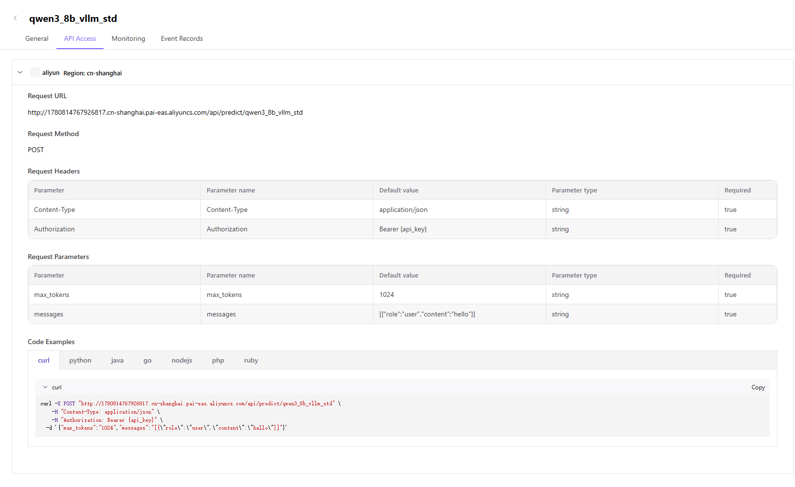
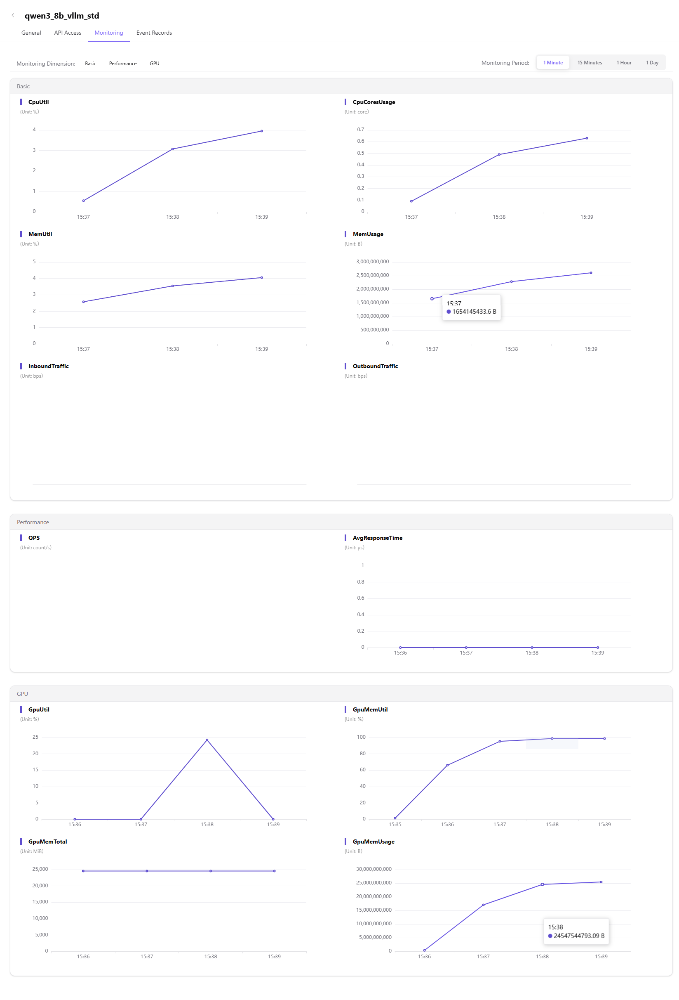

# My Deployments

:::: info Document Information
Version: v1.0
Updated: 2026-07-08
::::

## Feature Overview

`My Deployments` is used to maintain deployment instances, service status, Endpoint, API Key, monitoring, events, and invocation examples, supporting multi-cloud scheduling, resource authorization, and model deployment workflows.

| Item | Content |
| --- | --- |
| Applicable role | User |
| Navigation path | Model Services > My Deployments |
| Page route | /user/model-services/my-deployments |
| Managed objects | Deployment instances, service status, Endpoint, API Key, monitoring, events, and invocation examples |
| Typical use | View and manage created cloud model services |

### Beginner View

My Deployments is like the runtime console for model services. It is used to view the status, invocation information, events, and monitoring of each cloud model service and determine whether the service is actually available.

### Terms

| Term | Description |
| --- | --- |
| Deployment instance | One cloud model service deployment record. |
| Access method | Invocation information such as service Endpoint, API Key, and request method. |
| Event | Lifecycle records such as deployment, scaling, failure, and recovery. |
| Monitoring | Metric data for service resources and invocation performance. |

## Prerequisites

1. The current account already has deployment records or deployment view permission.
2. Deployment name, business region, model, or status filters are ready.
3. Endpoint and API Key usage methods have been confirmed before invocation testing.

## Page Description

The page is for users to manage created cloud model services. Users can view deployment status, copy redacted invocation information, view events and monitoring, and decide whether to retry, scale, stop, or contact the operator according to status.

Page screenshot:

Used to view deployment status, model, region, and operation entries.

## Main Operations

### Procedure

1. Go to `Model Services > My Deployments`.
2. Filter records by deployment name, business region, model, or status.
3. Open deployment details to view status, events, monitoring, and invocation information.
4. After the service runs, copy Endpoint, API Key placeholder description, or invocation example.
5. When a failure occurs, troubleshoot by event time, error prompt, and request ID.

Key step screenshots:

Mask Endpoint and API Key before copying invocation information.

When deployment is abnormal, troubleshoot using monitoring, events, and invocation results together.

Event records are used to locate creation failures, insufficient resources, or runtime exceptions.

### Parameters

| Field | Required | Type | Example | Description |
| --- | --- | --- | --- | --- |
| Deployment name | Yes | Text | `qwen-prod-001` | Deployment instance display name. |
| Service status | System-generated | Enum | `Running` | Shows whether the instance can be called. |
| Business region | System-generated | Text | `East China Production` | Business region of the deployment request. |
| Endpoint | System-generated | URL | `https://api.example.com/predict/model` | Invocation address. Screenshots must be redacted. |
| Event time | System-generated | Date time | `2026-07-06 10:00` | Used to locate deployment lifecycle issues. |

### Pitfalls

- Before copying invocation information, confirm that displayed content is redacted. Do not send real API Key values to tickets or group chats.
- Running status does not mean business invocation will always succeed. Model protocol and request parameters must also be checked.
- Before stopping or deleting a deployment, confirm that no business traffic is using it.

### Result Validation

1. Deployment records, models, and status are visible in the list.
2. The details page shows events, monitoring, and invocation information.
3. Test invocation returns a response that conforms to the model protocol.

## FAQ

### Deployment Stays in Creating

**Issue Symptom:**

After deployment submission, it does not enter running status for a long time.

**Possible Causes:**

- Resource pool queueing or insufficient capacity.
- Image pull, framework startup, or health check takes time.
- Cloud account or scheduling policy is abnormal.

**Handling:**

1. Open deployment events and check the current stage.
2. Wait for the queue or adjust the specification and retry.
3. Contact the operator with deployment name, business region, and event screenshot.

### Service Runs but Invocation Fails

**Issue Symptom:**

Deployment status is running, but API invocation returns an error.

**Possible Causes:**

- Endpoint or API Key is used incorrectly.
- Request parameters do not conform to the model protocol.
- Model service is throttled, times out, or has upstream exceptions.

**Handling:**

1. Copy the latest invocation example and test again.
2. Verify request path, request headers, and parameters.
3. View monitoring, events, and invocation error codes.

## Next Steps

1. Validate business invocation.
2. View usage, costs, and monitoring.
3. Scale, stop, or delete deployments as needed.

## Notes

- Confirm that credentials will not leak before copying invocation information.
- Running status does not mean business requests will always succeed.
- Confirm no business traffic before stopping or deleting deployments.
