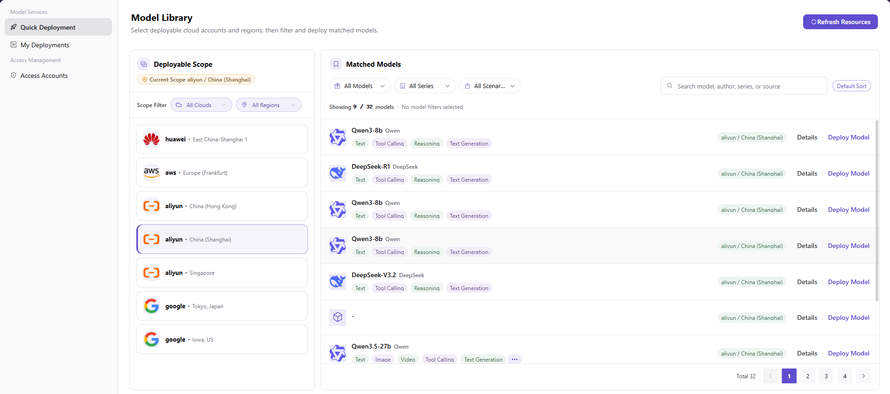
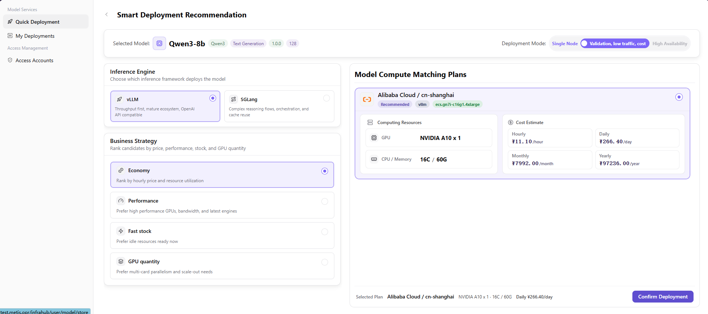
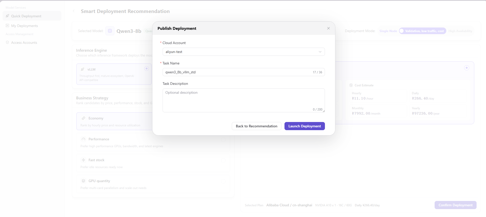

# Quick Deployment

:::: info Document Information
Version: v1.0
Updated: 2026-07-06
::::

## Feature Overview

`Quick Deployment` is used to select models, cloud resources, deployment specifications, and access configuration through a wizard, and to create cloud model services.

| Item | Content |
| --- | --- |
| Applicable role | User |
| Navigation path | Model Services > Quick Deployment |
| Page route | /infrahub/user/model-services/quick-deployment |
| Managed objects | Models, cloud account authorization, deployment regions, specifications, images, Endpoint, and API Key |
| Typical use | Quickly create cloud model services based on authorized cloud resources |

### Beginner View

Quick Deployment is like ordering a standard package: select the model, business region, specification, and access method, and the platform creates a cloud model service according to authorization and scheduling policies.

### Terms

| Term | Description |
| --- | --- |
| Endpoint | Service access address generated after deployment. It is sensitive information. |
| API Key | Authentication key used to call the deployed service. It should be displayed in redacted form. |
| Deployment region | Cloud provider region or business region that affects resource availability and access latency. |
| Deployment specification | CPU, GPU, memory, or instance specification used by the model service. |

## Prerequisites

1. The current account has Quick Deployment permission.
2. The target model, business region, and resource specification are selectable.
3. Deployment cost, instance count, and invocation credential display method have been confirmed.

## Page Description

The page is for users to create cloud model services. Users need to select a model, business region, deployment specification, instance count, and access method, and confirm before submission that costs, authorized accounts, and credential display will not leak.

## Main Operations

### Procedure

1. Go to `Model Services > Quick Deployment`.
2. Select the model and business region to deploy.
3. Select resource specification, instance count, and runtime parameters.
4. Confirm access method, invocation credential display method, and cost estimate.
5. After submission, go to My Deployments to view status, events, and monitoring.

Key step screenshots:

First confirm that the model, region, and cloud resources are visible.

Recommended plans must satisfy authorization, capacity, and model configuration at the same time.

Before submission, confirm costs, specifications, and access method again.

### Parameters

| Field | Required | Type | Example | Description |
| --- | --- | --- | --- | --- |
| Model | Yes | Dropdown | `qwen-cloud-7b` | Model asset to deploy. |
| Business region | Yes | Dropdown | `East China Production` | Determines available resources and scheduling scope. |
| Resource specification | Yes | Dropdown | `1GPU-16C-64G` | Compute specification used by deployment instances. |
| Instance count | Yes | Number | `1` | Number of service replicas. |
| Access credential | System-generated | Ciphertext | `<api-key>` | Invocation credential generated or associated after deployment. |

### Pitfalls

- If business region, model asset, or resource specification does not match, selectable options may be empty.
- Confirm costs and instance count before submission to avoid mistakenly creating high-cost services.
- Do not expose Endpoint, API Key, authorized accounts, or internal resource names in screenshots.

### Result Validation

1. A deployment record is generated after submission.
2. The My Deployments page shows deployment status and events.
3. After the service runs, redacted invocation information can be copied and a test call can be completed.

## FAQ

### Model or Specification Cannot Be Selected

**Issue Symptom:**

After entering Quick Deployment, the model, business region, or resource specification dropdown is empty.

**Possible Causes:**

- The model asset is not authorized to the current user.
- The business region is not bound to an available resource pool.
- Current tenant quota or resource capacity is insufficient.

**Handling:**

1. Switch business region and check again.
2. Check My Access Accounts and resource authorization status.
3. Contact the operator to verify model assets, resource pools, and quotas.

### Deployment Creation Fails

**Issue Symptom:**

Deployment fails after clicking submit, or My Deployments shows creation failed.

**Possible Causes:**

- Resource pool capacity is insufficient or the scheduling policy has no available fallback.
- Runtime image, framework, or model asset configuration does not match.
- Cloud account credentials or authorized account are unavailable.

**Handling:**

1. View My Deployments events and error information.
2. Adjust specification or instance count and retry.
3. Contact the operator with deployment name, time, business region, and error prompt.

## Next Steps

1. Go to My Deployments to view status.
2. Copy invocation information and perform a test call.
3. View events, monitoring, and cost usage.

## Notes

- Confirm costs and instance count before submission.
- Endpoint, API Key, and authorized account screenshots must be redacted.
- When deployment fails, check My Deployments events first.
