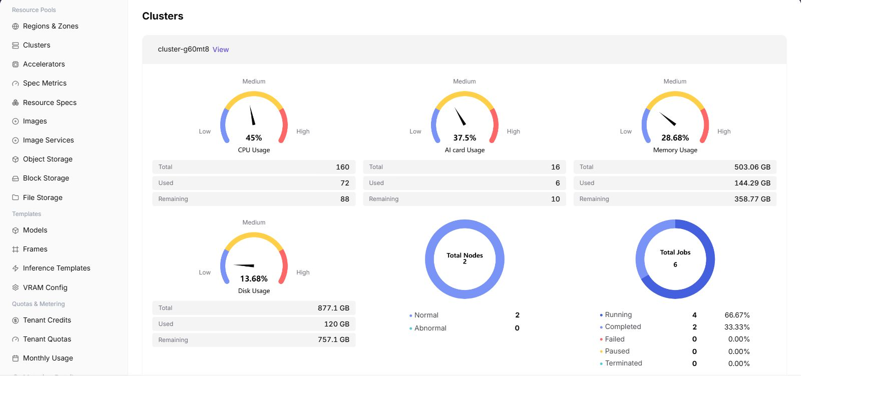

# Cluster Statistics

## Feature Overview

`Cluster Statistics` is used to view cluster status, resource capacity, job count, and region/availability zone ownership, helping operators perform capacity inspections, locate exceptions, and make resource scheduling judgments.

| Item | Content |
| --- | --- |
| Applicable Role | Operator |
| Navigation Path | Monitoring > Cluster Statistics |
| Page Route | `/powerone/monitor/clusters` |
| Managed Objects | Cluster status, resource capacity, job count, and region/availability zone ownership |
| Typical Use | Judge resource watermarks, health status, and scheduling carrying capacity by cluster |

### Beginner View

Cluster statistics are like health check reports for each equipment room. They compare capacity, health status, and resource watermarks across clusters to determine whether an issue is a local cluster problem or global resource shortage.

### Terms Quick Reference

| Term | Description |
| --- | --- |
| Cluster Capacity | Total CPU, memory, GPU/NPU, and other resources the cluster can provide. |
| Resource Watermark | Ratio of used resources to remaining resources. |
| Health Status | Whether cluster components, nodes, and scheduling capability are normal. |
| Schedulable Resources | Resources currently capable of hosting new jobs. |

## Prerequisites

1. The current account has cluster monitoring view permissions.
2. The target cluster has been registered and is within the monitorable scope.
3. Cluster capacity, node, and accelerator metrics have been collected.
4. The region or cluster scope to compare has been confirmed.

## Page Description

Cluster statistics are used to compare cluster capacity, health status, and resource watermarks across different regions or resource pools. Operators can use the cluster dimension to determine whether there is overall capacity shortage, collection exception, or a hotspot in a single cluster.

The following figure shows the cluster statistics page.

## View Cluster Statistics

### Procedure

1. Go to `Monitoring > Cluster Statistics`.
2. Confirm the region in the upper-right corner and page filters.
3. View lists, charts, or statistic cards.
4. Focus on abnormal status, high watermarks, long periods without updates, or data inconsistent with expectations.
5. When cluster watermarks are abnormal, enter cluster details, node statistics, and job monitoring to confirm specific nodes and jobs.

### Key Focus

- Whether cluster status is available.
- Whether GPU, CPU, memory, and disk usage rates are abnormal.
- Whether jobs are concentrated on a small number of clusters.

### Parameters

| Field Name | Required | Field Type | Example | Description |
| --- | --- | --- | --- | --- |
| Cluster Name | Yes | Text | `cluster-prod-a` | Locates the monitored cluster object. |
| Region / Availability Zone | Conditionally required | Drop-down | `Wuhan / Availability Zone A` | Limits the resource location to which the cluster belongs. |
| Resource Watermark | System-generated | Percentage | `GPU 78%` | Displays usage ratio of CPU, memory, GPU/NPU, and other resources. |
| Health Status | System-generated | Status | `Healthy` | Shows whether the cluster has unavailable, alert, or collection abnormal states. |
| GPU Usage | System-generated | Percentage | `65%` | Determines whether accelerator resources are close to bottleneck. |
| Update Time | System-generated | Date time | `2026-07-06 10:00` | Determines whether cluster monitoring data is timely. |

### Pitfalls

- Normal cluster watermarks do not mean every node or device is available.
- Use the same time range and metric units for cross-cluster comparison.
- Continue drilling down into node and device monitoring when a cluster is abnormal.

### Result Validation

1. The cluster list displays health status, capacity, and update time.
2. Resource watermarks correspond to node and device details.
3. Abnormal clusters can be located to nodes, devices, or collection links.

## Configuration Rules and Impact

- **Cluster status is used for capacity judgment**: If the cluster is healthy but watermarks are high, look at expansion or scheduling first. If abnormal, troubleshoot cluster access and collection first.
- **View resource watermarks by type**: CPU, memory, GPU/NPU, and storage bottlenecks mean different things. Do not look only at a single total score.
- **Fix the time range for cross-cluster comparison**: Different time windows affect peak values, averages, and exception statistics.
- **Unavailable clusters affect instance creation**: When users fail to create instances, also check cluster health, specification association, and quotas.

## FAQ

### A Cluster Has No Monitoring Data

**Symptom:**

The cluster is visible in the cluster list, but the monitoring page has no corresponding metrics.

**Possible Causes:**

- Cluster monitoring collection has not reported or reporting is delayed.
- Filtered region, availability zone, or status does not match.
- The cluster is accessing, unavailable, or under maintenance.

**Solution:**

1. Reset filters.
2. Go to resource pool cluster management and verify cluster status.
3. Check monitoring collection components and cluster network connectivity.

### Page List Is Empty

**Symptom:**

No monitoring records or charts are visible after entering the page.

**Possible Causes:**

- Filters limit the result scope.
- The target region does not yet have related resources or job data.
- The current account has no view permission for this monitoring object.
- Monitoring collection data has not been reported.

**Solution:**

1. Click reset to clear filters.
2. Confirm whether the region in the upper-right corner is correct.
3. Go to resource pool or job pages to confirm whether objects exist.
4. Contact the platform administrator to check permissions and collection links.

## Follow-Up Operations

1. When watermarks are high, enter node statistics to locate hotspot nodes.
2. When accelerators are tight, enter device monitoring to confirm model and VRAM.
3. When a cluster is unavailable, return to resource pool cluster management to check access status.

## Notes

- Cluster health does not mean all services are normal. Combine it with instance and job status.
- Fix the time range when comparing across clusters.
- Do not expose internal cluster names, API Server, or network information.
