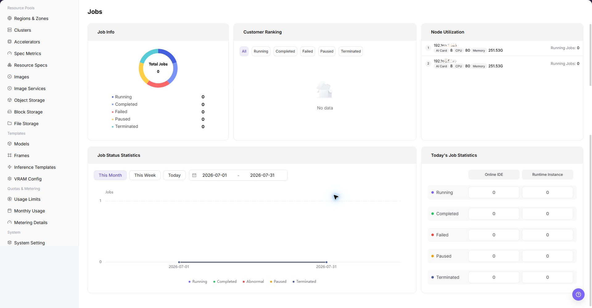

# Job Monitoring

::: info Document Information
Version: v1.0
Updated: 2026-07-08
:::

## Feature Overview

`Job Monitoring` is used to view model instances, online IDEs, runtime instances, training tasks, and historical jobs, helping operators perform capacity inspections, locate exceptions, and make resource scheduling judgments.

| Item | Content |
| --- | --- |
| Applicable role | Operator |
| Navigation path | AI Infrastructure > On-Prem > Monitoring > Job Monitoring |
| Page route | `/powerone/monitor/work` |
| Managed objects | Model instances, online IDEs, runtime instances, training tasks, and historical jobs |
| Typical use | Locate queueing, failures, high resource consumption, and long-running issues by job |

#### Beginner Explanation

Job monitoring is like a task queue and execution list. It shows training, inference, or development task status, queueing reasons, runtime duration, and resource occupation.

#### Terms Quick Reference

| Term | Description |
| --- | --- |
| Job Status | Queued, running, succeeded, failed, or canceled. |
| Queueing Reason | Reason the job cannot start due to insufficient resources, quota limits, or scheduling constraints. |
| Runtime Duration | Duration from job startup to the current time. |
| Failure Information | Error summary or event when a job fails. |

## Prerequisites

1. The current account has job monitoring view permissions.
2. The platform has collected job status, events, queueing, and runtime duration.
3. The target tenant, user, or cluster scope has been clarified.
4. For troubleshooting, job ID or submission time has been prepared.

## Page Description

Job monitoring is used to view job queueing, running status, failure causes, and resource occupation. Operators can use it to analyze insufficient resources, image pull failures, startup exceptions, or long-running tasks.

The following figure shows the job monitoring page.

## Main Operations

### View Job Monitoring

#### Procedure

1. Go to `Monitoring > Job Monitoring`.
2. Confirm the region in the upper-right corner and page filters.
3. View lists, charts, or statistic cards.
4. Focus on abnormal status, high watermarks, long periods without updates, or data inconsistent with expectations.
5. When a job is abnormal, go to instance details to view logs, events, image pull, startup command, and storage mount.

#### View Job Monitoring

1. Go to `AI Infra > On-Prem > Monitoring > Jobs`.
2. View the job list and overall running status, and confirm job ID, job name, job type, job status, tenant/user, cluster, and resource occupation.
3. Select job status, tenant/user, cluster, resource type, or time range filters as provided by the page.
4. Review queue duration, runtime duration, GPU/accelerator occupation, failure information, and event entrypoints to identify long queueing, startup failures, insufficient resources, or abnormal occupation.
5. If a job is abnormal, continue to job details and troubleshoot together with events, logs, image pull, startup command, storage mount, node status, and device status.
6. For learning or screenshots only, view statistic cards, charts, filters, and lists without terminating, restarting, or modifying any configuration.

#### Key Focus

- Whether failed and queued jobs increase abnormally.
- Whether long-running jobs occupy critical resources.
- Whether job tenant, specification, image, and cluster match expectations.

## Parameter Reference

| Field Name | Required | Field Type | Example | Description |
| --- | --- | --- | --- | --- |
| Job ID | Yes | Text | `job-20260706-001` | Locates a single job or task instance. |
| Job Name | Conditionally required | Text | `inference-job` | Helps locate a job by business name. |
| Job Type | Conditionally required | Enum | `Runtime Instance` | Distinguishes model instances, online IDEs, runtime instances, training tasks, or historical jobs. |
| Job Status | System-generated | Status | `Running` | Shows whether the job is queued, running, succeeded, or failed. |
| Tenant / User | Conditionally required | Text | `tenant-a` | Used to locate job ownership by tenant or user. |
| Cluster | Conditionally required | Text | `cluster-prod-a` | Locates the cluster where the job is running or queued. |
| Node | System-generated | Text | `node-gpu-01` | Shows the node to which the job is scheduled. |
| Resource Specification | System-generated | Text | `2 * A800` | Shows the resource specification requested or occupied by the job. |
| GPU / Accelerator Occupation | System-generated | Number / Text | `2 * A800` | Shows accelerator specification and quantity occupied by the job. |
| Queue Duration | System-generated | Duration | `18 minutes` | Determines whether scheduling is waiting or resources are insufficient. |
| Runtime Duration | System-generated | Duration | `2 hours 15 minutes` | Determines whether the job runs longer than expected. |
| Failure Information | System-generated | Text | `ImagePullBackOff` | Helps locate job failure causes. |
| Time Range | Conditionally required | Date range | `Last 1 hour` | Controls the query window for statistic cards, trend charts, and list data. |

## Pitfalls

- Job queueing is not necessarily a failure. It may be caused by insufficient resources or quotas.
- Failure causes should be judged together with events, logs, and image pull status.
- Long-running jobs should be evaluated for resource occupation and cost.
- Job monitoring may have collection latency. Do not judge faults based only on a single instant status.
- Job exceptions should be investigated together with events, logs, image pull, startup command, storage mount, node status, and device status.
- Long-running or high-resource jobs are not necessarily abnormal. Judge together with business expectations, tenant quotas, and model specifications.
- Do not write real job IDs, instance names, image addresses, data paths, log contents, tenant information, node names, cluster IDs, resource pool IDs, internal metric keys, or test data in the document.
- `Terminate`, `Restart`, and `Delete` are high-risk actions. Do not click them during learning or screenshots.

## Result Validation

1. The job list displays ID, status, queue duration, runtime duration, and resource occupation.
2. Failed jobs show an error summary or event entrypoint.
3. Statistics change accordingly after filtering by tenant, cluster, or time range.

## Configuration Rules and Impact

- **For queueing, check resources and scheduling conditions first**: Queueing is not necessarily a platform fault. It may be caused by specification, labels, quotas, or cluster capacity limits.
- **Use events with failure information**: Error codes and events can distinguish image, storage, startup command, permission, and insufficient resource issues.
- **Runtime duration helps discover stuck tasks**: Long-running tasks should be judged together with logs, resource utilization, and business expectations.
- **Resource occupation affects other users**: When large jobs are submitted intensively, monitor tenant quotas and cluster watermarks at the same time.

## FAQ

#### Job Remains Queued for a Long Time

**Symptom:**

In job monitoring, a task remains queued or scheduling for a long time.

**Possible Causes:**

- Target specification resources are insufficient.
- Quota is insufficient or template constraints are too strict.
- Image pull, storage mount, or node scheduling conditions are not satisfied.

**Solution:**

1. View job details and events.
2. Check remaining resources in clusters, nodes, and devices.
3. Verify tenant quota, image address, and storage mount.

#### Page List Is Empty

**Symptom:**

No monitoring records or charts are visible after entering the page.

**Possible Causes:**

- Filters limit the result scope.
- The target region does not yet have related resources or job data.
- The current account has no view permission for this monitoring object.
- Monitoring collection data has not been reported.

**Solution:**

1. Click reset to clear filters.
2. Confirm whether the region in the upper-right corner is correct.
3. Go to resource pool or job pages to confirm whether objects exist.
4. Contact the platform administrator to check permissions and collection links.

## Next Steps

1. For queueing issues, verify quotas, specifications, and cluster capacity.
2. For failure issues, verify images, startup commands, storage, and events.
3. For long-running tasks, enter usage and monitoring pages to evaluate consumption.

## Notes

- Job names, image addresses, data paths, and log contents may contain sensitive information.
- Before terminating a job, confirm business impact and output file retention policy.
- High-frequency failed jobs should be reviewed through templates or images.
- `Terminate`, `Restart`, and `Delete` affect real jobs. Do not click them during learning or screenshots.
- Documentation examples must not include real job IDs, instance names, image addresses, data paths, log contents, tenant information, node names, cluster IDs, resource pool IDs, internal metric keys, or test data.
