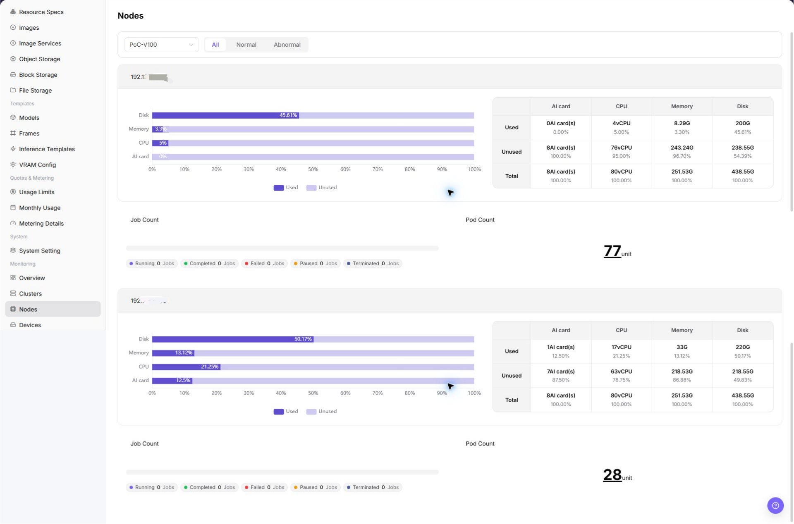

# Node Statistics

::: info Document Information
Version: v1.0
Updated: 2026-07-08
:::

## Feature Overview

`Node Statistics` is used to view node status, node role, resource utilization, heartbeat, and owning cluster, helping operators perform capacity inspections, locate exceptions, and make resource scheduling judgments.

| Item | Content |
| --- | --- |
| Applicable role | Operator |
| Navigation path | AI Infrastructure > On-Prem > Monitoring > Node Statistics |
| Page route | `/powerone/monitor/node` |
| Managed objects | Node status, node role, resource utilization, heartbeat, and owning cluster |
| Typical use | Locate resource bottlenecks, offline nodes, and abnormal job distribution by node |

#### Beginner Explanation

Node statistics are like a server inspection checklist. They show CPU, memory, disk, and status for each node, helping determine which machine an issue lands on.

#### Terms Quick Reference

| Term | Description |
| --- | --- |
| Node Status | Whether a node is Ready, unschedulable, or abnormal. |
| CPU Usage | Current CPU load of the node. |
| Memory Usage | Node memory occupation. |
| Disk Watermark | Space usage of system disk or data disk. |

## Prerequisites

1. The current account has node monitoring view permissions.
2. The target node belongs to an accessed cluster.
3. Node CPU, memory, disk, and status metrics are reported normally.
4. The troubleshooting time range or affected task has been clarified.

## Page Description

Node statistics are used to view CPU, memory, disk, and runtime status for each node. Operators can use it to locate NotReady nodes, high-watermark nodes, or machines with interrupted collection curves.

The following figure shows the node statistics page.

## Main Operations

### View Node Statistics

#### Procedure

1. Go to `Monitoring > Node Statistics`.
2. Confirm the region in the upper-right corner and page filters.
3. View lists, charts, or statistic cards.
4. Focus on abnormal status, high watermarks, long periods without updates, or data inconsistent with expectations.
5. When a node is abnormal, go to the cluster node page to view labels, taints, hardware, runtime, and job information.

#### View Node Statistics

1. Go to `AI Infra > On-Prem > Monitoring > Nodes`.
2. View the node list and overall running status, and confirm node name, cluster, region/AZ, node status, and resource usage level.
3. Select cluster, node, resource type, status, or time range filters as provided by the page.
4. Review CPU, memory, accelerator, storage, network, and job-related statistics to identify high load, insufficient resources, or abnormal node status.
5. If a node is abnormal, continue troubleshooting in Devices or Jobs monitoring pages, together with cluster statistics and scheduling events.
6. For learning or screenshots only, view statistic cards, charts, filters, and lists without modifying any configuration.

#### Key Focus

- Whether the node is online or Ready.
- Whether single-node resources are close to full load.
- Whether abnormal nodes are concentrated in the same cluster or availability zone.

## Parameter Reference

| Field Name | Required | Field Type | Example | Description |
| --- | --- | --- | --- | --- |
| Node Name | Yes | Text | `node-gpu-01` | Locates a specific compute node. |
| Cluster | Conditionally required | Drop-down | `cluster-prod-a` | Limits the cluster to which the node belongs. |
| Region / AZ | Conditionally required | Drop-down | `Wuhan / AZ A` | Limits the resource location to which the node belongs. |
| Node Status | System-generated | Status | `Ready` | Shows whether the node is schedulable, unavailable, or has alerts. |
| CPU Usage | System-generated | Percentage | `72%` | Determines whether node CPU is close to bottleneck. |
| Memory Usage | System-generated | Percentage | `81%` | Determines node memory pressure. |
| Accelerator Usage | System-generated | Percentage | `65%` | Determines whether GPU, NPU, or other accelerator resources are close to bottleneck. |
| Storage Usage | System-generated | Percentage | `68%` | Determines whether system disk, data disk, or mounted storage is close to limit. |
| Network Traffic | System-generated | Value / Trend | `Inbound / Outbound` | Helps determine whether node network traffic has abnormal fluctuation or bottlenecks. |
| Job Count | System-generated | Number | `12` | Shows the number of running, queued, or abnormal jobs on the node. |
| Time Range | Conditionally required | Date range | `Last 1 hour` | Controls the query window for statistic cards, trend charts, and list data. |
| Update Time | System-generated | Date time | `2026-07-06 10:00` | Determines whether node metrics are latest data. |

## Pitfalls

- Node Ready does not mean the device plugin is definitely normal.
- High disk watermark may cause image pull or log write failures.
- During troubleshooting, judge together with node events and job logs.
- Node statistics may have collection latency. Do not judge faults based only on a single instant metric.
- Node exceptions should be investigated together with clusters, devices, jobs, scheduling events, and node logs.
- Do not write real node names, node IPs, device IDs, cluster IDs, resource pool IDs, tenant information, internal metric keys, or test data in the document.

## Result Validation

1. The node list displays node name, status, and key resource metrics.
2. Node status corresponds to cluster health and job scheduling results.
3. Metric update time can explain whether collection is delayed.

## Configuration Rules and Impact

- **Node status before resource watermarks**: When a node is NotReady, unschedulable, or collection is abnormal, handle the status problem first.
- **Disk pressure affects job stability**: High disk watermark may cause image pull, log write, or temporary file creation failures.
- **Single-node exception can cause local queueing**: Scheduling failure is not necessarily overall cluster capacity shortage. It may be caused by target node labels or taint restrictions.
- **Metric delay requires event judgment**: When node metrics are delayed, also view cluster events and job failure reasons.

## FAQ

#### Node Status Is Abnormal

**Symptom:**

The node is displayed as unavailable, offline, or resource data is not updated for a long time.

**Possible Causes:**

- Node kubelet or container runtime is abnormal.
- The link from node to platform or monitoring collection is unreachable.
- The node is under maintenance, isolated, or has hardware failure.

**Solution:**

1. Go to the cluster node page to view node details.
2. Check kubelet, container runtime, and monitoring collection components.
3. Confirm whether the node is under maintenance or isolated.

#### Page List Is Empty

**Symptom:**

No monitoring records or charts are visible after entering the page.

**Possible Causes:**

- Filters limit the result scope.
- The target region does not yet have related resources or job data.
- The current account has no view permission for this monitoring object.
- Monitoring collection data has not been reported.

**Solution:**

1. Click reset to clear filters.
2. Confirm whether the region in the upper-right corner is correct.
3. Go to resource pool or job pages to confirm whether objects exist.
4. Contact the platform administrator to check permissions and collection links.

## Next Steps

1. When a node is NotReady, check cluster events and node status.
2. When resources have high watermarks, locate the instances or jobs occupying resources.
3. When accelerators are involved, continue viewing device monitoring.

## Notes

- Node names, IPs, labels, and equipment room information should be sanitized.
- A single-node exception does not necessarily mean the whole cluster is unavailable.
- Before node maintenance, confirm impact on running tasks and mounted storage.
- Before fault judgment, cross-check with cluster statistics, device monitoring, job monitoring, scheduling events, and node logs.
- Documentation examples must not include real node names, node IPs, device IDs, cluster IDs, resource pool IDs, tenant information, internal metric keys, or test data.
